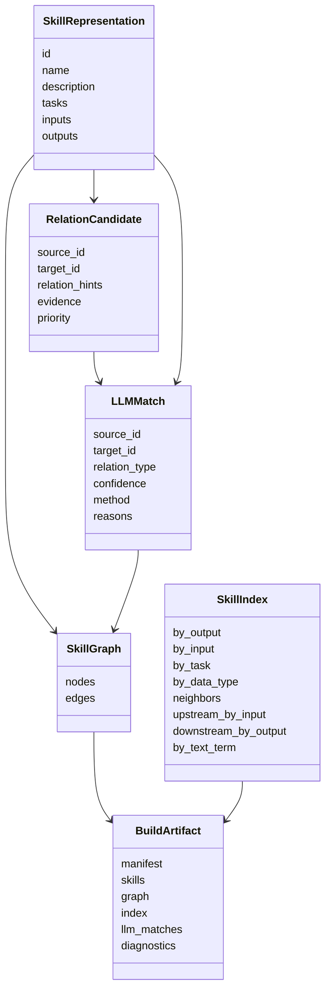
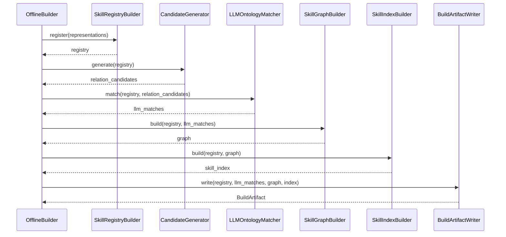

# 图构建模块设计说明书

## 1. 模块定位

图构建模块负责把结构化 Skill 表征转成本体驱动的 Skill 关联图谱、检索索引和离线构建产物。

它只消费表征提取模块的输出，不直接读取 `SKILL.md`。图谱只表达 Skill 之间的关系；`description`、`tasks`、`inputs`、`outputs` 等表征字段作为 Skill 节点属性和候选关系判断依据。程序侧负责候选生成、输出 schema 校验、索引生成和诊断记录。

本模块参考 Agent-OM 的核心思想：先给匹配器提供结构化的本体上下文，再让匹配器输出可解释的关系判断。对应到 SkillMash，直接使用 `description`、`tasks`、`inputs`、`outputs` 作为本体上下文即可，不额外引入 metadata/syntactic/lexical/semantic 四类画像作为持久化产物。

## 2. 组件划分

```text
SkillRegistryBuilder
CandidateGenerator
LLMOntologyMatcher
RelationResolver
SkillGraphBuilder
SkillIndexBuilder
ArtifactLexicon
GraphDiagnostics
BuildArtifactWriter
```

推荐组件职责：

| 组件 | 职责 |
| --- | --- |
| `SkillRegistryBuilder` | 注册并校验 `SkillRepresentation`，处理重复 ID 和缺失字段。 |
| `CandidateGenerator` | 基于 input/output/task/type/text 倒排索引生成高召回候选对。 |
| `LLMOntologyMatcher` | 将候选对和 `description/tasks/inputs/outputs` 组织成 LLM 输入，生成关联判断和匹配证据。 |
| `RelationResolver` | 聚合 LLM 匹配和确定性 exact-io 匹配，并统一输出关系诊断。 |
| `SkillGraphBuilder` | 将 Skill 节点和 LLM 匹配边组装为 typed graph。 |
| `SkillIndexBuilder` | 生成在线检索需要的倒排索引、邻接索引和候选计划入口。 |
| `ArtifactLexicon` | 提供统一的分词、停用词和 generic I/O 名称过滤规则。 |
| `GraphDiagnostics` | 记录冲突、低置信关联、孤立节点和不可闭合输入。 |
| `BuildArtifactWriter` | 写出 manifest、skills、graph、index、llm_matches 和 diagnostics。 |

## 3. 模块 N+1 视图

### 3.1 职责视图

职责：

1. 注册并校验 SkillRepresentation。
2. 基于 `description/tasks/inputs/outputs` 组织 LLM 可理解的本体上下文。
3. 先用确定性索引生成 Skill-Skill 候选对。
4. 调用 LLM 对候选对生成关联判断和解释。
5. 构建只包含 Skill 节点和 Skill-Skill 关系边的 typed graph。
6. 将通过校验和阈值的 LLM 关联写入 Skill-Skill typed edge。
7. 生成在线检索需要的倒排索引、邻接索引和候选组合入口。
8. 写出构建产物。
9. 记录重复 ID、缺失字段、孤立节点、低置信关联、LLM 输出不合法项和图结构诊断。

非职责：

1. 不解析原始 Skill 文件。
2. 不让 LLM 直接改写 Skill 表征。
3. 不根据用户任务规划。
4. 不执行 Skill。
5. 不把低置信匹配边当作确定性依赖边。

### 3.2 输入输出视图

输入：

```text
SkillRepresentation[]
```

输出：

```text
BuildArtifact
  build_manifest.json
  skills.json
  skill_graph.json
  skill_index.json
  llm_matches.json
  diagnostics.json
```

### 3.3 数据结构视图



### 3.4 协作视图



### 3.5 约束视图

1. 候选生成、schema 校验、阈值过滤和索引生成必须是确定性的。
2. 同一个 Skill ID 冲突时必须显式诊断。
3. 图边必须有类型，不能只存无语义连接。
4. `build_manifest.json` 是在线加载的唯一入口。
5. 新增产物必须通过 manifest 暴露，不能依赖目录扫描猜测。
6. 图谱必须区分确定性边和匹配推断边。
7. 每条匹配推断边必须能追溯到 `llm_matches.json` 中的证据。
8. 关联边必须带 `confidence` 和 `method`；在线可执行路径默认只使用达到阈值的 `can_feed` 边。
9. LLM 输出的 source、target、relation_type 必须经过程序侧 schema 和 ID 校验。
10. LLM 不能新增不存在的 Skill，也不能新增未在 schema 中声明的边类型。
11. LLM 调用必须记录 model、prompt_version、temperature 和输入摘要，保证构建结果可追踪。
12. LLM 不负责从全量 Skill 中枚举关系；候选必须先由 `CandidateGenerator` 生成。

### 3.6 LLM 本体上下文

LLM 构图不需要额外持久化 `entity_id/entity_type/metadata/syntactic/lexical/semantic` 画像。对当前 SkillMash 来说，`description/tasks/inputs/outputs` 已经是结构化后的本体上下文，更直接、更少重复。

推荐传给 LLM 的最小上下文：

```json
{
  "skills": [
    {
      "id": "web_search",
      "name": "Web Search",
      "description": "Search the web and return relevant results.",
      "tasks": ["search"],
      "inputs": [{"name": "topic", "type": "text", "required": true}],
      "outputs": [{"name": "search_results", "type": "json"}]
    }
  ],
  "allowed_relation_types": [
    "can_feed",
    "similar_to",
    "substitute_for"
  ]
}
```

`entity_id` 和 `entity_type` 仍然有必要，但只用于最终 Skill 图节点，而不是作为单独画像层：

| 字段 | 是否保留 | 理由 |
| --- | --- | --- |
| `entity_id` | 保留在 graph node | 图边需要稳定引用，例如 `skill:web_search`。 |
| `entity_type` | 保留在 graph node | 在线加载后明确这是 Skill 节点。 |
| `metadata/syntactic/lexical/semantic` | 不作为 v1 产物 | 与现有表征重复，先用 LLM 直接消费原始结构化字段。 |

### 3.7 候选生成策略

候选生成目标是高召回、低成本。它不决定最终关系是否成立，只负责把可能有关联的 Skill 对交给 LLM 判断。避免让 LLM 一次性对全量 Skill 做两两组合。

候选以无序 Skill pair 去重。同一个 pair 只进入一次 LLM；LLM 可以在一次判断中输出 A -> B 和 B -> A 两个方向的关系。

候选生成先构建倒排索引：

```text
by_output_name: output.name -> producer skill ids
by_input_name: input.name -> consumer skill ids
by_task: task -> skill ids
by_data_type: input/output.type -> skill ids
by_text_term: description/name/task/input/output tokens -> skill ids
```

候选类型：

| 候选来源 | relation_hints | 规则 | 优先级 |
| --- | --- | --- | --- |
| `exact_io_match` | `can_feed` | `source.outputs[].name == target.inputs[].name` | 高 |
| `compatible_type_match` | `can_feed` | output/input 的 `type` 相同，且 name 或 description token 有交集 | 中 |
| `task_overlap_match` | `similar_to` | 两个 Skill 的 task 有交集 | 中 |
| `shape_similarity_match` | `substitute_for` | inputs/outputs 的 name 和 type 结构相近 | 中 |
| `text_term_match` | `similar_to` | description/name 中有明显共享关键词 | 低 |

候选对象格式：

```json
{
  "source_id": "web_search",
  "target_id": "summarize_text",
  "relation_hints": ["can_feed"],
  "candidate_methods": ["exact_io_match"],
  "priority": "high",
  "evidence": {
    "directions": {
      "web_search->summarize_text": {
        "source_outputs": [{"name": "search_results", "type": "json"}],
        "target_inputs": [{"name": "search_results", "type": "json"}],
        "matched_terms": ["search_results"]
      }
    }
  }
}
```

候选去重和裁剪：

1. 同一无序 Skill pair 只保留一条候选，例如 `A->B` 和 `B->A` 会合并。
2. 多个方法命中同一候选时合并 `relation_hints`、`candidate_methods` 和 evidence，并提升 priority。
3. 每个 Skill 的候选数量设置上限，例如每个 source 最多保留 top-k。
4. `can_feed` 候选优先保留 exact I/O 命中，其次保留 type-compatible 命中。
5. 自环候选默认丢弃，除非未来明确支持 recursive/composite Skill。

### 3.8 LLM 本体匹配策略

本体匹配由 LLM 判断输入候选并产出匹配结果，程序侧做 deterministic validation。

每个无序 Skill pair 在单次匹配 run 中只出现一次。LLM 在该候选的 `relation_hints` 范围内一次性判断所有可能成立的关系，因此同一对 Skill 可以同时输出 `A -> B can_feed`、`B -> A can_feed`、`similar_to` 和 `substitute_for` 等多条边。

默认构建会对每个候选 batch 调用两次 LLM：

1. 第一次按候选方向组织 Skill 上下文，例如 A 在前、B 在后。
2. 第二次只交换传给 LLM 的 Skill 上下文顺序，例如 B 在前、A 在后，候选方向仍保持 A -> B。

只有两次都输出同一条 `(source_id, target_id, relation_type, candidate_id)` 且都通过校验和阈值过滤时，关系才会进入 `skill_graph.json`。这样可以降低 LLM 因 A/B 顺序造成的判断偏置。若构建速度优先，可以关闭共识检查。

LLM 需要判断：

1. `can_feed`：A 的输出是否能满足 B 的输入。
2. `similar_to`：两个 Skill 的能力是否相近（语义无向，持久化为双向边）。
3. `substitute_for`：source 是否可替代 target（有向语义，不默认反向成立）。

LLM 输出 schema：

```json
{
  "candidate_id": "summarize_text<->web_search",
  "matches": [
    {
      "source_id": "web_search",
      "target_id": "summarize_text",
      "relation_type": "can_feed",
      "confidence": 0.95,
      "method": "llm_ontology_match",
      "reasons": [
        "web_search outputs search_results.",
        "summarize_text accepts search_results as input."
      ],
      "supporting_fields": {
        "source_outputs": ["search_results"],
        "target_inputs": ["search_results"],
        "source_tasks": ["search"],
        "target_tasks": ["summarize"]
      }
    }
  ]
}
```

程序侧校验：

1. `source_id` 和 `target_id` 必须存在。
2. `relation_type` 必须在白名单中。
3. `confidence` 必须在 `[0, 1]`。
4. `can_feed` 至少要能在 source outputs 和 target inputs 中找到一组 LLM 标注的支持字段。
5. LLM 输出的关系必须对应输入候选的 `relation_hints`；如果 LLM 发现候选方向错误，只能 reject 并说明，不能自由新增反向边。
6. 低于阈值的匹配只进入 `llm_matches.json` 和 diagnostics，不进入默认可规划图。

### 3.9 图谱边类型

图谱边只表达 Skill 之间的关系。`inputs`、`outputs`、`tasks` 和 `data_type` 不展开为图节点或基础边，它们保留在 Skill 节点属性、索引和 LLM evidence 中。

| 边 | 含义 |
| --- | --- |
| `can_feed` | 一个 Skill 的输出可满足另一个 Skill 的输入。 |
| `similar_to` | Skill 的任务、输入输出和描述语义相近；语义无向，落盘为双向边。 |
| `substitute_for` | source Skill 在当前表征下可替代 target Skill；有向语义。 |

在线使用约束：

1. 在线路径构造只使用 `can_feed`。
2. `similar_to/substitute_for` 仅用于排序阶段的 slot 替换候选，不用于扩展新路径。

### 3.10 产物格式

`build_manifest.json`：

```json
{
  "schema_version": "skillmash-build-v1",
  "artifacts": {
    "skills": "skills.json",
    "graph": "skill_graph.json",
    "index": "skill_index.json",
    "llm_matches": "llm_matches.json",
    "diagnostics": "diagnostics.json"
  },
  "thresholds": {
    "can_feed": 0.7,
    "similar_to": 0.0,
    "substitute_for": 0.0
  }
}
```

`llm_matches.json`：

```json
{
  "matches": [
    {
      "source_id": "web_search",
      "target_id": "summarize_text",
      "relation_type": "can_feed",
      "confidence": 0.95,
      "method": "llm_ontology_match",
      "reasons": [
        "web_search outputs search_results",
        "summarize_text requires input search_results"
      ],
      "accepted": true
    }
  ]
}
```

### 3.11 +1 模块场景

输入：

```text
web_search
  inputs: topic
  outputs: search_results
  tasks: web_search

summarize_text
  inputs: search_results
  outputs: summary
  tasks: summarization
```

图构建输出边：

```text
web_search -> summarize_text                can_feed
```

索引输出：

```text
by_output.search_results = [web_search]
by_input.search_results = [summarize_text]
by_task.web_search = [web_search]
neighbors.web_search = [summarize_text]
upstream_by_input.search_results = [web_search]
```

匹配证据：

```text
web_search can_feed summarize_text
  method: llm_ontology_match
  confidence: 0.95
  evidence: output search_results == input search_results
```

### 3.12 关系反馈闭环（离线）

在线排序阶段可记录关系质量反馈（例如 `slot_no_viable_substitute`），但在线模块不直接改图。反馈用于下一次离线构建修边。

推荐反馈记录粒度：

```text
(source_skill, target_skill, relation_type, slot_io_signature, reason_code, count)
```

推荐流程：

1. 在线 append 反馈日志（默认 `.skillmash/runtime/relation_feedback.jsonl`，支持配置覆盖）。
2. 离线执行 `build --apply-feedback` 时加载反馈。
3. 在滚动窗口内按阈值触发降权：默认窗口为最近 `30` 天（支持配置），且需满足 `count >= 20` 与 `fail_rate >= 0.6`。
4. 每次触发将目标边 `confidence -= 0.1`，下限 `0.0`，并记录 `degrade_epoch` 以追踪降权轮次。
5. 降权结果只在下一次 build 产物中生效。

## 4. 实现分期

### 4.1 v1 LLM 构图

1. 使用 `description`、`tasks`、`inputs`、`outputs` 构造 LLM prompt。
2. 生成 Skill-only graph 节点，节点属性包含 `description`、`tasks`、`inputs`、`outputs`。
3. 用 `CandidateGenerator` 生成 relation candidates。
4. 调用 LLM 判断候选是否成立，输出 `can_feed`、`similar_to`、`substitute_for`。
5. 程序侧校验 LLM 输出并过滤低置信边。
6. 写出 `build_manifest.json`、`skills.json`、`skill_graph.json`、`skill_index.json`、`llm_matches.json`、`diagnostics.json`。

### 4.2 v2 批处理与候选裁剪

1. 当 Skill 数量较多时，先用 output/input name、type、task 和 text term 做候选裁剪。
2. 分批调用 LLM，避免一次 prompt 过长。
3. 对跨批次重复边做合并和置信度聚合。
4. 将 LLM 原始输出和校验结果写入 diagnostics。
5. 支持离线 `--apply-feedback`，按反馈统计对边做保守降权。

### 4.3 v3 可选增强

1. 引入 embedding 仅用于候选召回，不作为最终边判断。
2. 对高价值、低置信候选调用二次 LLM validator。
3. 支持外部领域词表或本体文件作为 `external_ontology`。
4. 记录模型、prompt 版本和温度，提升构建可追踪性。
5. 支持基于反馈的审查队列和人工确认禁用策略。
