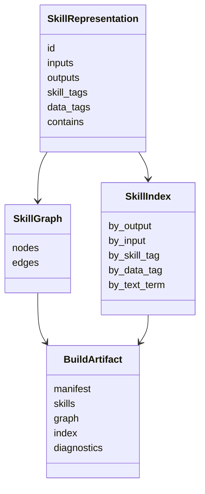
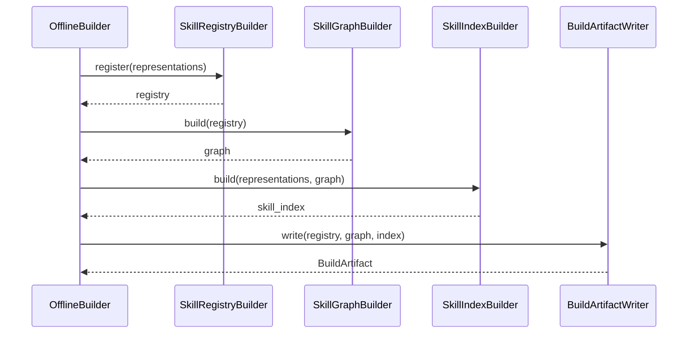

# 图构建模块设计说明书

## 1. 模块定位

图构建模块负责把结构化 Skill 表征转成 Skill 图谱、检索索引和离线构建产物。

它只消费表征提取模块的输出，不直接读取 `SKILL.md`，也不调用 LLM。

## 2. 组件划分

```text
SkillRegistryBuilder
SkillGraphBuilder
SkillIndexBuilder
GraphDiagnostics
BuildArtifactWriter
```

## 3. 模块 N+1 视图

### 3.1 职责视图

职责：

1. 注册并校验 SkillRepresentation。
2. 构建 Skill、Artifact、Tag 之间的 typed edge。
3. 生成在线检索需要的倒排索引。
4. 写出构建产物。
5. 记录重复 ID、缺失字段、孤立节点和图结构诊断。

非职责：

1. 不解析原始 Skill 文件。
2. 不调用 LLM。
3. 不根据用户任务规划。
4. 不执行 Skill。

### 3.2 输入输出视图

输入：

```text
SkillRepresentation[]
```

输出：

```text
BuildArtifact
  build_manifest.json
  skills.json
  skill_graph.json
  skill_index.json
  diagnostics.json
```

### 3.3 数据结构视图



### 3.4 协作视图



### 3.5 约束视图

1. 图构建必须是确定性的。
2. 同一个 Skill ID 冲突时必须显式诊断。
3. 图边必须有类型，不能只存无语义连接。
4. `build_manifest.json` 是在线加载的唯一入口。
5. 新增产物必须通过 manifest 暴露，不能依赖目录扫描猜测。

### 3.6 +1 模块场景

输入：

```text
web_search
  inputs: topic
  outputs: search_results
  skill_tags: web_search

summarize_text
  inputs: search_results
  outputs: summary
  skill_tags: summarization
```

图构建输出边：

```text
web_search -> artifact:search_results       produces
artifact:topic -> web_search                consumes
summarize_text -> artifact:summary          produces
artifact:search_results -> summarize_text   consumes
web_search -> tag:web_search                has_skill_tag
summarize_text -> tag:summarization         has_skill_tag
```

索引输出：

```text
by_output.search_results = [web_search]
by_input.search_results = [summarize_text]
by_skill_tag.web_search = [web_search]
```
