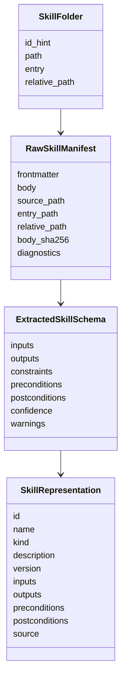
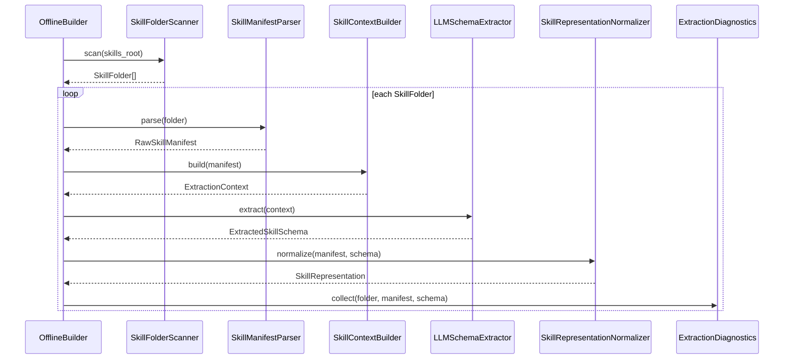

# 表征提取模块设计说明书

## 1. 模块定位

表征提取模块负责把原始 Skill 文件夹转成结构化 Skill 表征。它是 SkillMash 离线构建的第一步，也是后续图构建、在线检索和计划生成的语义来源。

这个模块只回答一个问题：

```text
这个 Skill 是什么，它需要什么输入，会产生什么输出，适合什么任务，来自哪里？
```

它不负责构建图，不负责生成索引，不负责在线召回、排序或执行。

### 1.1 第一阶段目标

第一阶段先把表征模块做成稳定、可追溯、可验收的离线组件：

1. 扫描一个 `skills_root` 下所有合法 Skill 文件夹。
2. 解析每个 `SKILL.md` 的 frontmatter、正文、工具声明和来源信息。
3. 通过 LLM 把自然语言描述转成结构化输入和输出。
4. 归一化为稳定的 `SkillRepresentation v1`。
5. 输出可供图构建模块直接消费的 `SkillRepresentation[]` 和诊断信息。

### 1.2 设计原则

1. 表征提取允许复杂，在线阶段必须简单。
2. LLM 是正式提取路径，规则解析只负责准备上下文和归一化，不作为语义兜底。
3. 输出 schema 必须稳定，字段缺失、类型非法和低置信结果必须显式诊断。
4. 每条表征必须能追溯到原始 Skill 文件夹、入口文件和内容 hash。
5. 表征模块只定义 Skill 自身，不推断 Skill 之间的图关系。

## 2. 组件划分

```text
SkillFolderScanner
SkillManifestParser
SkillContextBuilder
LLMSchemaExtractor
SkillRepresentationNormalizer
ExtractionDiagnostics
RepresentationWriter
```

| 组件 | 职责 |
| --- | --- |
| `SkillFolderScanner` | 从 `skills_root` 中发现包含 `SKILL.md` 的 Skill 文件夹，生成稳定有序的 `SkillFolder[]`。 |
| `SkillManifestParser` | 读取 `SKILL.md`，解析 frontmatter、正文、声明字段和基础诊断。 |
| `SkillContextBuilder` | 裁剪并组装传给 LLM 的上下文，包括 frontmatter、正文摘要、目录摘要和来源信息。 |
| `LLMSchemaExtractor` | 调用 LLM，要求返回符合 JSON Schema 的 `ExtractedSkillSchema`。 |
| `SkillRepresentationNormalizer` | 合并 manifest 与 LLM 输出，生成 `SkillRepresentation v1`。 |
| `ExtractionDiagnostics` | 收集扫描、解析、LLM、schema 校验和归一化阶段的诊断。 |
| `RepresentationWriter` | 可选组件，将表征与诊断写为离线中间产物，便于调试和复用。 |

## 3. 模块 N+1 视图

### 3.1 职责视图

职责：

1. 扫描 Skill 文件夹。
2. 读取并解析 `SKILL.md`。
3. 构造 LLM 提取上下文。
4. 调用 LLM 提取输入、输出和必要约束。
5. 将 LLM 结果归一化为稳定结构。
6. 记录提取诊断、模型配置、内容 hash 和来源信息。

非职责：

1. 不判断 Skill 之间的上下游关系。
2. 不生成 Skill 图、倒排索引或向量索引。
3. 不根据用户任务做在线召回。
4. 不执行 Skill 或验证真实工具可用性。
5. 不做安全审计、权限治理或供应链风险判断。

### 3.2 输入输出视图

输入：

```text
skills_root/
  some-skill/
    SKILL.md
    references/
    scripts/
    assets/
```

中间输入：

```text
RawSkillManifest
  frontmatter
  body
  source_path
  entry_path
  relative_path
  body_sha256
  diagnostics
```

LLM 中间输出：

```text
ExtractedSkillSchema
  inputs
  outputs
  constraints
  preconditions
  postconditions
  confidence
  warnings
```

模块输出：

```text
SkillRepresentation[]
ExtractionDiagnostics[]
NormalizationDecision[]
```

当作为离线构建流水线的第一步运行时，输出会继续交给图构建模块；当独立调试运行时，可以写出：

```text
.skillmash/representation/
  representations.json
  diagnostics.json
  normalization_decisions.json
  io_name_vocab.json
```

### 3.3 数据结构视图



### 3.4 协作视图



### 3.5 约束视图

1. LLM 提取是正式路径，不保留非 LLM 语义兜底路径。
2. 没有 API Key、模型调用失败、返回结构不合法或 schema 校验失败时，构建应失败。
3. LLM 输出必须经过 JSON Schema 校验和归一化。
4. 每个 Skill 表征必须包含 `source`，以便追溯到原始文件夹。
5. 诊断信息必须写入构建产物，不能只打印到控制台。
6. 扫描顺序、输出字段顺序、标签排序和 ID 生成规则必须确定性。
7. LLM prompt、模型名、模型参数和 schema 版本必须进入构建元信息，便于复现。

### 3.6 +1 模块场景

输入 Skill：

```text
aris-arxiv/
  SKILL.md
```

`SKILL.md` 描述该 Skill 可以检索 arXiv 论文并返回论文信息。

处理过程：

1. `SkillFolderScanner` 找到 `aris-arxiv/SKILL.md`。
2. `SkillManifestParser` 解析 frontmatter 和正文。
3. `SkillContextBuilder` 把 `name`、`description`、`argument-hint`、`allowed-tools` 和正文关键段落组装为 LLM 上下文。
4. `LLMSchemaExtractor` 提取：

```json
{
  "inputs": [
    {
      "name": "query",
      "type": "text",
      "required": true,
      "description": "Search query or arXiv identifier"
    }
  ],
  "outputs": [
    {
      "name": "paper",
      "type": "pdf",
      "description": "Matched paper records or downloaded PDFs"
    },
    {
      "name": "summary",
      "type": "markdown",
      "description": "Summary of paper content"
    }
  ],
  "constraints": [],
  "confidence": 0.86,
  "warnings": []
}
```

5. `SkillRepresentationNormalizer` 重点归一化输入输出的 `name` 和 `type`，并生成可写入 `skills.json` 的结构化 Skill；归一化证据写入独立的 `normalization_decisions.json`。

## 4. SkillRepresentation v1

`SkillRepresentation v1` 是表征模块对外提供的唯一稳定契约。图构建模块只能消费这个结构，不能回读 `SKILL.md`。

```json
{
  "id": "aris-arxiv",
  "name": "aris-arxiv",
  "kind": "wrapped",
  "description": "Search, download, and summarize academic papers from arXiv.",
  "version": "1.0.0",
  "inputs": [
    {
      "name": "query",
      "type": "text",
      "required": true,
      "description": "Search query or arXiv identifier",
      "default": null,
      "schema_ref": null
    }
  ],
  "outputs": [
    {
      "name": "paper",
      "type": "pdf",
      "description": "Paper or PDF artifact",
      "schema_ref": null
    }
  ],
  "preconditions": [],
  "postconditions": [],
  "source": {
    "type": "folder",
    "path": "C:\\Users\\admin\\Documents\\data\\skills\\aris-arxiv",
    "entry": "C:\\Users\\admin\\Documents\\data\\skills\\aris-arxiv\\SKILL.md",
    "relative_path": "aris-arxiv",
    "body_sha256": "..."
  }
}
```

### 4.1 字段说明

| 字段 | 必填 | 来源 | 说明 |
| --- | --- | --- | --- |
| `id` | 是 | frontmatter 或路径 | 稳定唯一 ID，默认由 `name` 或相对路径 slug 化生成。 |
| `name` | 是 | frontmatter 或 `id` | 面向人类的名称。 |
| `kind` | 是 | frontmatter 或默认值 | `atomic`、`composite`、`wrapped`，第一阶段默认 `wrapped`。 |
| `description` | 是 | frontmatter + LLM | Skill 的能力描述和适用场景。 |
| `version` | 是 | frontmatter 或默认值 | 默认 `1.0.0`。 |
| `inputs` | 是 | LLM | Skill 所需输入参数。 |
| `outputs` | 是 | LLM | Skill 产生的产物类型。 |
| `preconditions` | 是 | LLM | 执行前条件，未知时为空数组。 |
| `postconditions` | 是 | LLM | 执行后保证，未知时为空数组。 |
| `source` | 是 | scanner | 来源路径、入口文件、相对路径和内容 hash。 |

### 4.2 输入参数结构

```json
{
  "name": "query",
  "type": "text",
  "required": true,
  "description": "User query",
  "default": null
}
```

规则：

1. `name` 使用 `io_name_vocab` 归一化为语义词项，例如 `query`、`paper`、`summary`。
2. `type` 使用统一的 `DataType` 受控词表，表达数据传递形态，例如 `text`、`pdf`、`markdown`。
3. `required` 默认为 `true`。
4. 没有明确输入时，允许生成默认 `input:text`，但必须写入诊断。

### 4.3 输出产物结构

```json
{
  "name": "summary",
  "type": "markdown",
  "description": "Generated summary"
}
```

规则：

1. `outputs` 不能为空。
2. 无法可靠判断输出时，允许输出 `result:unknown`，但必须写入诊断。
3. `type` 使用统一的 `DataType` 受控词表，和输入参数的 `type` 共用同一套类型系统。
4. 产物语义放入 `name`，传递形态放入 `type`。

### 4.4 `io_name_vocab` 与统一 DataType

输入参数和输出产物的 `name` 共用 `io_name_vocab`。它表达图构建用的语义词项，例如 `query`、`topic`、`paper`、`summary`、`report`。动态词表管理器可以用 LLM 判断新名称是否是已有词项的同义词；如果词表容量未达上限，可以新增词项；如果已达上限，则只能合并到现有词项或排除非运行字段。

输入参数和输出产物的 `type` 共用 `DataType`。它表达数据传递形态，而不是产物语义；产物语义放到 `name`。

```text
DataType =
  text
  markdown
  json
  csv
  pdf
  html
  docx
  pptx
  xlsx
  png
  jpg
  svg
  url
  file
  path
  audio
  video
  unknown
```

统一原因：

1. 图构建可以用 `name + type + schema_ref` 判断输入输出是否可连接。
2. `name` 负责语义角色，`type` 负责传递形态，避免 `type` 和 `format` 重复。
3. `normalization_decisions.json` 记录名称和类型为什么这样归一化，最终表征保持干净。
4. 后续扩展到类型层级时，可以统一表达 `pdf -> file`、`pptx -> file` 这类泛化关系。

命名规则：

1. `type` 使用单数、小写、snake_case。
2. 不再输出 `format` 字段；具体格式已经合并到 `type`。
3. 工具名、平台名和动作名不作为类型。例如 `arxiv`、`web_search`、`summarize` 不应出现在 `type` 中。
4. 不能判断时使用 `unknown`，并写入诊断。

### 4.5 后续扩展字段

第一阶段暂不输出 `skill_tags`、`data_tags`、`cost` 和 `quality`。这些字段会在检索、图构建或排序模块明确需要时再引入。

保留策略：

1. LLM 可返回 `confidence`、`warnings` 和 `constraints`，但第一阶段不进入 `SkillRepresentation` 主体。
2. 输入输出的 `name` 和 `type` 是当前阶段的主要归一化目标。
3. `raw`、`normalization` 和 LLM 归一化证据不进入主表征，写入 `normalization_decisions.json`。
4. 后续如需标签或成本质量评估，应作为独立扩展，不污染第一版最小表征契约。

## 5. LLM 提取契约

### 5.1 输入上下文

LLM 只接收提取所需的最小上下文：

```json
{
  "source": {
    "relative_path": "aris-arxiv",
    "entry": "SKILL.md"
  },
  "frontmatter": {
    "name": "aris-arxiv",
    "description": "Search, download, and summarize academic papers from arXiv.",
    "argument-hint": "[query-or-arxiv-id]",
    "allowed-tools": "Bash(*), Read"
  },
  "body": "..."
}
```

上下文构造规则：

1. 优先保留 frontmatter 全量字段。
2. 正文超长时保留标题、使用条件、参数说明、输出说明、约束和示例片段。
3. 不把 `references/` 全量塞进 LLM；第一阶段只提供目录摘要。
4. 上下文必须记录截断信息，用于诊断。

### 5.2 LLM 输出 schema

```json
{
  "type": "object",
  "required": [
    "description",
    "inputs",
    "outputs",
    "constraints",
    "confidence",
    "warnings"
  ],
  "properties": {
    "description": {"type": "string"},
    "inputs": {"type": "array"},
    "outputs": {"type": "array"},
    "constraints": {"type": "array", "items": {"type": "string"}},
    "preconditions": {"type": "array"},
    "postconditions": {"type": "array"},
    "confidence": {"type": "number"},
    "warnings": {"type": "array", "items": {"type": "string"}}
  }
}
```

### 5.3 Prompt 要求

LLM prompt 必须明确：

1. 只根据给定 `SKILL.md` 信息提取，不编造不存在的工具能力。
2. 输入输出 `name` 要描述语义词项，`type` 要描述数据传递形态。
3. 第一阶段不要求输出标签、成本或质量评分。
4. 不输出 `format`；格式信息合并到 `type`。
5. 不确定时使用 `unknown`，并在 `warnings` 中解释。
6. 返回 JSON，不返回 markdown。

## 6. 归一化规则

`SkillRepresentationNormalizer` 是表征模块的稳定化层。LLM 输出的是候选语义结构，Normalizer 负责把候选结构变成可验证、可复现、可被图构建消费的 `SkillRepresentation v1`。

它不重新理解完整 Skill；它只做清洗、补齐、校验、收敛和诊断。对于 `io_name_vocab` 未命中的新名称，它会通过注入的 `IONameResolver` 做局部词表决策；默认 resolver 是确定性的，离线构建入口可以注入 LLM resolver。

输入：

```text
RawSkillManifest
ExtractedSkillSchema
NormalizationConfig
```

输出：

```text
SkillRepresentation
ExtractionDiagnostic[]
NormalizationDecision[]
```

处理顺序：

```text
1. 合并 manifest 与 LLM schema
2. 生成稳定 id/name/version/kind
3. 归一化 inputs/outputs
4. 归一化 io name 与 DataType
5. 归一化 constraints/preconditions/postconditions
6. 补齐 source
7. 做最终 schema 校验
8. 生成诊断和归一化决策日志
```

### 6.1 ID 与名称

1. `id` 优先使用 frontmatter `name`。
2. 缺失时使用相对路径最后一段。
3. 统一转成小写 slug：空格和下划线转 `-`，移除非字母数字和连字符。
4. ID 冲突不在本模块合并，交给图构建注册阶段报错；本模块只记录可疑诊断。

示例：

```text
"Aris Arxiv"       -> "aris-arxiv"
"agents/AutoGPT"   -> "autogpt"
"paper_analyzer"   -> "paper-analyzer"
```

### 6.2 输入输出归一化

输入输出归一化负责把 LLM 候选参数变成稳定结构。

规则：

1. `name` 先转 token，再通过 `io_name_vocab` 收敛到标准词表项。
2. `type` 必须进入统一 `DataType` 词表。
3. `required` 缺失时默认 `true`。
4. `description` 缺失时填空字符串。
5. `default` 缺失时填 `null`。
6. 空输入允许，但如果 Skill 没有明确输入且需要用户任务文本，生成默认 `input:text` 并写入 warning。
7. 空输出不允许；无法判断输出时生成 `result:unknown` 并写入 warning。

示例：

```json
{
  "name": "Query or Arxiv ID",
  "type": "natural language query",
  "required": true
}
```

归一化为：

```json
{
  "name": "query",
  "type": "text",
  "required": true,
  "description": "",
  "default": null
}
```

### 6.3 DataType 归一化

DataType 归一化把 LLM 的自由文本类型收敛到受控词表。这里的 `type` 是数据传递形态，不再和 `format` 拆成两个字段。

示例同义词表：

| 候选类型 | 归一化类型 |
| --- | --- |
| `natural language`、`plain text`、`query` | `text` |
| `markdown`、`md` | `markdown` |
| `link`、`uri`、`webpage` | `url` |
| `pdf`、`academic_paper`、`publication` | `pdf` |
| `spreadsheet`、`csv`、`dataframe` | `csv` |
| `slides`、`presentation`、`powerpoint` | `pptx` |
| `source_code`、`script`、`program` | `text` |
| `chart`、`flowchart`、`mermaid` | `png/svg/text` |

如果无法归一化：

1. 使用 `unknown`。
2. 写入 `unsupported_type_normalized` 诊断。
3. 在 `diagnostics` 和 `normalization_decisions` 中保留原始候选值。

### 6.4 约束与条件归一化

LLM 可能返回自然语言 `constraints`，也可能返回结构化 `preconditions` 和 `postconditions`。Normalizer 的第一阶段策略是保守收敛：

1. 无法结构化的 `constraints` 暂不进入 `SkillRepresentation` 主体，可由 diagnostics 或后续产物记录。
2. 明确的执行前要求进入 `preconditions`。
3. 明确的执行后保证进入 `postconditions`。
4. 条件结构统一为 `{ "type": "...", "expression": "...", "description": "..." }`。
5. 不确定的条件不强行进入 pre/postcondition，避免污染在线计划验证。

示例：

```json
{
  "type": "requires_tool",
  "expression": "curl",
  "description": "Requires curl for network requests"
}
```

### 6.5 source 补齐

Normalizer 必须补齐可追溯信息：

```json
{
  "source": {
    "type": "folder",
    "path": "...",
    "entry": ".../SKILL.md",
    "relative_path": "aris-arxiv",
    "body_sha256": "..."
  }
}
```

这些字段用于复现、比较构建差异和定位错误来源。

### 6.9 最终校验

Normalizer 输出前必须做最终校验：

1. 必填字段存在。
2. `inputs[*].type` 和 `outputs[*].type` 都属于 `DataType`。
3. `outputs` 非空。
4. `source.entry` 指向 `SKILL.md`。
5. `source.body_sha256` 存在。

最终校验失败时生成 `schema_validation_failed`，默认构建失败。

### 6.10 Normalizer 实现方式

Normalizer 建议实现成一组确定性纯函数，而不是一个依赖外部状态的大类。这样好测试、好复现，也方便在诊断里定位是哪一步改变了字段。

核心形态：

```python
class SkillRepresentationNormalizer:
    def __init__(self, config: NormalizationConfig) -> None:
        self.config = config

    def normalize(
        self,
        manifest: RawSkillManifest,
        extracted: ExtractedSkillSchema,
    ) -> NormalizationResult:
        diagnostics: list[ExtractionDiagnostic] = []
        decisions: list[NormalizationDecision] = []

        identity = normalize_identity(manifest, extracted, self.config, diagnostics)
        inputs = normalize_inputs(extracted.inputs, self.config, diagnostics, decisions)
        outputs = normalize_outputs(extracted.outputs, self.config, diagnostics, decisions)
        conditions = normalize_conditions(extracted, self.config, diagnostics)
        source = build_source(manifest)

        representation = SkillRepresentation(
            id=identity.id,
            name=identity.name,
            kind=identity.kind,
            description=identity.description,
            version=identity.version,
            inputs=inputs,
            outputs=outputs,
            preconditions=conditions.preconditions,
            postconditions=conditions.postconditions,
            source=source,
        )

        validate_representation(representation, diagnostics)
        return NormalizationResult(representation, diagnostics, decisions)
```

实现原则：

1. Normalizer 不读文件，不直接绑定具体 LLM；未命中 `io_name_vocab` 时只调用注入的 `IONameResolver`。
2. 所有默认值都来自 `NormalizationConfig`，I/O name 词表来自 `IONameVocabulary`。
3. 每个子函数只处理一个维度，例如 ID、io name、DataType、条件。
4. 子函数可以追加诊断和归一化决策，但不直接打印日志。
5. 输出数组全部稳定排序，避免重复构建产生无意义 diff。

### 6.11 NormalizationConfig

归一化规则不应散落在代码里，建议集中到配置对象。

```python
@dataclass(frozen=True)
class NormalizationConfig:
    schema_version: str = "skill-representation-v1"
    io_name_vocab_version: str = "io-name-vocab-v1"
    data_type_vocab_version: str = "data-type-v1"
    max_vocab_size: int = 8
    default_kind: str = "wrapped"
    default_version: str = "1.0.0"
    default_input_name: str = "input"
    default_input_type: str = "text"
    default_output_name: str = "result"
    unknown_type: str = "unknown"
    data_type_aliases: dict[str, str] = field(default_factory=dict)
    io_name_aliases: dict[str, str] = field(default_factory=dict)
```

第一阶段可以先把词表写在代码常量中；动态 `io_name_vocab` 稳定后，再移动到独立 JSON/YAML。

示例：

```python
DATA_TYPE_ALIASES = {
    "natural_language": "text",
    "plain_text": "text",
    "query": "text",
    "paper": "pdf",
    "academic_paper": "pdf",
    "spreadsheet": "csv",
    "dataframe": "csv",
    "slides": "pptx",
    "presentation": "pptx",
    "source_code": "text",
}
```

动态 `io_name_vocab` 约束：

1. `io_name_vocab` 词表容量有上限，例如 `max_vocab_size = 8`。
2. alias 数量不设硬上限，只记录频次、首次出现、最近出现和置信度。
3. 未命中新名称时，由注入的 `IONameResolver` 判断 `alias_existing`、`create_new`、`exclude_non_runtime` 或 `merge_existing`；示例脚本默认使用 LLM resolver，也可显式切换到本地 heuristic resolver。
4. 达到词表容量上限后，禁止 `create_new`，必须合并到现有词项或排除非运行字段。
5. LLM 决策自动生效，但必须写入 `normalization_decisions.json`，方便复现和回滚。
6. 离线构建完成后必须保存最终 `io_name_vocab.json`，供下一轮构建复用。

`io_name_vocab` 决策动作：

| action | 含义 |
| --- | --- |
| `alias_existing` | 新名称是已有词项的同义词，加入该词项 aliases。 |
| `create_new` | 词表未满且新名称代表新的运行语义，新增词项。 |
| `merge_existing` | 词表已满或语义足够接近，合并到已有词项。 |
| `exclude_non_runtime` | 统计、日志、trace、telemetry、原始副本等非运行字段，不进入主表征。 |

### 6.12 关键函数实现策略

`normalize_name`：

```text
trim -> lower -> replace spaces/underscores with hyphen -> remove invalid chars -> collapse hyphens
```

`normalize_parameter_name`：

```text
trim -> lower -> replace non-alnum with underscore -> collapse underscores
```

`normalize_data_type`：

```text
raw type
  -> normalize token
  -> alias lookup
  -> vocab validation
  -> unknown + diagnostic if not supported
```

`validate_representation`：

```text
required fields
outputs non-empty
types in DataType
source present
body_sha256 present
```

### 6.13 单元测试重点

Normalizer 的测试不需要 LLM，直接喂固定的 `RawSkillManifest` 和 `ExtractedSkillSchema`。

必须覆盖：

1. ID slug 化。
2. 参数名通过 `io_name_vocab` 收敛。
3. DataType 同义词收敛。
4. 输出名和输入名共用同一套 `io_name_vocab`。
5. `raw` 和 `normalization` 不进入主表征，归一化过程进入 `NormalizationDecision`。
6. 缺输入时生成默认 `input:text` 和 warning。
7. 缺输出时生成 `result:unknown` 和 warning。
8. 不支持类型时转 `unknown` 并保留原始值到 diagnostics 和 decisions。
9. 最终输出字段顺序和数组排序稳定。

## 7. 诊断设计

诊断必须结构化，不只输出文本。

```json
{
  "skill_id": "aris-arxiv",
  "path": "C:\\Users\\admin\\Documents\\data\\skills\\aris-arxiv",
  "stage": "normalization",
  "severity": "warning",
  "code": "missing_argument_hint",
  "message": "argument-hint missing; created default text input",
  "details": {}
}
```

### 7.1 严重级别

| 级别 | 含义 | 构建行为 |
| --- | --- | --- |
| `info` | 可追踪信息，不影响质量 | 继续 |
| `warning` | 字段缺失或置信度较低，但仍可产出表征 | 继续 |
| `error` | 单个 Skill 无法生成合法表征 | 默认失败 |
| `fatal` | 全局配置错误，例如无 API Key 或 schema 不可用 | 立即失败 |

### 7.2 第一阶段诊断代码

```text
missing_skill_md
invalid_frontmatter
body_truncated
llm_call_failed
llm_invalid_json
schema_validation_failed
missing_argument_hint
default_input_created
unknown_output_created
low_extraction_confidence
unsupported_type_normalized
```

### 7.3 归一化决策日志

`normalization_decisions.json` 记录每个 `name` 和 `type` 的归一化过程，不进入 `representations.json`。

```json
{
  "skill_id": "aris-arxiv",
  "path": "C:\\Users\\admin\\Documents\\data\\skills\\aris-arxiv",
  "direction": "output",
  "field": "name",
  "raw_value": "Downloaded PDF",
  "token": "downloaded_pdf",
  "normalized_value": "paper",
  "method": "vocab_alias",
  "vocab": "io_name_vocab",
  "vocab_version": "io-name-vocab-v1",
  "confidence": 0.95,
  "details": {}
}
```

## 8. 错误策略

第一阶段采用 fail-fast 默认策略：

1. 全局配置错误立即失败。
2. LLM 调用失败立即失败。
3. LLM 返回 JSON 不合法立即失败。
4. 单个 Skill schema 校验失败立即失败。
5. 低置信度、默认输入、未知输出属于 warning，可以继续。

后续可以增加 `--continue-on-error`，但默认构建不应静默跳过 Skill。

## 9. 实现边界

### 9.1 建议目录

```text
skillmash/
  representation/
    __init__.py
    extractor.py
    io_name_vocab.py
    llm.py
    manifest.py
    models.py
    normalizer.py
    pipeline.py
    scanner.py
    utils.py
    writer.py
```

### 9.2 公共接口

```python
class RepresentationExtractor:
    def extract_all(self, skills_root: Path) -> RepresentationExtractionResult:
        ...


class RepresentationExtractionResult:
    representations: list[SkillRepresentation]
    diagnostics: list[ExtractionDiagnostic]
    normalization_decisions: list[NormalizationDecision]
    io_name_vocab: dict
```

图构建模块只依赖 `RepresentationExtractionResult.representations`，离线构建入口负责把 diagnostics 合并进最终 `diagnostics.json`，把归一化证据写入 `normalization_decisions.json`，并保存最终 `io_name_vocab.json`。

## 10. 验收标准

第一阶段完成时应满足：

1. 给定包含多个 `SKILL.md` 的目录，可以稳定输出 `SkillRepresentation[]`。
2. 输出字段覆盖 `skills.json` 当前需要的 v1 字段。
3. 相同输入、相同模型配置下，非 LLM 随机因素全部确定。
4. 每个表征都有 `source.path`、`source.entry`、`source.relative_path` 和 `source.body_sha256`。
5. LLM 输出非法时构建失败，并产生结构化诊断。
6. 缺少 `argument-hint` 时可以生成默认输入，但必须有 warning。
7. 无法判断输出时可以生成 `result:unknown`，但必须有 warning。
8. 图构建模块不需要读取 `SKILL.md` 就能构建图和索引。

## 11. 第一阶段任务拆分

建议按下面顺序实现：

1. 定义 `SkillRepresentation v1`、`RawSkillManifest`、`ExtractedSkillSchema` 和 `ExtractionDiagnostic` 数据模型。
2. 实现 `SkillFolderScanner`，保证扫描结果稳定排序。
3. 实现 `SkillManifestParser`，支持 YAML frontmatter、正文和 `body_sha256`。
4. 实现 `SkillContextBuilder`，先做简单长度裁剪和目录摘要。
5. 实现 `LLMSchemaExtractor`，使用结构化 JSON schema 输出。
6. 实现 `SkillRepresentationNormalizer`，补齐默认值、标签和类型归一化。
7. 实现 diagnostics 聚合与 JSON 写出。
8. 用 2 到 3 个样例 Skill 做 smoke test，再接入完整离线构建。
