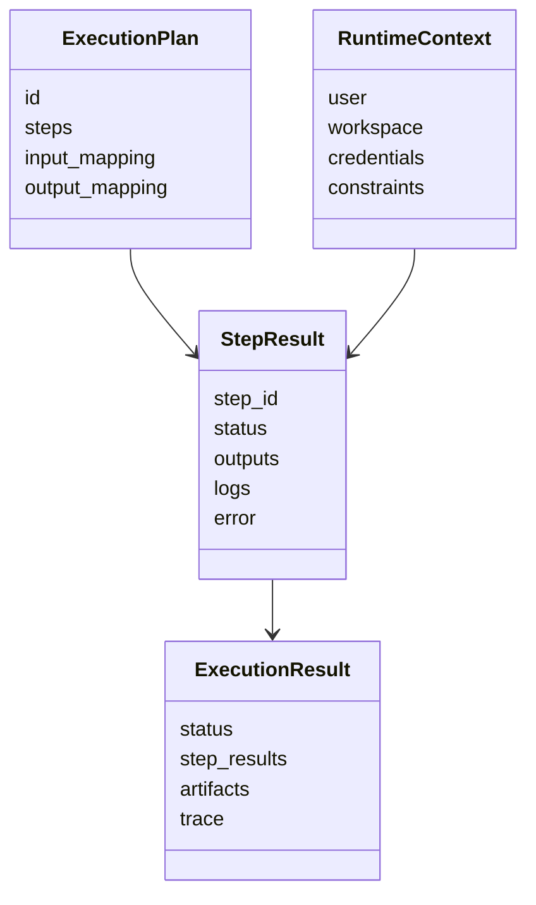
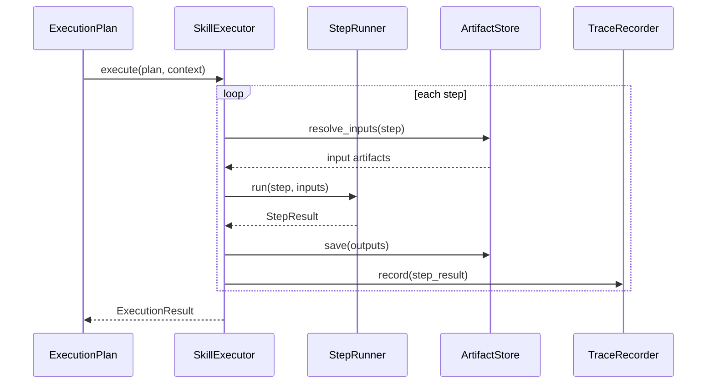

# 执行模块设计说明书

## 1. 模块定位

执行模块负责接收排序后的 ExecutionPlan，并按计划调度 Skill 执行，产出结果、产物和 trace。

当前阶段可以先定义执行接口和数据结构，不要求接入所有真实 Skill 运行时。

## 2. 组件划分

```text
SkillExecutor
ExecutionRuntime
StepRunner
ArtifactStore
TraceRecorder
ExecutionPolicy
```

## 3. 模块 N+1 视图

### 3.1 职责视图

职责：

1. 接收 ExecutionPlan。
2. 按拓扑顺序执行 Skill Step。
3. 管理输入绑定和输出产物。
4. 记录执行 trace。
5. 处理失败、重试和人工确认点。

非职责：

1. 不做 Skill 表征提取。
2. 不构建图。
3. 不生成候选计划。
4. 不决定计划排序。

### 3.2 输入输出视图

输入：

```text
ExecutionPlan
RuntimeContext
InitialArtifacts
ExecutionPolicy
```

输出：

```text
ExecutionResult
  status
  step_results
  artifacts
  trace
  errors
```

### 3.3 数据结构视图



### 3.4 协作视图



### 3.5 约束视图

1. 执行模块只接受结构化 ExecutionPlan，不接受原始用户任务。
2. 每一步执行必须可追踪。
3. 输入输出必须通过 ArtifactStore 传递，避免隐式全局状态。
4. 失败策略必须显式：终止、重试、跳过、人工确认或局部修复。
5. 执行模块未来需要接入权限、安全和审计，但当前阶段只预留边界。

### 3.6 +1 模块场景

输入计划：

```text
1. arxiv_search(topic) -> papers
2. summarize_text(papers) -> summary
3. create_ppt(summary) -> deck
```

执行过程：

1. `ArtifactStore` 提供初始 `topic`。
2. `StepRunner` 执行 `arxiv_search`，保存 `papers`。
3. `summarize_text` 消费 `papers`，保存 `summary`。
4. `create_ppt` 消费 `summary`，保存 `deck`。
5. `TraceRecorder` 记录每一步输入、输出、耗时和错误。
6. 返回 `ExecutionResult(status=success, artifacts=[deck])`。
