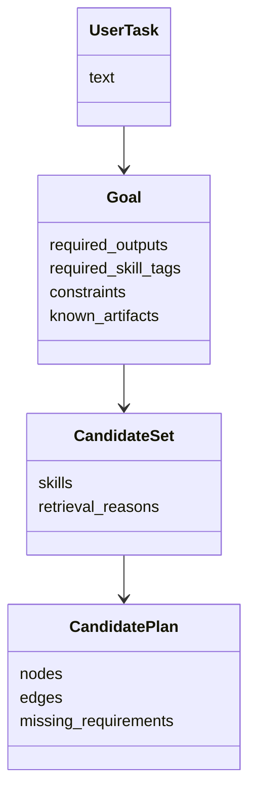
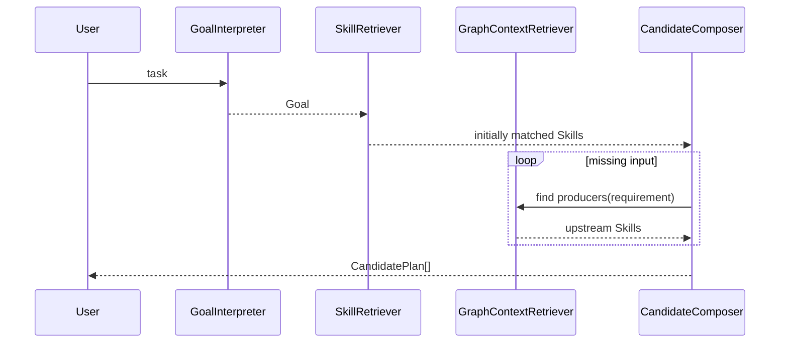

# 编排与检索模块设计说明书

## 1. 模块定位

编排与检索模块负责把用户任务转成结构化目标，并基于离线图谱边检索、边组织候选 Skill 和候选计划。

它的输出不是最终答案，而是候选计划草案。

## 2. 组件划分

```text
BuildArtifactLoader
GoalInterpreter
SkillRetriever
GraphContextRetriever
CandidateComposer
```

## 3. 模块 N+1 视图

### 3.1 职责视图

职责：

1. 加载离线构建产物。
2. 将用户任务解释成 Goal。
3. 根据目标输出、Skill 标签、数据标签召回候选 Skill。
4. 根据输入缺口反向检索上游 Skill。
5. 形成候选计划草案。

非职责：

1. 不做最终排序。
2. 不执行计划。
3. 不重新提取 Skill 表征。
4. 不修改离线图谱。

### 3.2 输入输出视图

输入：

```text
UserTask
BuildArtifact
RuntimeContext
```

输出：

```text
Goal
CandidateSet
CandidatePlan[]
RetrievalTrace
```

### 3.3 数据结构视图



### 3.4 协作视图



### 3.5 约束视图

1. 检索过程必须保留召回理由。
2. 候选计划可以不完整，但必须标注缺失输入。
3. 在线检索只读访问构建产物。
4. 候选生成要限制深度和分支数，避免图搜索爆炸。
5. 用户任务解释可以使用规则或 LLM，但输出必须落到 Goal 结构。

### 3.6 +1 模块场景

用户任务：

```text
帮我搜索 arXiv 上关于 Agent Memory 的论文并总结
```

处理：

1. `GoalInterpreter` 得到：

```text
required_skill_tags = [web_search, research, summarization]
required_outputs = [summary]
known_artifacts = [topic]
```

2. `SkillRetriever` 召回：

```text
arxiv_search
paper_reader
summarize_text
```

3. `CandidateComposer` 根据 `summarize_text` 缺少 `paper`，反向查找能产生 `paper` 的 `arxiv_search`。

4. 输出候选计划：

```text
arxiv_search -> summarize_text
```
