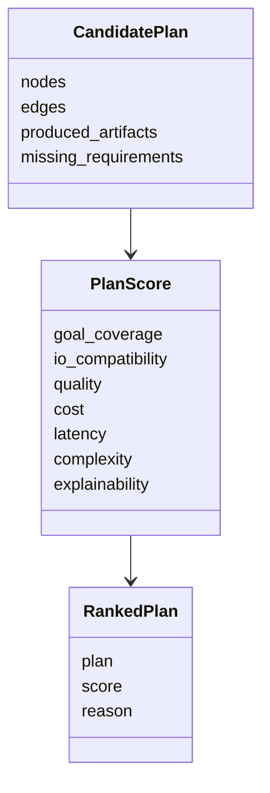
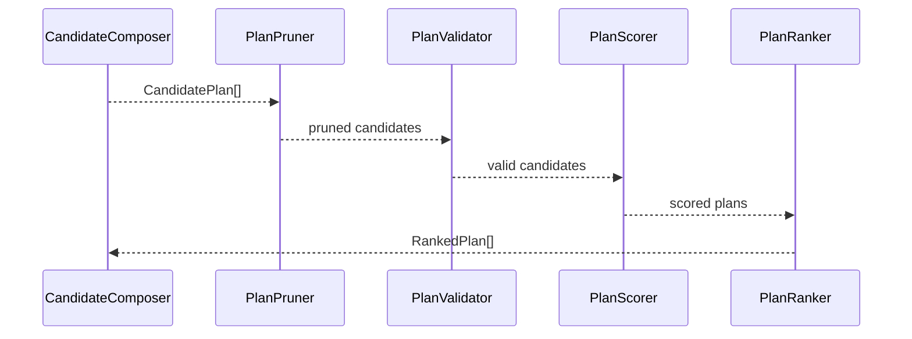

# 裁剪与排序模块设计说明书

## 1. 模块定位

裁剪与排序模块负责从候选计划中选出最值得执行的计划。

编排与检索模块偏“生成候选”，裁剪与排序模块偏“选择候选”。两者必须分开，否则在线规划会变成难以维护的一团规则。

## 2. 组件划分

```text
PlanPruner
PlanValidator
PlanDeduplicator
PlanScorer
PlanRanker
RankingExplainer
```

## 3. 模块 N+1 视图

### 3.1 职责视图

职责：

1. 剪掉输入输出不闭合的计划。
2. 剪掉环路、重复路径和明显冗余 Skill。
3. 验证计划是否覆盖用户目标。
4. 对候选计划评分。
5. 输出排序结果和选择理由。

非职责：

1. 不做初始 Skill 召回。
2. 不调用原始 Skill。
3. 不修改离线图谱。
4. 不负责 UI 展示。

### 3.2 输入输出视图

输入：

```text
CandidatePlan[]
Goal
RuntimeConstraints
```

输出：

```text
RankedPlan[]
PruningReport
RankingReason
```

### 3.3 数据结构视图



### 3.4 协作视图



### 3.5 约束视图

1. 排序必须可解释。
2. 裁剪规则必须记录原因，方便调试。
3. 评分不能只看路径长度，还要看目标覆盖、质量、成本和可控性。
4. 排序模块不能隐藏不可执行计划，应保留诊断摘要。
5. 评分权重应可配置。

### 3.6 +1 模块场景

候选计划：

```text
A: search_and_make_ppt
B: web_search -> summarize_text -> create_ppt
C: web_search -> web_search -> summarize_text -> create_ppt
```

裁剪与排序：

1. C 因重复搜索且没有新增产物，被标记为冗余。
2. A 路径短、速度快，但可解释性较低。
3. B 可解释性高，中间结果可审阅，但成本略高。
4. 如果用户要求“可控、可审阅”，B 排第一。
5. 如果用户要求“快速生成”，A 排第一。
