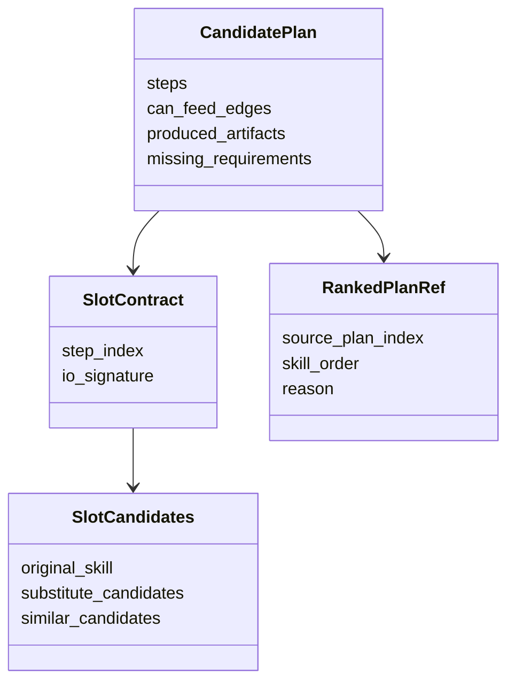
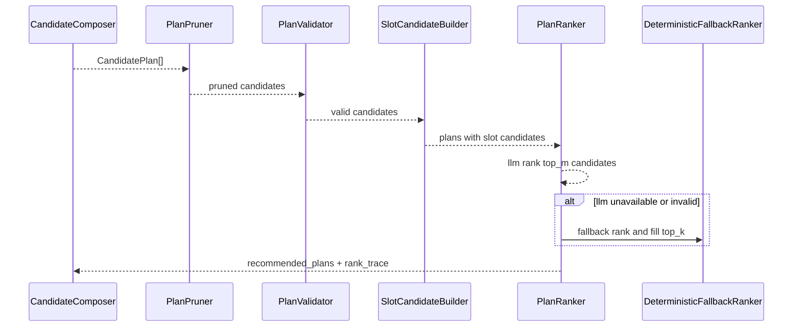

# 裁剪与排序模块设计说明书

## 1. 模块定位

裁剪与排序模块负责从候选计划中选出最值得执行的计划，并在不改变可执行路径结构的前提下，对 plan 内 Skill 做局部替换优化。

编排与检索模块偏“生成候选”，裁剪与排序模块偏“选择与优化候选”。两者分离，避免在线规划逻辑耦合失控。

当前实现遵循“先硬校验、后排序”的保守策略：

1. 先对候选计划执行确定性 hard filter（必需输入、边阈值、显式邻接）。
2. 只允许通过 hard filter 的计划进入排序与推荐。
3. 若通过集合为空，返回保守拒答，不输出可执行推荐。

## 2. 组件划分

```text
PlanPruner
PlanValidator
SlotCandidateBuilder
PlanRanker (LLM default)
DeterministicFallbackRanker
RankingExplainer
RelationFeedbackRecorder
```

## 3. 模块 N+1 视图

### 3.1 职责视图

职责：

1. 剪掉输入输出不闭合或明显不可执行的计划。
2. 验证计划是否覆盖用户目标。
3. 为每个 step 构建 slot 候选池（原 Skill + 可替代 Skill）。
4. 使用 LLM ranker 进行 Top-M 到 Top-K 选择。
5. LLM 失败或返回不足时回退到确定性排序并补齐 Top-K。
6. 记录排序理由、回退状态和替换失败反馈。

非职责：

1. 不做初始 Skill 召回。
2. 不执行计划。
3. 不修改离线图谱。

### 3.2 输入输出视图

输入：

```text
CandidatePlan[]
Goal
RuntimeConstraints
PlanningConfig
```

输出：

```text
recommended_plans
plans
ranking_mode
rank_trace
pruning_report
```

默认行为：

1. 同时返回 `plans` 与 `recommended_plans`。
2. `recommended_plans` 只返回引用与摘要（`source_plan_index`、`skill_order`、`reason`）。
3. 可通过配置关闭 `plans` 输出以精简响应。

### 3.3 数据结构视图



### 3.4 协作视图



### 3.5 约束视图

1. 在线可执行路径只以 `can_feed` 为准。
3. slot 替换采用贪心局部策略，每次替换后都要做整链 I/O 闭合校验；失败立即回退。
5. LLM ranker 只能选择现有候选索引，不能改步骤顺序、不能新增/合并计划。
6. `top_m` 默认 `12`，`top_k` 默认 `3`。
7. 当 LLM 返回索引非法、重复或数量不足时，必须使用确定性排序补齐到 `top_k`。
8. 对外暴露 `ranking_mode=llm|fallback`；详细异常仅写入内部 trace。
9. 排序与替换失败信号写入反馈日志，不在在线阶段直接修改图边。

### 3.6 +1 模块场景

候选计划：

```text
A: web_search -> summarize_text -> create_ppt
B: web_search_pro -> summarize_text -> create_ppt
C: paper_search -> summarize_text -> create_ppt
```

排序过程：

1. 先验证 A/B/C 可执行性和目标覆盖。
3. 若替换后 I/O 不闭合，则回退原 step 并记录 `slot_no_viable_substitute`。
4. LLM ranker 对 top_m 候选排序并返回 `recommended_plans`。
5. 若 LLM 异常，回退到确定性排序并补齐 `top_k`。
