# SkillMash 技能编排系统 N+1 视图

## 1. 视图方法说明

本文使用 N+1 视图描述 SkillMash。

这里的 `N+1` 含义是：

```text
N 个静态或动态视图 + 1 个贯穿场景
```

系统总览采用 `8+1` 视图：

1. 目标视图
2. 领域模型视图
3. 逻辑模块视图
4. 离线构建视图
5. 在线规划视图
6. 技能图谱视图
7. 接口边界视图
8. 部署与产物视图
9. `+1` 贯穿场景

单个模块采用 `5+1` 视图：

1. 职责视图
2. 输入输出视图
3. 数据结构视图
4. 协作视图
5. 约束视图
6. `+1` 模块场景

这样做的目的，是让系统既能从整体上被理解，也能让每个模块在实现时有明确边界。

## 2. 系统总览 6+1 视图

### 2.1 目标视图

SkillMash 要解决的问题是：

```text
技能数量和粒度不断增长，但系统缺少一种结构化方式理解、拆解、复用和编排这些技能。
```

系统目标：

- 注册不同粒度的 Skill。
- 从文件夹形式的 Skill 输入源扫描并解析 `SKILL.md`。
- 离线生成 SkillRegistry、SkillGraph 和 SkillIndex。
- 表达 Skill 之间的包含、依赖、输入输出和可组合关系。
- 找到粗粒度 Skill 内部的最细粒度原子 Skill。
- 根据用户任务生成候选执行方案。
- 在检索和执行之间增加 Skill Compilation 层，把候选 Skill 编译成 typed DAG。
- 支持节点级验证和未来的局部修复。
- 对候选方案评分，输出可解释的 ExecutionPlan。
- 保持核心逻辑与 UI/API 解耦。

非目标：

- 第一版不做真实 Skill 执行。
- 第一版不做安全审计。
- 第一版不做复杂学习型规划。
- 第一版不依赖具体前端框架。

### 2.2 领域模型视图

核心领域对象：

| 对象 | 含义 |
| --- | --- |
| `SkillDefinition` | Skill 的标准定义 |
| `SkillFolder` | 文件夹形式 Skill 的源目录 |
| `RawSkillManifest` | 从 `SKILL.md` 解析出的原始描述 |
| `BuildArtifact` | 离线构建产物 |
| `SkillIndex` | 在线检索使用的索引 |
| `ParameterSpec` | Skill 输入参数 |
| `ArtifactSpec` | Skill 输出产物 |
| `Condition` | 前置或后置条件 |
| `Composition` | 组合结构 |
| `SkillGraph` | Skill 与产物组成的有向图 |
| `MatchResult` | 两个 Skill 的组合匹配结果 |
| `Goal` | 用户任务解析后的目标模型 |
| `ExecutionPlan` | 候选执行计划 |
| `PlanNode` | typed DAG 中的 Skill 调用节点 |
| `PlanEdge` | typed DAG 中的依赖边 |
| `PlanStep` | 执行计划中的单个步骤 |

领域关系：

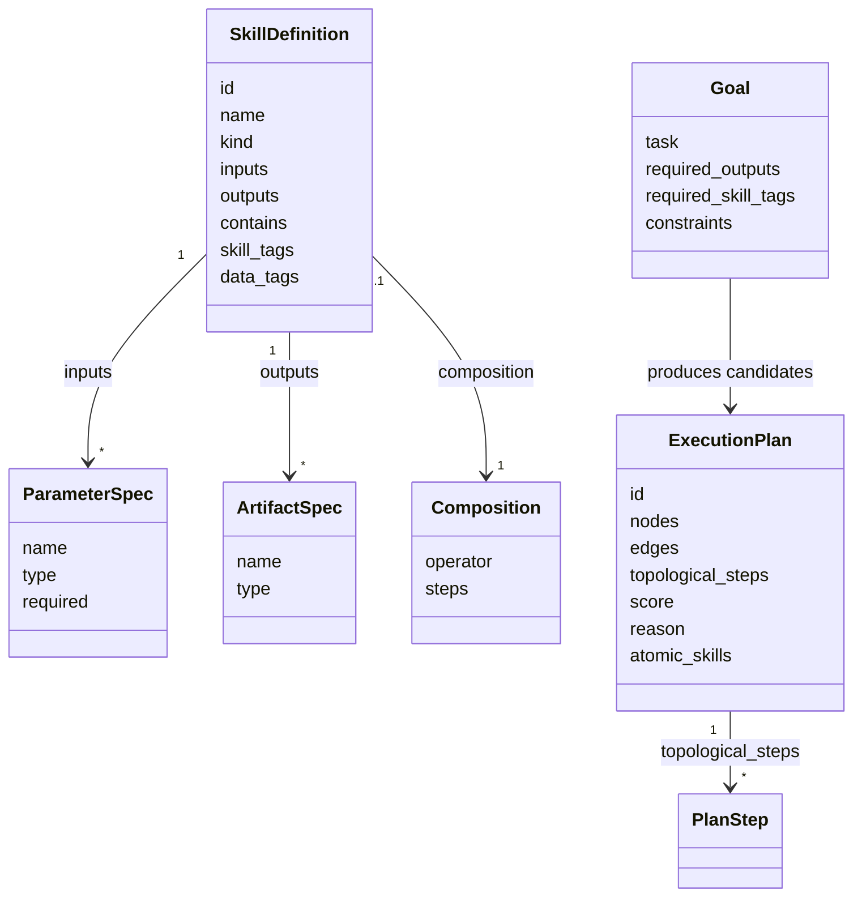

### 2.3 逻辑模块视图

系统分为离线构建层、在线规划层、服务层和展示层。

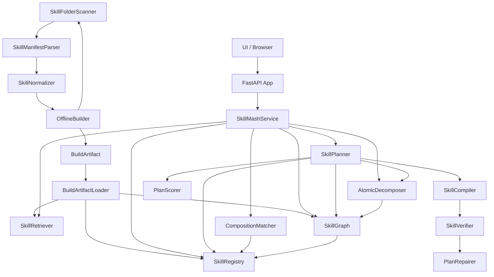

模块职责：

| 模块 | 职责 |
| --- | --- |
| `SkillFolderScanner` | 扫描包含 `SKILL.md` 的 Skill 文件夹 |
| `SkillManifestParser` | 解析 `SKILL.md` frontmatter 和正文 |
| `SkillNormalizer` | 将原始 manifest 转为标准 SkillDefinition |
| `OfflineBuilder` | 生成离线 registry、graph、index、manifest、diagnostics |
| `BuildArtifactLoader` | 在线只读加载离线构建产物 |
| `SkillRetriever` | 在线阶段基于索引召回候选 Skill |
| `SkillRegistry` | 注册、校验、查询 Skill |
| `SkillGraph` | 维护 Skill、产物、typed edge |
| `AtomicDecomposer` | 递归拆解原子 Skill |
| `CompositionMatcher` | 判断两个 Skill 是否可组合 |
| `SkillPlanner` | 从 Goal 生成候选 ExecutionPlan |
| `SkillCompiler` | 将候选 Skill 编译成 typed DAG |
| `SkillVerifier` | 验证 DAG 节点、边、输入绑定和目标可达性 |
| `PlanRepairer` | 对失败节点进行局部图修复 |
| `PlanScorer` | 对候选计划评分 |
| `SkillMashService` | 给 API/UI 提供稳定应用接口 |
| `FastAPI App` | 暴露 HTTP API 和演示页面 |

### 2.4 离线构建视图

离线构建只在 Skill 文件夹发生变化或构建配置变化时运行。

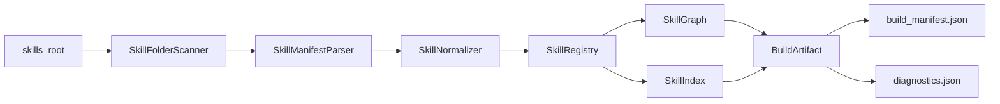

离线产物：

| 产物 | 用途 |
| --- | --- |
| `skills.json` | 标准化 SkillDefinition |
| `skill_graph.json` | SkillGraph 和 typed edges |
| `skill_index.json` | 在线召回索引 |
| `build_manifest.json` | 构建元信息 |
| `diagnostics.json` | 构建诊断 |

### 2.5 在线规划视图

在线规划不扫描文件夹，只加载离线产物。

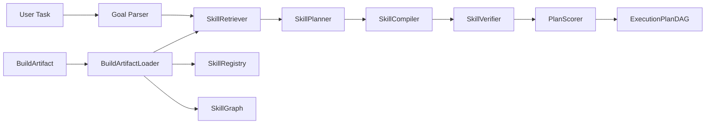

在线输入：

```text
task
runtime_constraints
offline build artifact
```

在线输出：

```text
ExecutionPlanDAG[]
```

### 2.6 技能图谱视图

技能图谱是系统的核心结构。

节点：

- Skill 节点：`web_search`、`summarize_text`、`create_ppt`
- Artifact 节点：`topic`、`search_results`、`summary`、`pptx`

边：

| 边 | 含义 |
| --- | --- |
| `contains` | 粗粒度 Skill 包含细粒度 Skill |
| `consumes` | Skill 消费某种产物 |
| `produces` | Skill 产生某种产物 |
| `can_replace` | Skill 可替代另一个 Skill，未来扩展 |
| `can_compose` | Skill 可组合，未来扩展 |
| `data` | 执行图中前序输出绑定后序输入 |
| `state` | 执行图中前序后置效果满足后序前置条件 |
| `order` | 执行图中软顺序约束 |

示例：

```mermaid
flowchart LR
  topic["artifact:topic"] -->|consumes| web_search["skill:web_search"]
  web_search -->|produces| search_results["artifact:search_results"]
  search_results -->|consumes| read_webpage["skill:read_webpage"]
  read_webpage -->|produces| webpage_content["artifact:webpage_content"]
  webpage_content -->|consumes| summarize_text["skill:summarize_text"]
  summarize_text -->|produces| summary["artifact:summary"]
  summary -->|consumes| generate_outline["skill:generate_outline"]
  generate_outline -->|produces| outline["artifact:outline"]
  outline -->|consumes| create_ppt["skill:create_ppt"]
  create_ppt -->|produces| pptx["artifact:pptx"]

  search_and_make_ppt["skill:search_and_make_ppt"] -->|contains| web_search
  search_and_make_ppt -->|contains| read_webpage
  search_and_make_ppt -->|contains| summarize_text
  search_and_make_ppt -->|contains| generate_outline
  search_and_make_ppt -->|contains| create_ppt
```

### 2.7 接口边界视图

核心层不依赖 HTTP、UI 或前端框架。

```text
UI -> FastAPI -> SkillMashService -> Online Planning Modules -> BuildArtifact
```

API：

| API | 用途 |
| --- | --- |
| `GET /api/skills` | 获取 Skill 列表 |
| `GET /api/graph` | 获取图谱边 |
| `GET /api/decompose` | 拆解原子 Skill |
| `GET /api/match` | 匹配两个 Skill |
| `GET /api/plan` | 根据任务生成计划 |

### 2.8 部署与产物视图

部署拆成两个入口：

```text
skillmash build --skills-root C:\Users\admin\Documents\data\skills --out .skillmash/index
skillmash serve --index .skillmash/index
```

构建产物目录：

```text
.skillmash/index/
  build_manifest.json
  skills.json
  skill_graph.json
  skill_index.json
  diagnostics.json
```

### 2.9 +1 贯穿场景：搜索 AI Agent 趋势并生成 PPT

离线阶段：

```text
扫描 C:\Users\admin\Documents\data\skills
解析 aris-arxiv、academic-researcher 等 Skill
生成 skills.json、skill_graph.json、skill_index.json
```

用户输入：

```text
帮我搜索 AI Agent 最新趋势，并生成 PPT
```

任务解析：

```json
{
  "required_outputs": ["pptx"],
  "required_skill_tags": ["web_search", "slide_generation"],
  "known_artifacts": ["topic"],
  "constraints": {
    "fresh_information": true
  }
}
```

候选计划：

```text
Plan A:
research_topic -> generate_outline -> create_ppt

Plan B:
web_search -> read_webpage -> summarize_text -> generate_outline -> create_ppt

Plan C:
search_and_make_ppt
```

系统返回：

- 每个计划的步骤。
- 每个步骤的输入输出映射。
- 每个计划的原子 Skill 集合。
- 每个计划的评分和选择理由。

## 3. 模块 N+1 视图

## 3.1 SkillFolderScanner 5+1 视图

### 职责视图

`SkillFolderScanner` 负责从真实目录树中发现 Skill。

它解决的问题：

- Skill 输入源是文件夹，不是手写 JSON。
- 哪些目录应该被识别为 Skill。
- 分类目录如何跳过。
- 如何保留文件系统路径，方便后续解析和 UI 跳转。

### 输入输出视图

输入：

```text
skills_root
```

输出：

```text
SkillFolder[]
```

### 数据结构视图

SkillFolder：

```json
{
  "id_hint": "aris-arxiv",
  "path": "C:\\Users\\admin\\Documents\\data\\skills\\aris-arxiv",
  "entry": "SKILL.md",
  "relative_path": "aris-arxiv"
}
```

### 协作视图

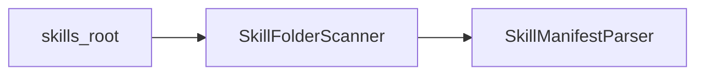

### 约束视图

- 只有包含 `SKILL.md` 的目录才注册为 Skill folder。
- 没有 `SKILL.md` 的目录视为分类目录。
- 扫描应支持嵌套目录。
- 扫描结果需要稳定排序，避免 UI 和测试不稳定。

### +1 场景

扫描：

```text
C:\Users\admin\Documents\data\skills
```

发现：

```text
academic-researcher\SKILL.md
aris-arxiv\SKILL.md
agents\langchain\SKILL.md
```

跳过：

```text
agents\
```

因为它没有自己的 `SKILL.md`。

## 3.2 SkillManifestParser 5+1 视图

### 职责视图

`SkillManifestParser` 负责解析 Skill 文件夹中的 `SKILL.md`。

它解决的问题：

- 如何从 Markdown frontmatter 中提取结构化元数据。
- 如何保留 Markdown 正文，供后续语义抽取。
- 如何识别输入提示、工具约束和版本信息。

### 输入输出视图

输入：

```text
SkillFolder
```

输出：

```text
RawSkillManifest
```

### 数据结构视图

RawSkillManifest：

```json
{
  "name": "aris-arxiv",
  "description": "Search, download, and summarize academic papers from arXiv.",
  "argument_hint": "[query-or-arxiv-id]",
  "allowed_tools": ["Bash(*)", "Read", "Write"],
  "metadata": {
    "version": "1.0.0"
  },
  "body": "# arXiv Paper Search & Download..."
}
```

### 协作视图

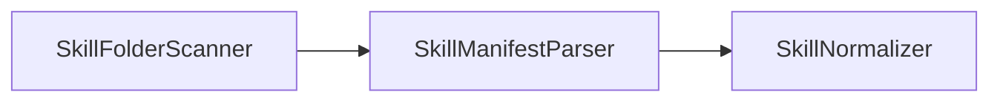

### 约束视图

- frontmatter 缺失时仍应保留正文，但标记为不完整。
- YAML 解析失败时返回诊断信息。
- Parser 不负责判断 Skill 是否原子或组合。
- Parser 不做复杂语义理解，只做结构提取。

### +1 场景

解析 `aris-arxiv/SKILL.md`：

1. 读取 frontmatter。
2. 提取 `name=aris-arxiv`。
3. 提取 `description`。
4. 提取 `argument-hint`。
5. 保存正文 workflow。

## 3.3 SkillNormalizer 5+1 视图

### 职责视图

`SkillNormalizer` 负责将 `RawSkillManifest` 转成标准 `SkillDefinition`。

它解决的问题：

- 文件夹 Skill 如何进入统一注册模型。
- `argument-hint` 如何初步变成输入参数。
- description 和正文如何生成初始 Skill 标签。
- 无法确定的输出如何占位。

### 输入输出视图

输入：

```text
RawSkillManifest
SkillFolder
```

输出：

```text
SkillDefinition
normalization warnings
```

### 数据结构视图

生成的 SkillDefinition 包含：

```text
id
name
kind
description
inputs
outputs
skill_tags
data_tags
source
```

### 协作视图

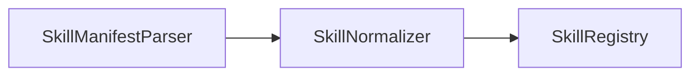

### 约束视图

- 默认 kind 可先设为 `wrapped`。
- 输出类型未知时设为 `unknown`，不能强行猜测。
- source path 必须保留。
- 生成结果应能被 `SkillRegistry` 校验。

### +1 场景

`argument-hint: [query-or-arxiv-id]` 被转换为：

```json
{
  "name": "query_or_arxiv_id",
  "type": "text",
  "required": true
}
```

## 3.4 OfflineBuilder 5+1 视图

### 职责视图

`OfflineBuilder` 负责编排离线构建流程。

它解决的问题：

- 如何从文件夹 Skill 生成可复现的在线索引。
- 如何把扫描、解析、标准化、图谱构建串起来。
- 如何输出构建诊断，方便修复坏 Skill。

### 输入输出视图

输入：

```text
skills_root
output_dir
build_config
```

输出：

```text
BuildArtifact
diagnostics
```

### 数据结构视图

BuildArtifact：

```json
{
  "version": "1",
  "source_root": "C:\\Users\\admin\\Documents\\data\\skills",
  "skills": "skills.json",
  "graph": "skill_graph.json",
  "indexes": "skill_index.json",
  "diagnostics": "diagnostics.json"
}
```

### 协作视图

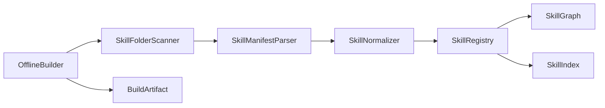

### 约束视图

- 构建产物必须可复现。
- 构建失败不能影响在线服务现有索引。
- 诊断信息必须保留。
- 第一版可以全量构建，后续再做增量构建。

### +1 场景

执行：

```text
skillmash build --skills-root C:\Users\admin\Documents\data\skills --out .skillmash/index
```

输出：

```text
skills.json
skill_graph.json
skill_index.json
build_manifest.json
diagnostics.json
```

## 3.5 BuildArtifactLoader 5+1 视图

### 职责视图

`BuildArtifactLoader` 负责在线服务启动时加载离线产物。

它解决的问题：

- 在线阶段不扫描文件夹。
- 在线阶段只读加载构建产物。
- 构建产物版本不兼容时及时失败。

### 输入输出视图

输入：

```text
index_dir
```

输出：

```text
readonly registry
readonly graph
skill index
diagnostics summary
```

### 数据结构视图

加载对象：

```text
SkillRegistry
SkillGraph
SkillIndex
BuildManifest
```

### 协作视图

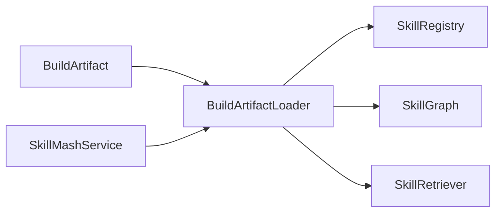

### 约束视图

- Loader 不修改构建产物。
- 构建版本不兼容时拒绝启动。
- 缺少关键文件时拒绝启动。
- diagnostics 可以展示，但不影响只读加载。

### +1 场景

在线服务启动：

```text
skillmash serve --index .skillmash/index
```

Loader 读取构建产物，并初始化在线规划所需的只读对象。

## 3.6 SkillRetriever 5+1 视图

### 职责视图

`SkillRetriever` 负责在线阶段从索引中召回候选 Skill。

它解决的问题：

- 用户任务不应该扫描全量 Skill。
- 召回数量需要受控。
- 召回需要结合输出、标签、输入类型和文本。

### 输入输出视图

输入：

```text
Goal
SkillIndex
retrieval_config
```

输出：

```text
candidate SkillDefinition[]
```

### 数据结构视图

索引：

```text
output_type -> skill_id[]
input_type -> skill_id[]
skill_tag -> skill_id[]
data_tag -> skill_id[]
text_terms -> skill_id[]
```

### 协作视图

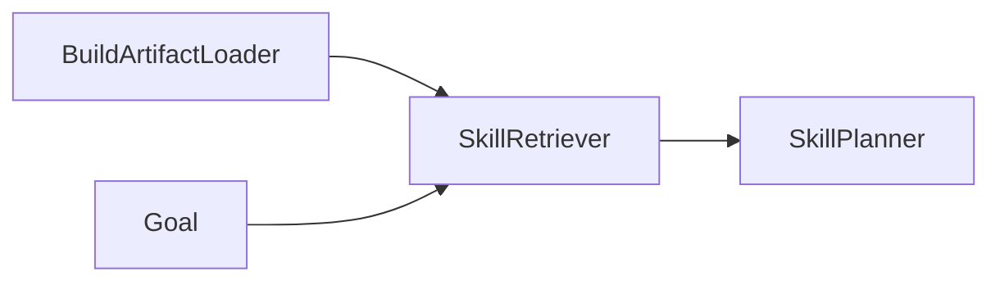

### 约束视图

- 召回数量应有上限。
- 检索结果应有理由和分数。
- 不应在在线阶段解析 `SKILL.md`。
- 过度召回应交给 SkillCompiler 进一步过滤。

### +1 场景

Goal 需要：

```text
required_outputs = ["pptx"]
required_skill_tags = ["web_search", "slide_generation"]
```

Retriever 从 `skill_index.json` 召回：

```text
search_and_make_ppt
web_search
create_ppt
research_topic
```

## 3.7 SkillRegistry 5+1 视图

### 职责视图

`SkillRegistry` 负责保存所有 `SkillDefinition`，并提供基础查询功能。

它解决的问题：

- Skill 如何注册。
- Skill ID 如何保持唯一。
- Skill 定义如何校验。
- 如何按输入、输出、标签、文本查询 Skill。

### 输入输出视图

输入：

```text
SkillDefinition
skill_id
output_type
input_type
skill_tag
query_text
```

输出：

```text
registered skill
SkillDefinition
SkillDefinition[]
validation error
```

### 数据结构视图

核心结构：

```text
dict[skill_id, SkillDefinition]
```

索引第一版可以即时扫描，后续可以扩展为：

```text
output_type -> skill_id[]
input_type -> skill_id[]
skill_tag -> skill_id[]
data_tag -> skill_id[]
```

### 协作视图

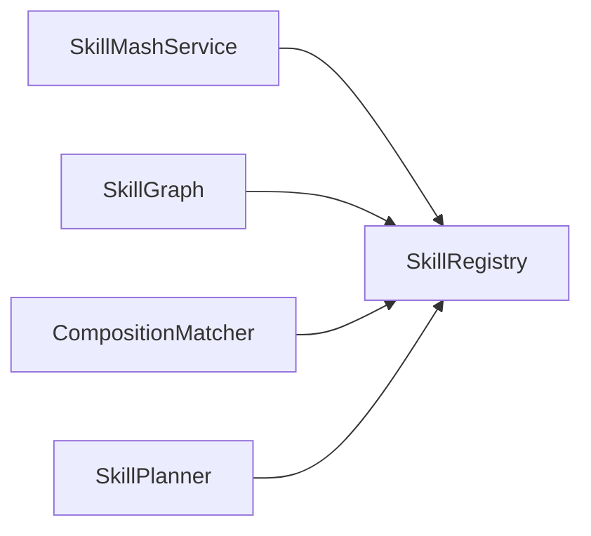

### 约束视图

- `id` 必须唯一。
- 原子 Skill 必须有输入和输出。
- 组合 Skill 或封装 Skill 必须声明 `contains` 或 `composition`。
- `contains` 引用的 Skill 必须存在。

### +1 场景

注册 `search_and_make_ppt`：

1. 检查 ID 是否重复。
2. 检查 `kind=wrapped` 是否合法。
3. 检查输出是否包含 `pptx`。
4. 检查 `contains` 中的子 Skill 是否存在。
5. 注册成功后，供 `SkillGraph` 构建边。

## 3.8 SkillGraph 5+1 视图

### 职责视图

`SkillGraph` 负责把 Skill 定义转换为图结构。

它解决的问题：

- 粗 Skill 包含哪些细 Skill。
- 哪些 Skill 可以产生某个产物。
- 哪些 Skill 需要消费某个产物。
- `contains` 是否形成环。

### 输入输出视图

输入：

```text
SkillRegistry
SkillDefinition
edge(source, target, type)
artifact_type
skill_id
```

输出：

```text
children skill_id[]
producer skill_id[]
consumer skill_id[]
input artifact[]
output artifact[]
cycle error
```

### 数据结构视图

核心结构：

```text
Edge {
  source
  target
  type
  metadata
}
```

内部索引：

```text
out_edges[source] -> Edge[]
in_edges[target] -> Edge[]
```

### 协作视图

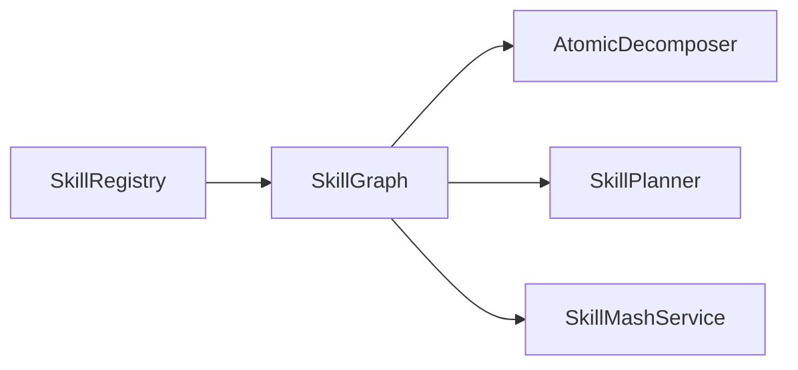

### 约束视图

- `contains` 关系必须无环。
- Artifact 节点使用稳定命名，例如 `artifact:pptx`。
- `inputs` 应同步为 `consumes` 边。
- `outputs` 应同步为 `produces` 边。

### +1 场景

查询谁能产生 `pptx`：

1. 将 `pptx` 转成 `artifact:pptx`。
2. 查询该节点的入边。
3. 筛选 `type=produces`。
4. 返回 source Skill，例如 `create_ppt`、`search_and_make_ppt`。

## 3.9 AtomicDecomposer 5+1 视图

### 职责视图

`AtomicDecomposer` 负责沿 `contains` 边递归展开 Skill。

它解决的问题：

- 一个粗粒度 Skill 最终由哪些原子 Skill 组成。
- 多层组合如何展开。
- 重复原子 Skill 如何去重。
- 展示层如何得到树形结构。

### 输入输出视图

输入：

```text
skill_id
```

输出：

```text
atomic skill_id[]
decomposition tree
cycle error
```

### 数据结构视图

平铺结果：

```json
["web_search", "read_webpage", "summarize_text"]
```

树形结果：

```json
{
  "id": "research_topic",
  "children": [
    {"id": "web_search", "children": []}
  ]
}
```

### 协作视图

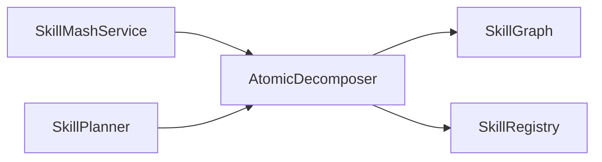

### 约束视图

- 展开过程中必须记录访问路径，防止循环。
- 原子 Skill 的判断以 `kind=atomic` 或没有 children 为准。
- 输出顺序保持发现顺序。
- 平铺结果需要去重。

### +1 场景

拆解 `search_and_make_ppt`：

```text
search_and_make_ppt
  -> web_search
  -> read_webpage
  -> summarize_text
  -> generate_outline
  -> create_ppt
```

返回原子 Skill：

```text
web_search, read_webpage, summarize_text, generate_outline, create_ppt
```

## 3.10 CompositionMatcher 5+1 视图

### 职责视图

`CompositionMatcher` 负责判断两个 Skill 是否可以组合。

它解决的问题：

- 前序 Skill 的输出是否能满足后序 Skill 的输入。
- 是否需要轻量转换。
- 参数映射应该如何生成。
- 匹配结果是否可解释。

### 输入输出视图

输入：

```text
source_skill_id
target_skill_id
```

输出：

```text
MatchResult {
  composable
  operator
  compatibility
  score
  input_mapping
  notes
}
```

### 数据结构视图

匹配结果示例：

```json
{
  "source_skill_id": "web_search",
  "target_skill_id": "read_webpage",
  "composable": true,
  "operator": "sequential",
  "compatibility": "exact_match",
  "input_mapping": {
    "results": "web_search.results"
  }
}
```

### 协作视图

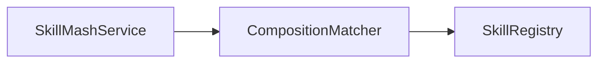

### 约束视图

- 完全匹配优先于转换匹配。
- 必需输入无法满足时不能判定为完全可组合。
- 匹配结果必须带说明，方便 UI 展示和调试。
- 第一版默认只判断顺序组合。

### +1 场景

匹配：

```text
web_search -> read_webpage
```

判断过程：

1. `web_search` 输出 `search_results`。
2. `read_webpage` 输入需要 `search_results`。
3. 类型完全匹配。
4. 返回 `exact_match`。

## 3.11 SkillPlanner 5+1 视图

### 职责视图

`SkillPlanner` 负责从用户任务生成候选执行计划。

它解决的问题：

- 用户自然语言任务如何转成 Goal。
- 目标产物如何反向找到生产 Skill。
- 中间输入缺口如何补齐。
- 粗 Skill、原子 Skill 链、混合 Skill 链如何同时保留。

### 输入输出视图

输入：

```text
task
Goal
max_depth
max_plans
```

输出：

```text
ExecutionPlan[]
```

### 数据结构视图

Goal：

```json
{
  "task": "帮我搜索 AI Agent 最新趋势，并生成 PPT",
  "required_outputs": ["pptx"],
  "required_skill_tags": ["web_search", "slide_generation"],
  "known_artifacts": ["topic"],
  "constraints": {
    "fresh_information": true
  }
}
```

ExecutionPlan：

```json
{
  "id": "plan_001",
  "steps": [],
  "score": 0.79,
  "reason": "matched required output and skill tags",
  "atomic_skills": []
}
```

### 协作视图

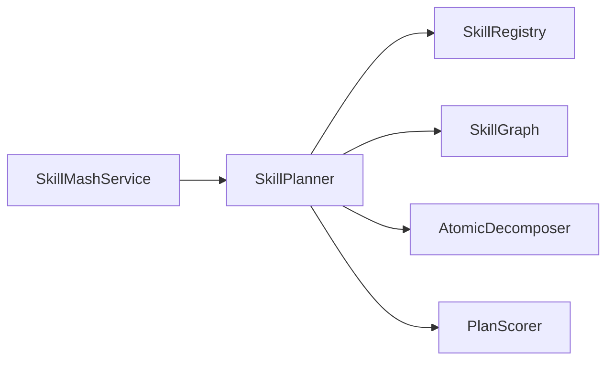

### 约束视图

- 规划器只生成计划，不执行 Skill。
- 规划深度需要有限制。
- 每个缺口最多召回有限候选，避免搜索爆炸。
- 计划需要保留原始粒度，同时提供原子 Skill 展开结果。

### +1 场景

目标是 `pptx`：

1. 找到能产生 `pptx` 的 Skill。
2. 发现 `create_ppt` 需要 `outline`。
3. 找到 `generate_outline`。
4. 继续补齐 `summary`、`webpage_content`、`search_results`。
5. 生成多条候选计划。
6. 调用 `PlanScorer` 排序。

## 3.12 PlanScorer 5+1 视图

### 职责视图

`PlanScorer` 负责给候选计划打分。

它解决的问题：

- 多条可行计划如何排序。
- 目标输出是否满足。
- Skill 标签是否覆盖。
- 质量、延迟、复杂度如何影响选择。

### 输入输出视图

输入：

```text
ExecutionPlan
required_skill_tags
constraints
```

输出：

```text
score
reason
```

### 数据结构视图

评分组成：

```text
score =
  output_match
  + skill_tag_match
  + reliability
  + explainability
  + freshness
  - latency_cost
  - complexity_cost
```

### 协作视图

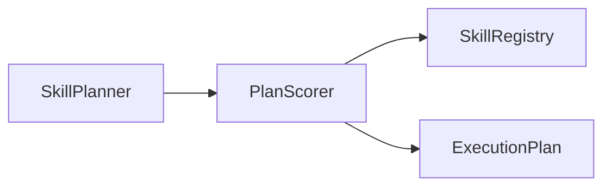

### 约束视图

- 不完整计划分数为 0。
- 分数范围控制在 0 到 1。
- 评分理由必须可读。
- 第一版使用规则评分，未来可替换为学习型排序器。

### +1 场景

如果用户任务要求最新信息：

1. `constraints.fresh_information=true`。
2. 评分器读取每个 Skill 的 freshness。
3. 新鲜度高的路径得分略高。
4. 仍然保留其他候选计划，方便用户比较。

## 3.13 ExecutionPlan 5+1 视图

### 职责视图

`ExecutionPlan` 是规划器输出的结构化执行方案。

它解决的问题：

- 执行计划如何表达。
- 步骤顺序如何保存。
- 输入输出映射如何保存。
- 原子 Skill 展开结果如何保存。
- 为什么选择该方案如何解释。

### 输入输出视图

输入：

```text
PlanStep[]
score
reason
produced_artifacts
atomic_skills
missing_requirements
```

输出：

```text
dict for API/UI
status
```

### 数据结构视图

```json
{
  "id": "plan_001",
  "status": "ready",
  "steps": [
    {
      "skill_id": "web_search",
      "operator": "sequential",
      "input_mapping": {
        "query": "task"
      },
      "output_mapping": {
        "results": "search_results"
      }
    }
  ]
}
```

### 协作视图

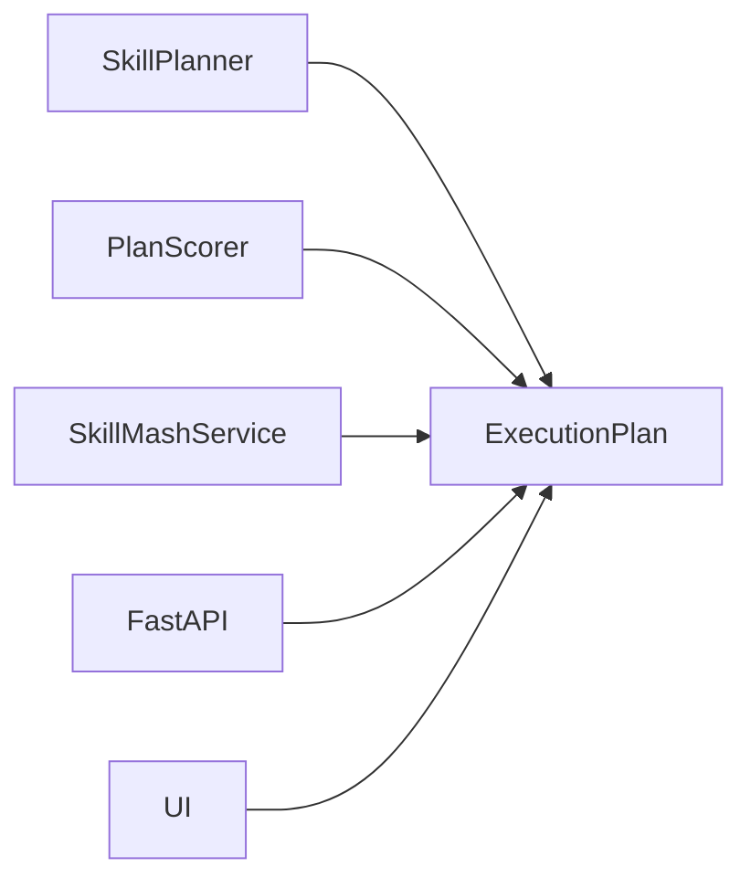

### 约束视图

- `missing_requirements` 为空时，状态为 `ready`。
- `missing_requirements` 非空时，状态为 `incomplete`。
- Plan 不执行 Skill，只描述执行方式。
- Plan 必须能序列化为 JSON。

### +1 场景

UI 展示计划：

1. API 返回 ExecutionPlan JSON。
2. UI 展示步骤链。
3. UI 展示原子 Skill。
4. UI 展示 score 和 reason。
5. 用户可以比较多条计划。

## 3.14 SkillMashService 5+1 视图

### 职责视图

`SkillMashService` 是应用门面，隔离 UI/API 和核心模块。

它解决的问题：

- UI 不直接依赖核心模块内部结构。
- API 不重复编排核心模块。
- 后续替换 UI 或 API 框架时，核心逻辑不变。

### 输入输出视图

输入：

```text
skill_id
source_skill_id
target_skill_id
task
```

输出：

```text
skill dict
decomposition dict
match dict
plan dict
graph summary dict
```

### 数据结构视图

服务方法：

```text
list_skills()
get_skill(skill_id)
decompose(skill_id)
match(source, target)
plan(task)
graph_summary()
```

### 协作视图

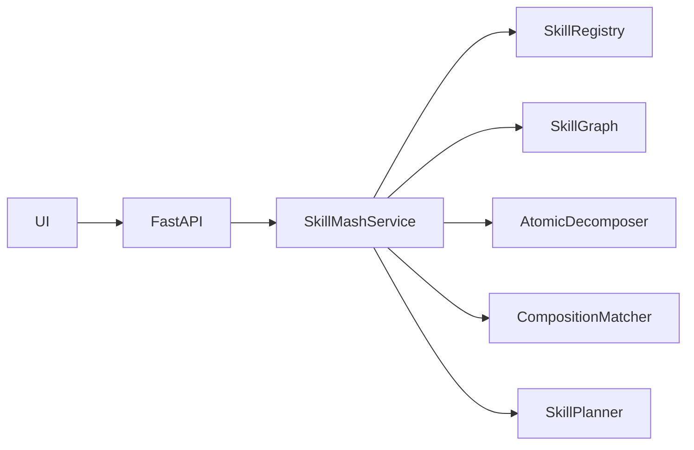

### 约束视图

- Service 不持有 UI 状态。
- Service 返回普通 dict，方便 API 序列化。
- Service 负责组装核心模块，但不实现具体规划算法。
- Service 是外部应用接入的稳定边界。

### +1 场景

用户在 UI 点击“原子拆解”：

1. UI 请求 `/api/decompose?skill_id=search_and_make_ppt`。
2. FastAPI 调用 `SkillMashService.decompose`。
3. Service 调用 `AtomicDecomposer`。
4. 返回原子 Skill 和树形结构。
5. UI 展示结果。

## 3.15 API/UI 5+1 视图

### 职责视图

API/UI 负责演示和交互，不负责核心算法。

它解决的问题：

- 用户如何查看 Skill。
- 用户如何触发拆解、匹配、规划。
- 用户如何比较候选计划。
- 用户如何查看图谱边。

### 输入输出视图

输入：

```text
HTTP GET request
query params
```

输出：

```text
HTML
JSON
```

### 数据结构视图

HTTP API：

```text
GET /
GET /api/skills
GET /api/graph
GET /api/decompose
GET /api/match
GET /api/plan
```

### 协作视图


### 约束视图

- UI 不直接 import 核心模块。
- UI 只通过 HTTP API 获取数据。
- FastAPI 层不包含规划算法。
- 页面展示可以替换，不影响核心模块。

### +1 场景

用户输入任务：

```text
帮我搜索 AI Agent 最新趋势，并生成 PPT
```

流程：

1. UI 调用 `/api/plan`。
2. API 调用 `SkillMashService.plan`。
3. Service 调用 Planner。
4. Planner 返回多条 ExecutionPlan。
5. UI 展示候选方案、步骤和评分。

## 3.16 SkillCompiler 5+1 视图

### 职责视图

`SkillCompiler` 负责把候选 Skill 编译为 typed DAG。

它解决的问题：

- 检索出来的 Skill 如何从平铺集合变成结构化执行图。
- 哪些 Skill 应该被保留，哪些应该被剔除。
- 输入输出如何绑定。
- 前置条件和后置效果如何连接。
- 软顺序约束如何表达。

### 输入输出视图

输入：

```text
Goal
retrieved_skills
known_artifacts
constraints
```

输出：

```text
ExecutionPlanDAG
compile diagnostics
```

### 数据结构视图

PlanNode：

```json
{
  "id": "node_web_search",
  "skill_id": "web_search",
  "args": {
    "query": "task.topic"
  },
  "status": "pending",
  "confidence": 0.86,
  "repair_budget": 2
}
```

PlanEdge：

```json
{
  "source": "node_web_search",
  "target": "node_read_webpage",
  "type": "data",
  "binding": {
    "results": "documents"
  },
  "hard": true
}
```

边类型：

| 类型 | 含义 |
| --- | --- |
| `data` | output 到 input 的绑定 |
| `state` | postcondition 到 precondition 的满足关系 |
| `order` | 经验或资源导致的软顺序关系 |

### 协作视图

```mermaid
flowchart LR
  Planner["SkillPlanner"] --> Compiler["SkillCompiler"]
  Compiler --> Registry["SkillRegistry"]
  Compiler --> Graph["SkillGraph"]
  Compiler --> Verifier["SkillVerifier"]
  Compiler --> Plan["ExecutionPlan"]
```

### 约束视图

- 输出必须是 DAG。
- 硬边不可无理由删除。
- `order` 边可以作为软约束被修复器重连或删除。
- 无法连接到目标的 Skill 不应进入最终计划。
- 每个节点必须有明确 Skill schema 和参数绑定。

### +1 场景

候选 Skill 包含：

```text
web_search
read_webpage
summarize_text
create_ppt
weather_query
```

编译结果：

```text
weather_query 无法连接到 pptx 目标，被剔除。
web_search -> read_webpage -> summarize_text -> create_ppt 被编译为 typed DAG。
```

## 3.17 SkillVerifier 5+1 视图

### 职责视图

`SkillVerifier` 负责验证 ExecutionPlanDAG 的可执行性。

它解决的问题：

- 节点是否有合法 SkillDefinition。
- 必需输入是否被绑定。
- 目标产物是否可达。
- DAG 是否无环。
- 执行过程中每个节点前后条件是否满足。

### 输入输出视图

输入：

```text
ExecutionPlanDAG
current_state
artifact_store
```

输出：

```text
verification report
node status updates
failure event
```

### 数据结构视图

节点状态：

```text
pending
ready
running
verified
failed
skipped
```

失败事件：

```json
{
  "node_id": "node_create_ppt",
  "type": "precondition_failed",
  "message": "outline is missing"
}
```

### 协作视图

```mermaid
flowchart LR
  Compiler["SkillCompiler"] --> Verifier["SkillVerifier"]
  Executor["Executor"] --> Verifier
  Verifier --> Repairer["PlanRepairer"]
```

### 约束视图

- 编译期验证不执行 Skill。
- 执行期验证围绕单个节点进行。
- 验证失败必须产出结构化 failure event。
- 验证器不直接修复，只报告问题。

### +1 场景

执行 `create_ppt` 前：

1. Verifier 检查 `outline` 是否存在。
2. 如果存在，节点变为 `ready`。
3. 执行后检查是否产出 `pptx`。
4. 如果没有产出，生成 `postcondition_failed` 事件。

## 3.18 PlanRepairer 5+1 视图

### 职责视图

`PlanRepairer` 负责在局部范围内修复失败计划。

它解决的问题：

- 失败是否需要全局重规划。
- 是否可以只修复失败节点邻域。
- 已验证节点能否保留。
- 如何替换、插入或重连 Skill。

### 输入输出视图

输入：

```text
ExecutionPlanDAG
failure_event
current_state
repair_budget
```

输出：

```text
patched ExecutionPlanDAG
repair report
global replan request
```

### 数据结构视图

修复算子：

| 算子 | 含义 |
| --- | --- |
| `REBIND` | 重新绑定参数 |
| `INSERT_PREREQ` | 插入前置子图 |
| `SUBSTITUTE` | 替换 Skill |
| `REWIRE` | 调整局部边 |
| `BYPASS` | 跳过节点 |

### 协作视图

```mermaid
flowchart LR
  Verifier["SkillVerifier"] --> Repairer["PlanRepairer"]
  Repairer --> Graph["SkillGraph"]
  Repairer --> Registry["SkillRegistry"]
  Repairer --> Compiler["SkillCompiler"]
  Repairer --> Planner["SkillPlanner"]
```

### 约束视图

- 默认只修复失败节点的局部邻域。
- 已经 `verified` 且不受影响的节点不应被重算。
- 本地修复失败后才升级为全局重规划。
- 全局重规划失败后再回退到 reactive execution。

### +1 场景

`create_ppt` 因缺少 `outline` 失败：

1. Verifier 生成 `precondition_failed`。
2. Repairer 选择 `INSERT_PREREQ`。
3. 查询能产生 `outline` 的 Skill。
4. 插入 `generate_outline` 节点。
5. 增加 `data` edge。
6. 重新验证局部子图。

## 4. 视图到实现文件映射

| 视图对象 | 当前实现文件 |
| --- | --- |
| `SkillDefinition` 等模型 | `skillmash/core/models.py` |
| `SkillRegistry` | `skillmash/core/registry.py` |
| `SkillGraph` | `skillmash/core/graph.py` |
| `AtomicDecomposer` | `skillmash/core/decomposer.py` |
| `CompositionMatcher` | `skillmash/core/matcher.py` |
| `SkillPlanner` | `skillmash/core/planner.py` |
| `SkillCompiler` | 待实现 |
| `SkillVerifier` | 待实现 |
| `PlanRepairer` | 待实现 |
| `PlanScorer` | `skillmash/core/scoring.py` |
| `SkillMashService` | `skillmash/runtime/app_service.py` |
| API/UI | `skillmash/interfaces/api.py`, `skillmash/interfaces/ui_server.py` |

说明：当前代码中图模块文件仍为 `core/graph.py`。设计文档层面统一称为 `SkillGraph`，后续可以同步调整实现命名。


