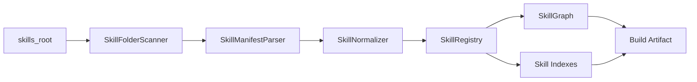
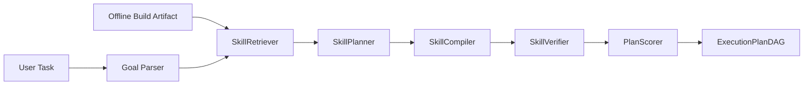
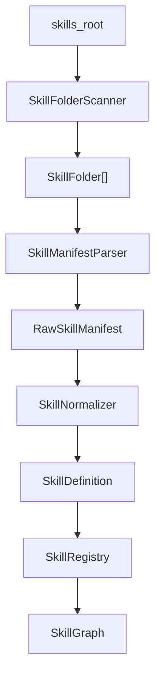

# SkillMash 技能编排系统设计方案

## 1. 设计定位

SkillMash 是一个面向 Agent 技能生态的技能组织、拆解、检索与任务规划系统。它的重点不是简单拼接技能，而是把不同粒度的技能放入统一图谱中管理，并根据用户目标动态生成执行方案。

系统的核心目标是：

1. 注册不同粒度的技能，包括原子技能、组合技能和外部封装技能。
2. 用统一的数据结构描述技能之间的包含、依赖、输入输出和组合关系。
3. 从粗粒度技能中递归拆解出最细粒度原子技能。
4. 根据技能关系编排出更复杂的技能。
5. 当用户提出任务时，系统能够边检索、边组织、边评分，找到较优的执行方案。

当前版本暂不实现安全审计。安全审计、语义一致性检查和组合风险模拟作为未来扩展方向预留接口。

本文设计吸收 GraSP: Graph-Structured Skill Compositions for LLM Agents 的关键思想：在 Skill 检索和 Skill 执行之间增加 Skill Compilation 层，将平铺候选 Skill 编译为 typed DAG，并在执行阶段进行节点级验证和局部修复。

当前 Skill 输入源以文件夹形式存在。例如：

```text
C:\Users\admin\Documents\data\skills
  academic-researcher\
    SKILL.md
  aris-arxiv\
    SKILL.md
  agents\
    langchain\
      SKILL.md
      references\
```

因此，系统需要把“注册 Skill”落到真实目录扫描和 `SKILL.md` 解析流程上。

系统整体拆为两部分：

```text
离线构建：扫描 Skill 文件夹，解析 SKILL.md，生成 SkillRegistry、SkillGraph 和检索索引。
在线规划：加载离线产物，根据用户任务检索 Skill，编译 typed DAG，并生成 ExecutionPlan。
```

离线构建关注“把 Skill 世界组织清楚”，在线规划关注“根据任务快速生成可解释计划”。

系统总览和各模块的 N+1 视图见：

[SkillMash 技能编排系统 N+1 视图](skill-orchestration-n-plus-one-views.md)

### 1.1 背景问题

随着 Agent、插件、工具调用和技能市场的发展，一个系统里可能同时存在大量技能来源：

- 有些技能是非常细的工具函数，例如 `web_search`、`read_file`、`summarize_text`。
- 有些技能是中等粒度的流程，例如 `research_topic`、`translate_document`。
- 有些技能是非常粗的外部 Agent，例如“联网搜索并生成 PPT”“分析数据并生成报告”。
- 有些技能描述很相似，但实际输入、输出、质量、成本和适用场景不同。

如果这些技能只是以列表形式存在，系统会很快遇到几个问题：

1. 不知道一个粗粒度技能内部到底包含哪些技能。
2. 不知道哪些技能是最小可复用单元。
3. 不知道两个技能能不能接起来。
4. 不知道一个用户目标可以由哪些技能链完成。
5. 不知道直接调用粗粒度技能更好，还是拆成多个原子技能更好。
6. 不知道多个候选方案中哪个成本更低、质量更高、可解释性更强。
7. 不知道已有技能能不能复用，导致重复注册、重复实现、重复规划。
8. 当技能数量变多时，人工维护技能关系会变得不可持续。

SkillMash 要解决的核心矛盾是：

```text
技能数量和粒度不断增长，但系统缺少一种结构化方式理解、拆解、复用和编排这些技能。
```

因此，SkillMash 的第一性问题不是“如何执行某个技能”，而是：

```text
如何把技能组织成一个可检索、可拆解、可组合、可规划的技能网络。
```

### 1.2 要解决的具体问题

本系统第一阶段重点解决以下问题。

#### 问题一：技能粒度不一致

同一个系统中可能同时存在：

```text
web_search
search_news
research_topic
search_and_make_ppt
full_research_agent
```

它们都和“搜索”有关，但粒度完全不同。如果没有结构化关系，系统无法判断：

- `search_and_make_ppt` 是否包含 `web_search`。
- `research_topic` 是否可以作为 `search_and_make_ppt` 的前半段。
- `full_research_agent` 能不能替代多个小技能组成的链路。
- 哪些技能才是可复用的原子技能。

解决方式：

- 用 `kind` 区分原子技能、组合技能和封装技能。
- 用 `contains` 表达粗技能和细技能的包含关系。
- 用递归拆解算法找到最细粒度原子技能。
- 用技能图谱避免同一个原子技能在多个组合技能中重复定义。

#### 问题二：技能关系不清楚

很多技能描述是自然语言，例如：

```text
这个技能可以搜索网页并总结结果。
这个技能可以根据大纲生成PPT。
这个技能可以读取网页正文。
```

这些描述对人友好，但对系统不够明确。系统真正需要知道的是：

- 这个技能需要什么输入？
- 它会产生什么输出？
- 它执行前需要满足什么条件？
- 它执行后能满足什么条件？
- 它和哪些技能存在包含、依赖、替代或可组合关系？

解决方式：

- 用统一技能模型描述 `inputs`、`outputs`、`preconditions`、`postconditions`。
- 用 `consumes` 和 `produces` 把技能连接到数据产物。
- 用 typed edge 显式表达关系，而不是只存一段描述文本。

#### 问题三：无法自动判断技能能不能组合

例如：

```text
web_search -> summarize_text
```

这个组合通常是合理的。但系统必须知道：

```text
web_search.outputs.search_results
```

是否能映射到：

```text
summarize_text.inputs.documents
```

再比如：

```text
generate_outline -> create_ppt
```

系统需要确认 `generate_outline` 真的能产出 `outline`，而 `create_ppt` 正好消费 `outline`。

解决方式：

- 先做标签粗筛。
- 再做输入输出兼容性检查。
- 再做前置后置条件匹配。
- 最后检查功能是否互补，避免无意义组合。

#### 问题四：用户任务和技能之间存在语义鸿沟

用户通常不会直接说：

```text
请依次执行 web_search、read_webpage、summarize_text、generate_outline、create_ppt。
```

用户会说：

```text
帮我调研 AI Agent 最新趋势并生成一份 PPT。
```

系统需要把用户目标转换成结构化目标：

```text
required_skill_tags = web_search + summarization + slide_generation
required_output = pptx
constraints = fresh_information + citations
```

解决方式：

- 将用户任务解析为 Goal Model。
- 根据目标输出反向查找可产出该结果的技能。
- 根据中间产物继续倒推依赖。
- 生成多个候选执行方案，而不是只找一个技能。

#### 问题五：存在多种可行方案但缺少选择依据

同一个任务可能有多条路径：

```text
方案 A：search_and_make_ppt
方案 B：web_search -> read_webpage -> summarize_text -> generate_outline -> create_ppt
方案 C：deep_web_search -> summarize_text -> ppt_agent
```

如果系统只要“可行”就返回，会导致结果不可控。不同场景下，最优方案不同：

- 用户追求速度时，可以选择粗粒度技能。
- 用户追求可解释和可控时，可以选择原子技能链。
- 用户追求质量时，可以选择更强但更贵的技能。
- 用户需要审阅中间结果时，应该选择可拆解流程。

解决方式：

- 给每个候选方案计算评分。
- 评分考虑目标匹配、输出匹配、兼容性、质量、成本、复杂度和可解释性。
- 输出选择理由，而不是只输出技能序列。

#### 问题六：技能系统需要长期演进

随着系统发展，会不断出现：

- 新技能。
- 新版本。
- 新组合方式。
- 新数据类型。
- 新执行环境。
- 新的外部 Agent。

如果没有稳定的抽象，系统会逐渐变成不可维护的规则堆。

解决方式：

- 让技能模型稳定。
- 让关系通过图表达。
- 让组合算子可扩展。
- 让规划器和执行器解耦。
- 让安全审计、质量评估、真实执行作为后续模块接入。

### 1.3 系统要回答的关键问题

SkillMash 至少需要稳定回答以下问题：

```text
一个技能是什么？
一个技能需要什么输入？
一个技能会产出什么结果？
一个技能执行前后有哪些条件？
一个粗粒度技能包含哪些子技能？
一个技能最终可以拆成哪些原子技能？
两个技能是否可以顺序组合？
两个技能是否可以并行组合？
多个技能是否能完成某个用户目标？
一个目标有哪些候选执行方案？
哪个候选方案更合适，为什么？
如果缺少某个中间产物，应该补哪个技能？
如果一个技能不可用，有没有替代技能？
```

### 1.4 当前阶段不解决的问题

为了保持第一版边界清晰，以下功能暂不作为 MVP 的必需项：

- 不做完整安全审计。
- 不做真实技能市场治理。
- 不做自动代码漏洞扫描。
- 不要求一开始支持复杂强化学习规划。
- 不要求一开始执行真实外部工具。
- 不要求完全自动理解所有自然语言技能描述。

第一版优先建立技能组织和规划骨架。真实执行、安全审计和智能化优化可以在稳定的数据结构之上逐步加入。

### 1.5 成功标准

第一阶段完成后，系统应该可以做到：

1. 注册一批不同粒度的技能。
2. 查询一个粗粒度技能包含哪些子技能。
3. 递归找出任意技能的原子技能集合。
4. 判断两个技能是否可以组合，并给出参数映射。
5. 根据目标输出，例如 `pptx`，找到可能的技能链。
6. 对多个候选技能链打分并排序。
7. 输出一个可解释的 Execution Plan。
8. 在新增技能时，不需要大规模修改已有技能定义。

## 2. 核心思想

技能不应该被建模为一个平铺列表，也不适合只用树来表达。

更合适的结构是技能图谱：

```text
Skill Graph = Skill Nodes + Artifact Nodes + Typed Edges
```

其中：

- Skill Node 表示技能，例如联网搜索、文本总结、生成 PPT。
- Artifact Node 表示数据产物，例如搜索结果、网页正文、摘要、大纲、PPT 文件。
- Typed Edge 表示技能之间或技能与数据之间的关系。

这种图结构可以同时支持：

- 粗粒度技能向细粒度技能拆解。
- 多个组合技能复用同一个原子技能。
- 根据输入输出自动判断技能是否可连接。
- 根据目标产物反向规划执行路径。
- 根据成本、质量和约束选择更优方案。

## 3. 双阶段架构：离线构建与在线规划

SkillMash 需要明确区分离线构建和在线规划。

如果在线阶段每次都扫描文件夹、解析 Markdown、抽取标签、构建图谱，会导致：

- 响应慢。
- 结果不稳定。
- 线上逻辑复杂。
- 难以缓存和复现。
- 难以定位 Skill 变更对规划结果的影响。

因此，系统采用：

```text
Offline Build Once, Online Plan Many Times
```

### 3.1 离线构建阶段

离线构建阶段从 Skill 文件夹生成结构化产物。

输入：

```text
skills_root
```

例如：

```text
C:\Users\admin\Documents\data\skills
```

处理流程：



离线产物：

| 产物 | 用途 |
| --- | --- |
| `skills.json` | 标准化后的 SkillDefinition 列表 |
| `skill_graph.json` | Skill、Artifact 和 typed edges |
| `skill_index.json` | 按标签、输入、输出、文本建立的检索索引 |
| `build_manifest.json` | 构建时间、源目录、文件 hash、版本信息 |
| `diagnostics.json` | 解析失败、字段缺失、冲突、警告 |

离线阶段负责：

- 扫描 Skill 文件夹。
- 解析 `SKILL.md`。
- 归一化 SkillDefinition。
- 生成初始 `skill_tags` 和 `data_tags`。
- 构建 SkillGraph。
- 检查 `contains` 环。
- 建立检索索引。
- 输出可复现构建产物。

离线阶段不负责：

- 解析用户任务。
- 生成在线执行计划。
- 调用真实 Skill。
- 做运行时修复。

### 3.2 在线规划阶段

在线规划阶段加载离线产物，根据用户任务生成计划。

输入：

```text
task
offline_build_artifact
runtime_constraints
```

处理流程：



在线阶段负责：

- 解析用户任务为 Goal。
- 从索引召回候选 Skill。
- 根据目标产物补齐输入缺口。
- 编译 typed DAG。
- 静态验证 DAG。
- 评分和排序候选计划。
- 返回 ExecutionPlan。

在线阶段不负责：

- 重新扫描 Skill 文件夹。
- 重新解析全部 `SKILL.md`。
- 重建全量 SkillGraph。
- 修改离线构建产物。

### 3.3 离线与在线边界

边界对象是 `BuildArtifact`。

```json
{
  "version": "1",
  "source_root": "C:\\Users\\admin\\Documents\\data\\skills",
  "built_at": "2026-05-14T00:00:00+08:00",
  "skills": "skills.json",
  "graph": "skill_graph.json",
  "indexes": "skill_index.json",
  "diagnostics": "diagnostics.json"
}
```

在线服务只读该产物。

如果 Skill 文件夹发生变化，需要重新执行离线构建：

```text
skillmash build --skills-root C:\Users\admin\Documents\data\skills --out .skillmash/index
```

在线服务启动时加载：

```text
skillmash serve --index .skillmash/index
```

### 3.4 增量构建

第一版可以全量构建。后续支持增量构建。

增量判断依据：

- `SKILL.md` 文件 hash。
- Skill 文件夹路径。
- 资源目录修改时间。
- parser / normalizer 版本。

增量构建策略：

```text
unchanged skill -> reuse previous SkillDefinition
changed skill -> reparse and renormalize
deleted skill -> remove from registry and graph
new skill -> add to registry and graph
```

### 3.5 为什么必须拆成两阶段

两阶段架构带来的收益：

- 在线响应更快。
- 规划结果更稳定。
- Skill 变更可追踪。
- 构建诊断可独立查看。
- 在线服务只读索引，更容易部署。
- 后续可以把离线构建做成批处理，把在线规划做成 API 服务。

## 4. 技能分类

系统中的技能分为三类。

### 4.1 原子技能

原子技能是不能继续拆分，或者系统暂时不再继续拆分的最小技能单元。

示例：

```text
web_search
read_webpage
summarize_text
generate_outline
create_ppt
export_pptx
```

原子技能的判断标准：

```text
skill.contains 为空
```

### 4.2 组合技能

组合技能由多个技能通过组合算子构成。

示例：

```text
research_topic = web_search -> read_webpage -> summarize_text
make_research_ppt = research_topic -> generate_outline -> create_ppt -> export_pptx
```

组合技能本身也可以被其他更大的技能继续组合。

### 4.3 封装技能

封装技能是外部 Agent、插件、工具包或技能市场暴露出来的粗粒度技能。

例如某个外部 Agent 声明：

```text
联网搜索后生成 PPT
```

这个技能在系统内可以被注册为一个 wrapped skill，并映射到内部技能链：

```text
web_search -> read_webpage -> summarize_text -> generate_outline -> create_ppt
```

封装技能的意义是兼容外部生态，同时保留继续拆解和替换的空间。

## 5. 技能形式化模型

参考技能组合的形式化定义，一个技能可以表示为五元组：

```text
S = <I, O, P, Cinit, Cterm>
```

含义如下：

- `I`: 输入空间，描述技能可接受的输入。
- `O`: 输出空间，描述技能会产生的输出。
- `P`: 执行策略，可以是真实函数、API、Agent 调用或组合计划。
- `Cinit`: 前置条件，描述执行前必须满足的条件。
- `Cterm`: 后置条件，描述执行后应满足的条件。

在工程实现中，需要扩展为更完整的结构：

```json
{
  "id": "search_and_make_ppt",
  "name": "联网搜索并生成PPT",
  "kind": "composite",
  "description": "根据主题联网搜索资料，整理内容并生成PPT",
  "version": "1.0.0",
  "inputs": [
    {
      "name": "topic",
      "type": "text",
      "required": true,
      "description": "用户要调研的主题"
    }
  ],
  "outputs": [
    {
      "name": "deck",
      "type": "pptx",
      "description": "生成的PPT文件"
    }
  ],
  "skill_tags": ["web_search", "summarization", "slide_generation"],
  "data_tags": ["text", "webpage", "outline", "pptx"],
  "preconditions": [
    {
      "type": "environment",
      "expression": "network_available",
      "description": "网络可用"
    }
  ],
  "postconditions": [
    {
      "type": "data",
      "expression": "pptx_generated",
      "description": "生成可下载的PPT文件"
    }
  ],
  "contains": [
    "web_search",
    "read_webpage",
    "summarize_text",
    "generate_outline",
    "create_ppt"
  ],
  "composition": {
    "structure": "sequential",
    "steps": []
  },
  "cost": {
    "latency": 8,
    "money": 4,
    "complexity": 5
  },
  "quality": {
    "reliability": 0.86,
    "freshness": 0.9
  }
}
```

## 6. Skill 文件夹输入模型

当前系统的输入不是手写 JSON，而是一个 Skill 目录树。每个 Skill 通常对应一个文件夹，文件夹内以 `SKILL.md` 作为入口。

### 6.1 目录约定

推荐目录结构：

```text
skills_root/
  skill-a/
    SKILL.md
    tools/
    references/
    assets/
  category/
    skill-b/
      SKILL.md
```

约定：

- `SKILL.md` 是 Skill 的主描述文件。
- 文件夹名可作为默认 `skill_id`。
- `SKILL.md` frontmatter 中的 `name` 优先作为 Skill 名称。
- `description` 用于初始语义检索和 Skill 标签抽取。
- `allowed-tools` 可作为执行约束和环境需求来源。
- `argument-hint` 可辅助生成输入参数。
- `metadata.version` 可映射到 Skill 版本。
- `references/`、`tools/`、`assets/` 暂作为资源路径记录，不直接展开为 Skill。

### 6.2 SKILL.md frontmatter 示例

```yaml
---
name: aris-arxiv
description: Search, download, and summarize academic papers from arXiv.
argument-hint: [query-or-arxiv-id]
allowed-tools: Bash(*), Read, Write
license: MIT
metadata:
  author: wanshuiyin/ARIS
  version: "1.0.0"
---
```

解析后生成初始 SkillDefinition：

```json
{
  "id": "aris-arxiv",
  "name": "aris-arxiv",
  "kind": "wrapped",
  "description": "Search, download, and summarize academic papers from arXiv.",
  "version": "1.0.0",
  "source": {
    "type": "folder",
    "root": "C:\\Users\\admin\\Documents\\data\\skills",
    "path": "C:\\Users\\admin\\Documents\\data\\skills\\aris-arxiv",
    "entry": "SKILL.md"
  },
  "inputs": [
    {
      "name": "query_or_arxiv_id",
      "type": "text",
      "required": true
    }
  ],
  "outputs": [
    {
      "name": "result",
      "type": "unknown"
    }
  ],
  "skill_tags": ["arxiv", "search", "download", "summarize"],
  "data_tags": ["paper", "pdf", "text"]
}
```

### 6.3 SkillFolderScanner

`SkillFolderScanner` 负责从根目录发现 Skill。

输入：

```text
skills_root
```

输出：

```text
SkillFolder[]
```

扫描规则：

1. 从根目录递归查找 `SKILL.md`。
2. 每个包含 `SKILL.md` 的目录视为一个 Skill folder。
3. 如果目录只是分类目录，例如 `agents/`，但没有自己的 `SKILL.md`，则不注册为 Skill。
4. Skill ID 默认取相对路径并规范化，例如 `agents/langchain` 可转为 `agents.langchain` 或 `agents-langchain`。
5. 同名冲突时优先使用 frontmatter 中的 `name`，仍冲突则追加路径 hash。

### 6.4 SkillManifestParser

`SkillManifestParser` 负责解析 `SKILL.md`。

解析内容：

| 来源 | 映射字段 |
| --- | --- |
| frontmatter `name` | `SkillDefinition.name` |
| frontmatter `description` | `description` |
| frontmatter `argument-hint` | `inputs` 初始推断 |
| frontmatter `allowed-tools` | `execution_constraints` |
| frontmatter `metadata.version` | `version` |
| markdown headings | workflow hints |
| markdown body | semantic text |

第一版解析策略：

- 必须解析 frontmatter。
- Markdown 正文先整体保存为 `source_text`。
- 输入输出在离线构建阶段由 LLM extractor 提取，并写入构建产物。
- 无法确定的输出类型标记为 `unknown`，后续由 SkillNormalizer 补齐。

### 6.5 SkillNormalizer

`SkillNormalizer` 负责把从文件夹解析出的原始信息规整为标准 `SkillDefinition`。

职责：

- 规范化 Skill ID。
- 规范化输入参数名。
- 根据 description 和正文生成初始 `skill_tags`。
- 根据关键词生成初始 `data_tags`。
- 判断 `kind`：
  - 如果没有明确 contains，默认作为 `wrapped`。
  - 如果后续能拆出 workflow steps，可升级为 `composite`。
  - 如果明确是单一工具调用，可标记为 `atomic`。
- 保存 source 信息，方便 UI 跳转和后续执行。

### 6.6 文件夹输入到注册流程



第一版只需要实现：

```text
scan folders
parse SKILL.md frontmatter
normalize into SkillDefinition
register into SkillRegistry
```

更复杂的 Skill 抽取、workflow 抽取和代码分析后续实现。

## 7. 技能图谱设计

### 7.1 节点类型

技能图谱中有两类核心节点。

```text
SkillNode
ArtifactNode
```

SkillNode 表示技能：

```text
web_search
summarize_text
create_ppt
search_and_make_ppt
```

ArtifactNode 表示数据或状态：

```text
query
search_results
webpage_content
summary
outline
pptx
```

### 7.2 边类型

系统需要显式表达不同关系，避免所有关系都混成 dependency。

| Edge | 含义 | 示例 |
| --- | --- | --- |
| `contains` | 粗技能包含细技能 | `search_and_make_ppt contains web_search` |
| `requires` | 技能执行依赖其他技能 | `create_ppt requires generate_outline` |
| `consumes` | 技能消费某种数据 | `summarize_text consumes webpage_content` |
| `produces` | 技能产出某种数据 | `web_search produces search_results` |
| `can_replace` | 技能可替代另一个技能 | `deep_search can_replace web_search` |
| `can_compose` | 技能之间可组合 | `web_search can_compose summarize_text` |

未来可以扩展：

| Edge | 含义 |
| --- | --- |
| `risk_link` | 两个技能组合存在潜在风险 |
| `conflicts_with` | 两个技能存在冲突 |
| `optimizes` | 一个技能是另一个技能的优化实现 |

## 8. 原子技能发现

### 8.1 定义

如果一个技能没有更细的 `contains` 子技能，则它是原子技能。

```text
atomic(skill) = skill.contains is empty
```

### 8.2 递归拆解

算法：

```text
find_atomic_skills(skill):
  if skill.contains is empty:
    return [skill]

  result = []
  for child in skill.contains:
    result += find_atomic_skills(child)

  return deduplicate(result)
```

示例：

```text
make_research_ppt
  contains research_topic
  contains build_ppt

research_topic
  contains web_search
  contains read_webpage
  contains summarize_text

build_ppt
  contains generate_outline
  contains create_ppt
  contains export_pptx
```

最终原子技能：

```text
web_search
read_webpage
summarize_text
generate_outline
create_ppt
export_pptx
```

### 8.3 循环保护

技能图谱是图，不是树，所以需要防止循环包含。

非法示例：

```text
A contains B
B contains C
C contains A
```

注册技能或更新 `contains` 关系时，需要做环检测。

## 9. 技能组合算子

系统第一版支持四类基础组合算子。

### 9.1 顺序组合

```text
A -> B
```

含义：A 执行完成后，B 消费 A 的输出继续执行。

成立条件：

```text
A.outputs compatible_with B.inputs
A.postconditions satisfy B.preconditions
```

示例：

```text
web_search -> summarize_text
```

### 9.2 并行组合

```text
A || B
```

含义：A 和 B 可以同时执行，之后合并结果。

成立条件：

```text
A and B have no direct data dependency
A and B preconditions can be satisfied at the same time
A.outputs and B.outputs can be merged or jointly consumed
```

示例：

```text
search_web || search_academic_papers
```

### 9.3 选择组合

```text
A xor B
```

含义：A 和 B 能完成相似目标，系统根据上下文选择一个。

成立条件：

```text
A.outputs compatible_with B.outputs
A.capabilities overlap B.capabilities
```

示例：

```text
basic_web_search xor deep_web_search
```

### 9.4 迭代组合

```text
A*
```

含义：重复执行 A，直到满足终止条件。

成立条件：

```text
termination_condition exists
A has no unacceptable side effect
```

示例：

```text
web_search* until enough_valid_sources
```

## 10. 组合匹配规则

组合匹配采用从粗到细的四层过滤。

### 10.1 标签匹配

先用标签快速筛选候选技能。

示例：

```text
web_search 输出 text/search_results
summarize_text 输入 text/documents
```

二者数据标签存在交集，进入下一层检查。

### 10.2 输入输出兼容

判断前序技能输出是否可以作为后续技能输入。

兼容分三类：

```text
exact_match       完全兼容
transform_match   需要轻量转换
no_match          不兼容
```

示例：

```text
search_results(array) -> summarize_text.documents(array)
```

完全兼容。

```text
search_results(array with summary field) -> summarize_text.text(string)
```

可以通过字段提取转换，属于轻量转换。

### 10.3 前置后置条件匹配

判断前序技能执行后的状态是否满足后续技能的前置条件。

示例：

```text
web_search.postcondition = search_results_non_empty
summarize_text.precondition = input_documents_non_empty
```

如果存在明确映射，则可以组合。

### 10.4 功能互补性

避免无意义组合。

合理组合：

```text
搜索 -> 阅读 -> 总结 -> 生成大纲 -> 生成PPT
```

低价值组合：

```text
普通搜索 -> 另一个普通搜索
```

除非这是选择组合、并行多源搜索或质量增强策略，否则应降低评分或排除。

## 11. 任务规划流程

当用户提出任务时，系统不直接选择一个技能，而是生成目标模型，再围绕目标做检索和规划。

规划器要解决的问题是：

```text
给定一个用户目标、当前已知输入、可用技能集合和环境约束，找到一条或多条能产生目标输出的技能执行图。
```

它的输入不是单个技能名称，而是一组目标和约束：

```text
Goal = required_outputs + required_skill_tags + constraints + user_preferences
```

它的输出也不是简单列表，而是可执行计划：

```text
ExecutionPlan = steps + operators + input_mapping + output_mapping + intermediate_artifacts + score + reason
```

从 GraSP 思路看，ExecutionPlan 不应长期停留在线性 steps 结构。第一版可以保留 steps 作为展示和简单执行格式，但目标结构应该升级为 typed DAG：

```text
ExecutionPlan = nodes + edges + topological_steps + score + reason
```

其中：

- `nodes` 表示具体 Skill 调用实例。
- `edges` 表示 Skill 调用之间的依赖关系。
- `topological_steps` 是 DAG 的一种线性化展示。
- `score` 和 `reason` 用于候选计划排序和解释。

### 11.0 规划状态模型

规划过程中需要维护一个状态对象，用来记录“现在已经有什么、还缺什么、可以继续扩展什么”。

```json
{
  "known_artifacts": ["topic"],
  "required_artifacts": ["pptx"],
  "required_skill_tags": ["web_search", "summarization", "slide_generation"],
  "constraints": {
    "fresh_information": true,
    "need_citations": true
  },
  "candidate_steps": [],
  "open_requirements": ["pptx"]
}
```

关键字段：

- `known_artifacts`: 当前已经具备的数据，例如用户输入的 topic。
- `required_artifacts`: 用户最终需要的产物，例如 pptx。
- `required_skill_tags`: 用户任务隐含需要的技能。
- `candidate_steps`: 当前已经选择的技能步骤。
- `open_requirements`: 还没有被满足的产物或技能缺口。

规划过程本质上就是不断减少 `open_requirements`，直到目标被满足，或者确认当前技能库无法完成任务。

### 11.1 用户任务解析

用户输入：

```text
帮我搜索 AI Agent 最新趋势，并生成 PPT
```

解析为：

```json
{
  "intent": "research_and_generate_ppt",
  "required_skill_tags": ["web_search", "summarization", "slide_generation"],
  "required_outputs": ["pptx"],
  "constraints": {
    "fresh_information": true,
    "need_citations": true
  }
}
```

### 11.2 目标反向规划

从目标产物倒推。

```text
需要 pptx
  <- create_ppt produces pptx
  <- create_ppt consumes outline
  <- generate_outline produces outline
  <- generate_outline consumes summary
  <- summarize_text produces summary
  <- summarize_text consumes webpage_content
  <- read_webpage produces webpage_content
  <- web_search produces search_results
```

得到候选链路：

```text
web_search -> read_webpage -> summarize_text -> generate_outline -> create_ppt
```

### 11.3 检索候选技能

检索策略包含：

1. 按目标输出检索：找 `produces pptx` 的技能。
2. 按技能标签检索：找 `web_search`、`summarization`、`slide_generation`。
3. 按数据流检索：找能消费当前中间产物的技能。
4. 按组合技能检索：找已经注册的粗粒度技能。

候选技能检索不应该只查一次。它应该随着规划状态变化持续发生：

```text
初始目标：需要 pptx
  检索 produces=pptx 的技能

发现 create_ppt 需要 outline
  检索 produces=outline 的技能

发现 generate_outline 需要 summary
  检索 produces=summary 的技能

发现 summarize_text 需要 webpage_content
  检索 produces=webpage_content 的技能
```

这个过程是“边检索、边组织”的核心。

### 11.3.1 技能召回来源

规划器可以从多个索引召回技能：

| 召回方式 | 用途 | 示例 |
| --- | --- | --- |
| 按输出类型 | 从目标产物倒推 | `produces=pptx` |
| 按输入类型 | 找能消费当前产物的后继技能 | `consumes=summary` |
| 按技能标签 | 找语义相关技能 | `skill=web_search` |
| 按数据标签 | 找数据流兼容技能 | `data=text` |
| 按包含关系 | 展开组合技能 | `contains=*` |
| 按替代关系 | 找候选替换技能 | `can_replace=web_search` |

### 11.3.2 候选技能过滤

召回后需要过滤，否则规划空间会迅速膨胀。

过滤规则：

1. 不满足硬约束的技能直接排除，例如需要联网但当前环境不允许联网。
2. 输入输出完全不兼容的技能排除。
3. 与目标技能需求无关且不能贡献中间产物的技能排除。
4. 会造成循环依赖的技能排除。
5. 超过最大规划深度的链路停止扩展。

第一版可以设置简单限制：

```text
max_plan_depth = 8
max_candidates_per_requirement = 5
max_generated_plans = 20
```

### 11.4 生成候选方案

系统可能生成多个方案。

方案 A：直接使用粗粒度技能。

```text
search_and_make_ppt
```

方案 B：完全拆成原子技能。

```text
web_search -> read_webpage -> summarize_text -> generate_outline -> create_ppt
```

方案 C：混合方案。

```text
deep_web_search -> summarize_text -> ppt_agent
```

### 11.4.1 缺口补全

生成方案时，规划器需要识别每一步的输入缺口。

例如：

```text
create_ppt requires outline
known_artifacts = ["topic"]
```

此时 `outline` 不存在，所以规划器要继续寻找：

```text
which skill produces outline?
```

找到：

```text
generate_outline produces outline
```

然后继续检查：

```text
generate_outline requires summary
```

如果 `summary` 也不存在，继续补全。

这个过程可以表示为：

```text
while open_requirements is not empty:
  requirement = pop(open_requirements)
  candidates = retrieve_skills_that_satisfy(requirement)
  for candidate in candidates:
    add candidate to partial_plan
    add candidate.unsatisfied_inputs to open_requirements
```

### 11.4.2 粗技能与细技能的取舍

当系统同时发现粗粒度技能和细粒度技能链时，不应该立即丢弃任何一方。

例如：

```text
search_and_make_ppt
```

和：

```text
web_search -> read_webpage -> summarize_text -> generate_outline -> create_ppt
```

都可以满足目标。它们的差异是：

| 维度 | 粗粒度技能 | 原子技能链 |
| --- | --- | --- |
| 速度 | 通常更快 | 通常更慢 |
| 可控性 | 较低 | 较高 |
| 可解释性 | 较低 | 较高 |
| 中间结果检查 | 不方便 | 方便 |
| 替换局部步骤 | 不方便 | 方便 |
| 实现复杂度 | 低 | 高 |

因此，规划器应该保留两种候选方案，然后交给评分器选择。

### 11.4.3 规划终止条件

规划成功的条件：

```text
required_artifacts 全部被产生
required_skill_tags 全部被覆盖
所有步骤的必需输入都能被满足
所有硬约束都被满足
```

规划失败的条件：

```text
某个必需产物找不到生产技能
某个必需输入无法由用户输入或前序技能提供
规划深度超过限制
候选方案全部被过滤
```

失败时不应该只返回“无法完成”，而应该返回缺口：

```json
{
  "status": "failed",
  "missing_requirements": [
    {
      "artifact": "outline",
      "reason": "no skill can produce outline"
    }
  ],
  "suggestion": "注册一个 generate_outline 技能，或提供已有 outline 输入。"
}
```

### 11.5 方案评分

评分公式第一版可以使用规则权重：

```text
score =
  task_match_score
  + output_match_score
  + compatibility_score
  + reliability_score
  + freshness_score
  - latency_cost
  - money_cost
  - complexity_cost
  - transform_penalty
```

评分维度：

- 是否满足用户目标。
- 是否产出目标格式。
- 输入输出是否完全兼容。
- 是否需要额外数据转换。
- 是否支持必要环境，例如联网。
- 信息是否足够新鲜。
- 执行链路是否可解释。
- 成本、延迟和复杂度是否可接受。

### 11.6 输出执行计划

输出结构示例：

```json
{
  "task": "搜索 AI Agent 最新趋势并生成 PPT",
  "selected_plan": {
    "id": "plan_001",
    "score": 0.87,
    "reason": "该方案满足联网检索、内容总结和PPT生成需求，且每一步输入输出可审计。",
    "steps": [
      {
        "skill": "web_search",
        "operator": "sequential",
        "input_mapping": {
          "query": "task.topic"
        },
        "output_mapping": {
          "results": "search_results"
        }
      },
      {
        "skill": "read_webpage",
        "operator": "sequential",
        "input_mapping": {
          "urls": "search_results.urls"
        },
        "output_mapping": {
          "documents": "webpage_content"
        }
      },
      {
        "skill": "summarize_text",
        "operator": "sequential",
        "input_mapping": {
          "documents": "webpage_content"
        },
        "output_mapping": {
          "summary": "research_summary"
        }
      },
      {
        "skill": "generate_outline",
        "operator": "sequential",
        "input_mapping": {
          "content": "research_summary"
        },
        "output_mapping": {
          "outline": "ppt_outline"
        }
      },
      {
        "skill": "create_ppt",
        "operator": "sequential",
        "input_mapping": {
          "outline": "ppt_outline"
        },
        "output_mapping": {
          "deck": "pptx"
        }
      }
    ],
    "atomic_skills": [
      "web_search",
      "read_webpage",
      "summarize_text",
      "generate_outline",
      "create_ppt"
    ]
  }
}
```

## 12. Skill Compilation、验证执行与局部修复

GraSP 论文指出，Skill 系统真正缺失的是位于“检索”和“执行”之间的编译层。检索只回答“哪些 Skill 相关”，执行只回答“下一步做什么”，中间还需要回答：

```text
这些 Skill 如何依赖？
哪些 Skill 应该被剔除？
哪些输入输出需要绑定？
哪些前置条件由哪些后置效果满足？
最终最小可执行图是什么？
```

因此，SkillMash 后续应在 `SkillPlanner` 和真实执行器之间增加：

```text
SkillCompiler -> SkillVerifier -> PlanRepairer
```

### 12.1 SkillCompiler

`SkillCompiler` 负责将候选 Skill 集合编译为 typed DAG。

输入：

```text
Goal
retrieved_skills
known_artifacts
constraints
```

输出：

```text
ExecutionPlanDAG
```

编译职责：

1. 选择最小必要 Skill 子集，避免把过多 Skill 塞入执行上下文。
2. 为每个 Skill 创建调用节点。
3. 根据输入输出建立 `data` 边。
4. 根据前置条件和后置条件建立 `state` 边。
5. 根据经验、资源冲突或用户偏好建立 `order` 边。
6. 校验每个节点的必需输入是否有来源。
7. 删除无法连入目标图的孤立 Skill。
8. 尝试消除环，如果环来自软顺序边，可以删除低置信度 `order` 边。

### 12.2 typed DAG 计划结构

后续 ExecutionPlan 建议使用如下结构：

```json
{
  "id": "plan_001",
  "task": "帮我搜索 AI Agent 最新趋势，并生成 PPT",
  "nodes": [
    {
      "id": "node_web_search",
      "skill_id": "web_search",
      "args": {
        "query": "task.topic"
      },
      "status": "pending",
      "confidence": 0.86,
      "repair_budget": 2
    }
  ],
  "edges": [
    {
      "source": "node_web_search",
      "target": "node_read_webpage",
      "type": "data",
      "binding": {
        "results": "documents"
      },
      "hard": true
    }
  ],
  "topological_steps": [
    "node_web_search",
    "node_read_webpage"
  ],
  "score": 0.87,
  "reason": "目标产物和 Skill 标签均满足，图中所有硬依赖可验证。"
}
```

边类型：

| 边类型 | 含义 | 是否硬约束 |
| --- | --- | --- |
| `data` | 前序输出绑定到后序输入 | 是 |
| `state` | 前序后置效果满足后序前置条件 | 是 |
| `order` | 软顺序约束，例如经验偏好或资源冲突 | 否 |

现有边的映射关系：

| 现有关系 | DAG 编译后的关系 |
| --- | --- |
| `produces` + `consumes` | `data` edge |
| `postconditions` + `preconditions` | `state` edge |
| `contains` | 编译前的粒度展开关系 |
| `can_replace` | `SUBSTITUTE` 修复候选 |
| `can_compose` | 编译候选提示 |

### 12.3 SkillVerifier

`SkillVerifier` 负责节点级验证。

验证分两类：

1. 编译期验证。
2. 执行期验证。

编译期验证：

```text
每个节点是否有 SkillDefinition
每个必需输入是否有绑定
每条 hard edge 是否可解释
目标输出是否可达
DAG 是否无环
```

执行期验证：

```text
precondition check
execute skill
postcondition check
artifact schema check
```

节点状态：

```text
pending
ready
running
verified
failed
skipped
```

第一版可以先做静态验证，不需要真实执行 Skill。

### 12.4 PlanRepairer

`PlanRepairer` 负责在计划失败时进行局部修复，而不是直接全局重规划。

失败事件：

```json
{
  "node_id": "node_create_ppt",
  "type": "precondition_failed",
  "message": "outline is missing",
  "state": {}
}
```

参考 GraSP，SkillMash 可以设计五个修复算子：

| 修复算子 | 含义 | 示例 |
| --- | --- | --- |
| `REBIND` | 重新绑定参数 | 把错误的 `summary.text` 改为 `summary.content` |
| `INSERT_PREREQ` | 插入前置子图 | 缺 `outline` 时插入 `generate_outline` |
| `SUBSTITUTE` | 替换 Skill | `web_search` 替换为 `deep_web_search` |
| `REWIRE` | 调整局部边 | 将 data edge 指向新的中间产物 |
| `BYPASS` | 跳过节点 | 下游需求已满足时跳过重复总结 |

局部修复边界：

```text
只修复 failed node 的 h-hop 邻域
保留已经 verified 的无关节点
修复失败再升级为全局重规划
全局重规划失败再回退到普通 ReAct/手工执行模式
```

### 12.5 与现有模块的关系

引入编译、验证和修复后，模块链路变为：

```text
Task
  -> Goal
  -> SkillRetriever
  -> SkillPlanner
  -> SkillCompiler
  -> SkillVerifier
  -> PlanScorer
  -> ExecutionPlanDAG
  -> Executor
  -> PlanRepairer
```

第一版当前实现中：

- `SkillPlanner` 同时承担了部分检索、补缺和计划生成。
- `ExecutionPlan` 仍以 steps 为主。
- `SkillVerifier` 和 `PlanRepairer` 尚未实现。

后续演进方向：

1. 从 `SkillPlanner` 中拆出 `SkillCompiler`。
2. 将 `ExecutionPlan.steps` 升级为 `nodes + edges + topological_steps`。
3. 增加静态 `SkillVerifier`。
4. 增加 `PlanRepairer` 的 `REBIND`、`INSERT_PREREQ`、`SUBSTITUTE` 三个基础算子。

## 13. 系统模块设计

模块设计的原则是让每个问题都有明确归属，避免所有逻辑都堆在一个 planner 里。

| 问题 | 负责模块 | 说明 |
| --- | --- | --- |
| 技能如何注册和管理 | SkillRegistry | 保存技能定义、版本、标签、输入输出 |
| 技能之间有什么关系 | SkillGraph | 保存 contains、produces、consumes 等 typed edges |
| 粗技能如何拆成原子技能 | AtomicDecomposer | 沿 contains 边递归展开 |
| 两个技能能否组合 | CompositionMatcher | 判断标签、输入输出、条件和功能互补 |
| 用户目标如何变成技能链 | SkillPlanner | 从目标输出反向规划，生成候选计划 |
| 候选 Skill 如何变成 typed DAG | SkillCompiler | 绑定参数、建立 data/state/order 边、过滤无关 Skill |
| 计划是否静态可执行 | SkillVerifier | 检查输入绑定、目标可达、DAG 无环 |
| 计划失败后如何局部修复 | PlanRepairer | REBIND、INSERT_PREREQ、SUBSTITUTE、REWIRE、BYPASS |
| 多个候选方案如何排序 | PlanScorer | 根据质量、成本、兼容性和可解释性打分 |
| 最终方案如何表达 | ExecutionPlan | 保存步骤、参数映射、中间产物和选择理由 |
| 文件夹形式的 Skill 如何导入 | SkillFolderScanner | 扫描包含 `SKILL.md` 的目录 |
| `SKILL.md` 如何解析 | SkillManifestParser | 解析 frontmatter 和 Markdown 正文 |
| 原始 Skill 文档如何标准化 | SkillNormalizer | 转成标准 SkillDefinition |
| 离线构建如何编排 | OfflineBuilder | 生成 registry、graph、index、manifest、diagnostics |
| 在线服务如何加载构建产物 | BuildArtifactLoader | 只读加载离线构建产物 |
| 在线阶段如何召回 Skill | SkillRetriever | 基于离线索引召回候选 Skill |

### 13.1 SkillFolderScanner

负责发现文件夹形式的 Skill。

核心职责：

- 递归扫描 `skills_root`。
- 找到所有包含 `SKILL.md` 的目录。
- 生成 Skill folder 清单。
- 跳过没有 `SKILL.md` 的分类目录。
- 保留相对路径，作为 Skill ID 生成依据。

输入：

```text
skills_root
```

输出：

```text
SkillFolder[]
```

### 13.2 SkillManifestParser

负责解析 Skill 文件夹中的 `SKILL.md`。

核心职责：

- 解析 YAML frontmatter。
- 提取 `name`、`description`、`argument-hint`、`allowed-tools`、`metadata`。
- 保存 Markdown 正文。
- 识别本地资源目录，例如 `tools/`、`references/`、`assets/`。

输入：

```text
SkillFolder
```

输出：

```text
RawSkillManifest
```

### 13.3 SkillNormalizer

负责将 `RawSkillManifest` 转成标准 `SkillDefinition`。

核心职责：

- 规范化 Skill ID。
- 推断 `kind`。
- 初步生成输入输出。
- 初步生成 `skill_tags` 和 `data_tags`。
- 保存 source 路径。
- 将解析失败或字段缺失的 Skill 标记为需要人工补齐。

### 13.4 OfflineBuilder

负责串联离线构建流程。

核心职责：

- 调用 `SkillFolderScanner` 发现 Skill 文件夹。
- 调用 `SkillManifestParser` 解析 `SKILL.md`。
- 调用 `SkillNormalizer` 生成 `SkillDefinition`。
- 构建 `SkillRegistry`。
- 构建 `SkillGraph`。
- 构建检索索引。
- 输出 `BuildArtifact`。
- 生成 `diagnostics.json`。

输入：

```text
skills_root
output_dir
build_config
```

输出：

```text
BuildArtifact
```

### 13.5 BuildArtifactLoader

负责在线阶段加载离线构建产物。

核心职责：

- 读取 `build_manifest.json`。
- 加载 `skills.json`。
- 加载 `skill_graph.json`。
- 加载 `skill_index.json`。
- 初始化只读的 Registry、Graph 和 Retriever。
- 校验构建产物版本兼容性。

### 13.6 SkillRetriever

负责在线阶段召回候选 Skill。

核心职责：

- 根据目标输出召回 Skill。
- 根据 Skill 标签召回 Skill。
- 根据输入输出类型召回 Skill。
- 根据文本检索召回 Skill。
- 控制召回数量，避免过度检索。

输入：

```text
Goal
SkillIndex
```

输出：

```text
candidate SkillDefinition[]
```

### 13.7 SkillRegistry

负责技能注册、查询、更新和版本管理。

核心职责：

- 注册原子技能、组合技能、封装技能。
- 校验技能结构完整性。
- 管理技能版本。
- 根据 id、标签、输入输出和技能描述检索技能。

输入：

```text
SkillDefinition
```

输出：

```text
registered_skill_id
retrieved_skills
```

关键校验：

- `id` 唯一。
- `kind` 合法。
- `inputs` 和 `outputs` 至少有一项。
- `contains` 引用的技能存在。
- 组合技能必须提供 `contains` 或 `composition`。

### 13.8 SkillGraph

负责维护技能图谱。

核心职责：

- 添加 SkillNode 和 ArtifactNode。
- 添加 typed edge。
- 查询某个技能包含的子技能。
- 查询某个产物由哪些技能产生。
- 查询某个技能可以连接到哪些后继技能。
- 检查 `contains` 关系是否存在环。

典型查询：

```text
get_children(skill_id)
get_parents(skill_id)
get_producers(artifact_type)
get_consumers(artifact_type)
get_replaceable_skills(skill_id)
get_composable_next_steps(skill_id)
```

图谱更新时需要保持两类一致性：

- 技能定义中的 `contains` 要同步为图中的 `contains` 边。
- 技能的 `inputs` 和 `outputs` 要同步为 `consumes` 和 `produces` 边。

### 13.9 AtomicDecomposer

负责递归拆解技能。

核心职责：

- 给定一个技能，返回所有原子技能。
- 支持多层组合技能展开。
- 对重复原子技能去重。
- 对循环依赖做保护。

输入：

```text
skill_id
```

输出：

```json
{
  "skill": "make_research_ppt",
  "atomic_skills": [
    "web_search",
    "read_webpage",
    "summarize_text",
    "generate_outline",
    "create_ppt"
  ],
  "tree": {}
}
```

这里同时返回平铺的 `atomic_skills` 和树形 `tree`。前者方便规划器使用，后者方便用户理解。

### 13.10 CompositionMatcher

负责判断技能之间是否可组合。

核心职责：

- 标签匹配。
- 输入输出兼容判断。
- 前置后置条件匹配。
- 功能互补性判断。
- 返回匹配等级和参数映射建议。

输出示例：

```json
{
  "source": "web_search",
  "target": "summarize_text",
  "composable": true,
  "operator": "sequential",
  "compatibility": "transform_match",
  "input_mapping": {
    "documents": "web_search.results"
  },
  "notes": [
    "search_results can be converted to documents by extracting title, url and summary fields"
  ]
}
```

### 13.11 SkillPlanner

负责任务级规划。

核心职责：

- 将任务目标转成目标模型。
- 根据目标输出反向检索技能。
- 生成候选执行图。
- 支持粗粒度技能、原子技能链和混合方案。

规划器不直接执行技能。它只生成计划。

这样可以保证：

- 计划可以被用户审阅。
- 计划可以被评分器比较。
- 计划可以被未来的执行引擎执行。
- 计划可以被未来的安全模块检查。

### 13.12 SkillCompiler

负责把候选 Skill 和中间缺口补全结果编译成 typed DAG。

核心职责：

- 创建 Skill 调用节点。
- 建立 `data`、`state`、`order` 三类边。
- 过滤无法连入目标图的 Skill。
- 检查硬依赖是否满足。
- 输出 DAG 形式的 ExecutionPlan。

### 13.13 SkillVerifier

负责验证 ExecutionPlan 是否可执行。

核心职责：

- 编译期静态验证。
- 执行期节点验证。
- 标记节点状态。
- 生成失败事件，交给 PlanRepairer。

### 13.14 PlanRepairer

负责局部修复失败计划。

核心职责：

- 根据失败事件选择修复算子。
- 在局部子图内重绑定、插入、替换、重连或跳过节点。
- 保留已验证且不受影响的节点。
- 修复失败时触发全局重规划。

### 13.15 PlanScorer

负责候选计划排序。

核心职责：

- 根据目标匹配度、兼容性、质量、成本和复杂度评分。
- 对需要过多数据转换的方案降权。
- 对更可解释、可审计的方案加权。

第一版评分不追求绝对准确，只需要稳定地区分明显优劣。

示例：

```text
exact_match > transform_match > no_match
atomic_chain_explainability > opaque_wrapped_skill
lower_latency > higher_latency
required_output_match > optional_skill_match
```

### 13.16 ExecutionPlan

负责描述最终执行计划。

核心职责：

- 保存步骤顺序。
- 保存组合算子。
- 保存参数映射。
- 保存中间产物。
- 保存原子技能展开结果。
- 保存评分和选择理由。

ExecutionPlan 是系统中非常重要的边界对象。它既不是技能定义，也不是执行结果，而是“准备如何执行”的结构化承诺。

后续 ExecutionPlan 应从线性步骤升级为 typed DAG，同时保留拓扑排序后的 `topological_steps` 方便 UI 展示。

后续真实执行器只需要消费 ExecutionPlan：

```text
ExecutionPlan -> Executor -> ExecutionResult
```

## 14. 数据存储建议

第一版可以使用 JSON/YAML 文件或轻量 SQLite。后续再切换到图数据库或关系数据库。

建议核心表或集合：

### 14.1 skills

存储技能定义。

关键字段：

```text
id
name
kind
description
version
inputs
outputs
preconditions
postconditions
skill_tags
data_tags
contains
composition
cost
quality
```

### 14.2 artifacts

存储数据产物类型。

关键字段：

```text
id
name
type
schema
description
```

### 14.3 edges

存储技能图谱关系。

关键字段：

```text
source_id
target_id
edge_type
metadata
```

### 14.4 plans

存储生成过的组合方案。

关键字段：

```text
id
task
steps
score
reason
created_at
```

## 15. MVP 实现范围

第一阶段建议实现以下功能：

1. 技能注册。
2. 技能标准化模型。
3. 技能图谱基础关系。
4. 原子技能递归拆解。
5. 输入输出兼容匹配。
6. 顺序组合方案生成。
7. 简单任务目标到执行计划的规划。
8. 候选方案规则评分。

暂缓实现：

- 真实技能执行引擎。
- 自动代码分析。
- 复杂安全审计。
- 强化学习或 MDP 规划。
- 大规模图数据库优化。

## 16. 示例：联网搜索并生成 PPT

注册技能：

```text
web_search
  input: query
  output: search_results

read_webpage
  input: urls
  output: webpage_content

summarize_text
  input: webpage_content
  output: summary

generate_outline
  input: summary
  output: outline

create_ppt
  input: outline
  output: pptx
```

组合技能：

```text
search_and_make_ppt
  contains:
    web_search
    read_webpage
    summarize_text
    generate_outline
    create_ppt
```

用户任务：

```text
帮我搜索 AI Agent 最新趋势并生成 PPT
```

规划结果：

```text
web_search
  -> read_webpage
  -> summarize_text
  -> generate_outline
  -> create_ppt
```

原子技能：

```text
web_search
read_webpage
summarize_text
generate_outline
create_ppt
```

## 17. 未来扩展

### 17.1 安全审计

未来可以参考 SkillProbe 思路增加：

- 声明技能与实际技能一致性检测。
- 输入敏感标签和输出风险标签。
- 组合风险边。
- 技能链风险模拟。

### 17.2 更强规划功能

未来可以增加：

- HTN 规划。
- 基于向量检索的技能召回。
- 基于 LLM 的任务拆解。
- 动态重规划。
- 失败恢复和替代技能选择。

### 17.3 真实执行引擎

未来可以增加：

- 技能实例化。
- 参数绑定。
- 并行执行。
- 状态管理。
- 运行日志。
- 执行失败回滚。

### 17.4 GraSP 风格增强

后续可以继续吸收 GraSP 的完整思路：

- memory-conditioned Skill retrieval。
- confidence-based routing。
- typed DAG execution。
- node-level verification。
- bounded local repair。
- structured fallback to reactive execution。

## 18. 总结

SkillMash 的核心不是简单地把技能串起来，而是建立一个能够理解技能粒度、包含关系、数据流和组合可行性的技能操作层。

第一版系统应重点解决：

```text
技能如何标准化表示
技能之间如何表达关系
如何找到最细粒度原子技能
如何判断技能能否组合
如何根据用户目标生成执行方案
```

当这几个问题解决后，后续再接入真实执行器、LLM 任务解析、技能市场和安全审计，系统会自然扩展，而不会变成一组难以维护的 prompt 或规则碎片。


