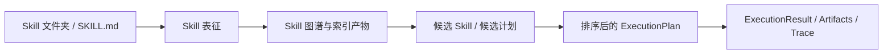
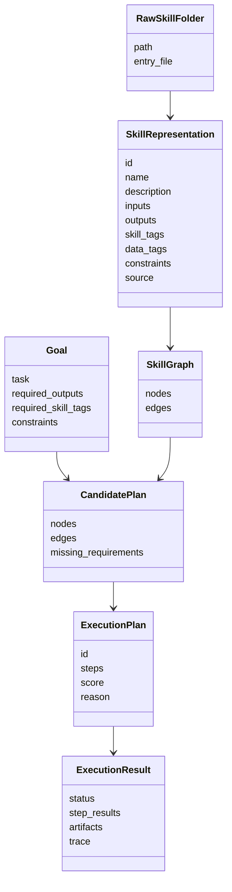
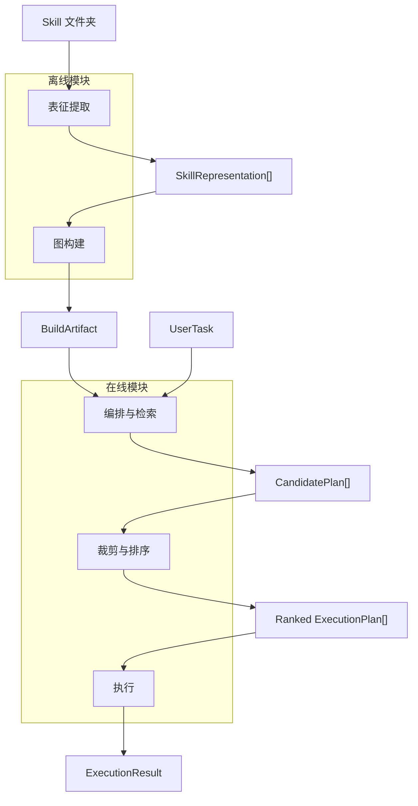
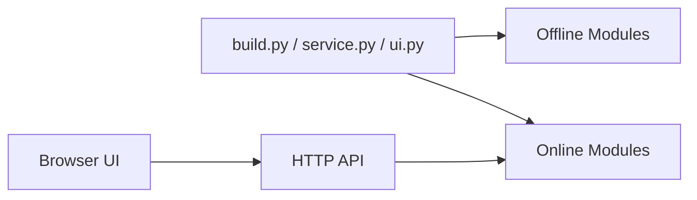

# SkillMash 技能编排系统设计说明书

## 1. 设计定位

SkillMash 是一个面向 Agent Skill 生态的技能组织、表征提取、图构建、在线检索、规划排序与执行承载系统。

它要解决的核心问题是：

```text
Skill 数量和粒度不断增长，但系统缺少一种结构化方式理解、拆解、复用、组合和执行这些 Skill。
```

系统不把 Skill 当成一个平铺列表，而是把 Skill 转成结构化表征，再构建成可检索、可推理、可规划的 Skill 图谱。在线阶段基于图谱边检索、边组织、边裁剪、边排序，最终形成可解释的执行计划。

当前阶段暂不实现安全审计。安全审计、组合风险模拟、工具权限策略和供应链治理作为未来扩展。

## 2. 文档结构

设计说明书拆为系统设计说明书和模块设计说明书。

```text
docs/
  skill-orchestration-system-design.md
  modules/
    offline-representation-extraction.md
    offline-graph-construction.md
    online-orchestration-retrieval.md
    online-pruning-ranking.md
    online-execution.md
```

系统级 N+1 视图放在本文。每个模块自己的 N+1 视图放在对应模块文档中，不再维护一个独立的超长 N+1 文档。

## 3. 总体模块划分

SkillMash 拆成五个主模块。

```text
离线模块 Offline
  1. 表征提取 Representation Extraction
  2. 图构建 Graph Construction

在线模块 Online
  3. 编排与检索 Orchestration & Retrieval
  4. 裁剪与排序 Pruning & Ranking
  5. 执行 Execution
```

这五个模块形成一条清晰的数据流：



## 4. 模块职责

| 模块 | 所属阶段 | 核心职责 | 模块文档 |
| --- | --- | --- | --- |
| 表征提取 | 离线 | 从 Skill 文件夹和 `SKILL.md` 中提取结构化 Skill 表征 | [offline-representation-extraction.md](modules/offline-representation-extraction.md) |
| 图构建 | 离线 | 基于 Skill 表征构建 Skill 图、索引和构建产物 | [offline-graph-construction.md](modules/offline-graph-construction.md) |
| 编排与检索 | 在线 | 理解用户任务，召回候选 Skill，边检索边组织候选计划 | [online-orchestration-retrieval.md](modules/online-orchestration-retrieval.md) |
| 裁剪与排序 | 在线 | 剪掉无效/冗余计划，对候选计划评分排序 | [online-pruning-ranking.md](modules/online-pruning-ranking.md) |
| 执行 | 在线 | 接收 ExecutionPlan，调度 Skill 执行并记录结果与 trace | [online-execution.md](modules/online-execution.md) |

## 5. 阶段边界

### 5.1 离线阶段

离线阶段关注“把 Skill 世界组织清楚”。

输入：

```text
skills_root/
  skill-a/
    SKILL.md
  skill-b/
    SKILL.md
```

输出：

```text
.skillmash/index/
  build_manifest.json
  skills.json
  skill_graph.json
  skill_index.json
  diagnostics.json
```

离线阶段允许调用 LLM，因为它不是请求路径的一部分。LLM 负责把自然语言 Skill 描述转为结构化输入输出、Skill 标签、数据标签和约束。

### 5.2 在线阶段

在线阶段关注“根据用户任务快速生成可解释方案”。

输入：

```text
UserTask
BuildArtifact
RuntimeContext
```

输出：

```text
Ranked ExecutionPlan[]
ExecutionResult
Trace
Artifacts
```

在线阶段不重新扫描 Skill 文件夹，不重新解析 `SKILL.md`，也不重新做离线表征提取。它只加载离线构建产物。

## 6. 系统级 N+1 视图

### 6.1 目标视图

系统目标：

1. 将文件夹形式 Skill 转成统一结构化表征。
2. 构建包含 Skill、产物、标签和关系的 Skill 图谱。
3. 让在线规划可以基于图谱边检索边组织候选方案。
4. 对候选方案进行裁剪、去重、验证和排序。
5. 用 ExecutionPlan 作为执行模块的稳定输入。
6. 保持 UI/API 与核心模块解耦。

非目标：

1. 当前阶段不做安全审计。
2. 当前阶段不做复杂权限治理。
3. 当前阶段执行模块可以先定义接口，不必接入所有真实工具。

### 6.2 领域模型视图



### 6.3 逻辑模块视图



### 6.4 离线构建视图

```text
SkillFolderScanner
  -> SkillManifestParser
  -> LLMSchemaExtractor
  -> SkillRepresentationNormalizer
  -> SkillGraphBuilder
  -> SkillIndexBuilder
  -> BuildArtifactWriter
```

离线构建必须保证：

- 同一输入和同一模型配置下，产物尽量可复现。
- 每个 Skill 的来源路径、提取诊断和 LLM 提取版本可追踪。
- 图构建只消费结构化表征，不直接依赖 `SKILL.md`。

### 6.5 在线规划视图

```text
UserTask
  -> GoalInterpreter
  -> SkillRetriever
  -> CandidateComposer
  -> PlanPruner
  -> PlanRanker
  -> ExecutionPlan
```

在线规划的关键是“边检索，边组织”：

1. 先根据用户目标召回可能满足最终输出的 Skill。
2. 根据候选 Skill 的输入缺口反向检索上游 Skill。
3. 形成候选计划草案。
4. 将候选计划交给裁剪与排序模块。

### 6.6 图谱视图

Skill 图谱包含四类核心节点：

| 节点 | 示例 |
| --- | --- |
| Skill 节点 | `web_search` |
| Artifact 节点 | `artifact:pptx` |
| SkillTag 节点 | `tag:web_search` |
| DataTag 节点 | `data:paper` |

核心边：

| 边 | 含义 |
| --- | --- |
| `produces` | Skill 产生某类产物 |
| `consumes` | Skill 消费某类产物 |
| `contains` | 粗粒度 Skill 包含细粒度 Skill |
| `has_skill_tag` | Skill 具备某类技能标签 |
| `has_data_tag` | Skill 关联某类数据域 |
| `similar_to` | Skill 语义相似 |
| `substitute_for` | Skill 可作为替代 |

### 6.7 接口边界视图



接口原则：

- `build.py` 只触发离线构建。
- `service.py` 只加载离线产物并提供在线服务。
- `ui.py` 只做可视化展示，不嵌入核心逻辑。
- 外部系统优先依赖稳定数据结构，而不是内部类细节。

### 6.8 部署与产物视图

```text
开发/构建机器
  build.py
  skills_root
  OPENAI_API_KEY
  .skillmash/index

在线服务机器
  service.py
  .skillmash/index
  HTTP API / UI
```

离线构建和在线服务可以部署在同一机器，也可以拆开。在线服务不要求访问原始 Skill 文件夹。

### 6.9 +1 贯穿场景

用户任务：

```text
帮我调研 AI Agent 最新趋势并生成一份 PPT
```

系统流程：

1. 离线阶段已从 Skill 文件夹提取出 `web_search`、`paper_search`、`summarize_text`、`create_ppt` 等 Skill 表征。
2. 图构建阶段生成 Skill 图和索引。
3. 在线阶段将用户任务解释为需要 `web_search`、`summarization`、`slide_generation` 和 `pptx` 输出。
4. 编排与检索模块召回能产出 `pptx` 的 Skill，并根据输入缺口继续召回上游 Skill。
5. 裁剪与排序模块去掉输入不闭合、冗余或成本过高的候选计划。
6. 执行模块接收排名最高的 ExecutionPlan，逐步执行并记录中间产物。

## 7. 设计原则

1. 离线复杂，在线快速。
2. 表征提取和图构建分离。
3. 候选生成和候选排序分离。
4. 计划和执行分离。
5. UI/API 与核心功能解耦。
6. 所有跨模块数据都应结构化、可序列化、可诊断。

## 8. 当前实现与目标结构的关系

当前代码已初步按以下目录组织：

```text
skillmash/
  core/
  build/
  runtime/
  interfaces/
  samples/
```

下一步代码重构时，建议让实现目录进一步贴近本文模块：

```text
skillmash/
  offline/
    representation/
    graph_building/
  online/
    orchestration/
    ranking/
    execution/
  core/
  interfaces/
```

本次文档调整只定义设计边界，不要求立即改代码。
