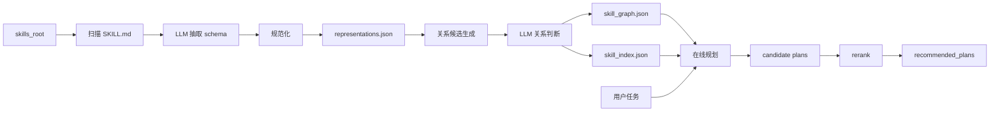

# SkillMash 技能编排系统设计方案

## 1. 系统定位

SkillMash 是一个面向 Agent Skill 的离线表示构建与在线编排系统。系统把真实 Skill 文件夹转成稳定的结构化资产，并基于这些资产生成可解释的候选编排计划。

系统主链路是：

```text
Skill 文件夹 / SKILL.md
  -> SkillRepresentation
  -> Skill-only 关系图与检索索引
  -> 用户任务 grounding
  -> 候选 OrchestrationPlan
  -> PlanReranker 推荐计划
```

系统继承最初设计里的核心问题意识：

```text
Skill 数量和粒度不断增长，但系统缺少一种结构化方式理解、拆解、复用、组合和规划这些 Skill。
```

系统优先稳定 `SkillRepresentation`、图构建产物、在线检索和候选计划排序。更完整的 `contains` 原子拆解、ArtifactNode 图、typed DAG、节点验证、局部修复和真实执行放在后面的“下一步计划”中说明。

## 2. 设计初衷

SkillMash 最初的设计初衷不是“怎么执行某个 Skill”，而是先回答：

```text
如何把越来越多、粒度不一、描述方式不同的 Skill，组织成一个可理解、可复用、可拆解、可组合、可规划的技能网络。
```

具体问题包括：

1. 技能粒度不一致：同一个系统里可能同时有 `web_search`、`research_topic`、`search_and_make_ppt`、`full_research_agent`。系统需要判断哪些是原子技能，哪些是组合技能，哪些是外部封装技能。
2. 技能关系不清楚：自然语言描述对人友好，但系统需要明确知道 Skill 需要什么输入、产出什么输出、前置条件是什么、后置条件是什么，以及它和其他 Skill 有什么关系。
3. 粗粒度技能难以拆解：一个“联网搜索并生成 PPT”的 Skill 可能包含搜索、阅读、总结、大纲生成和 PPT 生成等步骤。系统需要能递归找到最细粒度的可复用 Skill。
4. 无法自动判断 Skill 能否组合：系统需要判断一个 Skill 的输出是否能作为另一个 Skill 的输入，例如 `web_search -> summarize_text` 或 `generate_outline -> create_ppt`。
5. 用户任务和 Skill 之间存在语义鸿沟：用户通常说“帮我调研 AI Agent 最新趋势并生成 PPT”，而不是直接给出 Skill 序列。系统需要把自然语言目标转换成结构化目标和候选执行链。
6. 多条可行方案缺少选择依据：同一个任务可能既能调用一个粗粒度 Skill，也能拆成原子 Skill 链。系统需要根据质量、成本、可解释性、可控性和输入输出兼容性排序。
7. 技能复用和重复注册难以管理：当技能数量增多，如果没有图谱和关系模型，系统很难发现已有 Skill 可以复用，容易重复注册、重复实现、重复规划。
8. 技能系统需要长期演进：新 Skill、新版本、新组合方式、新数据类型和新执行环境会不断出现，系统需要稳定的数据结构和模块边界，而不是堆越来越多规则。
9. 检索和执行之间缺少编译层：参考 GraSP 思路，检索只回答“哪些 Skill 相关”，执行只回答“下一步做什么”，中间还需要把候选 Skill 编译成 typed DAG，绑定输入输出并验证依赖。
10. 失败时缺少可诊断信息：如果无法完成任务，系统不应该只返回失败，而应该说明缺少哪个输入、哪个中间 artifact、哪个前置 Skill 或哪类关系。

这些问题定义了 SkillMash 的设计方向。系统首先稳定其中最基础、最影响整体可靠性的部分：Skill 表示、图关系、索引、在线计划和排序。

## 3. 系统要解决的问题

系统重点解决四个问题。

### 3.1 把自然语言 Skill 文档转成稳定表示

输入源是真实目录中的 Skill：

```text
skills_root/
  academic-researcher/
    SKILL.md
  aris-arxiv/
    SKILL.md
  agents/
    langchain/
      SKILL.md
      references/
```

这些 Skill 的能力、输入、输出和约束大多写在 `SKILL.md` 中。SkillMash 通过扫描、解析、LLM 抽取和规范化，把它们转成统一的 `SkillRepresentation`。

### 3.2 统一输入输出和任务词

不同 Skill 可能用不同说法描述相同概念：

```text
Query or Arxiv ID
search query
paper topic
```

系统需要把这些词规范化为可用于图构建和在线匹配的语义字段，例如：

```text
query
paper
summary
outline
pptx
```

系统通过 `io_name_vocab`、`task_vocab` 和 `data_type_vocab` 分别管理输入输出语义名、能力词和数据承载类型。

### 3.3 判断 Skill 之间是否能连接

图构建不直接要求开发者手写所有关系，而是先用确定性规则生成候选 Skill pair，再让 LLM 判断候选关系。

最重要的关系是：

```text
can_feed: source Skill 的输出可以满足 target Skill 的输入
```

在线编排主要沿 `can_feed` 边搜索候选路径。

### 3.4 根据用户任务生成候选计划

用户通常不会给出 Skill 序列，而是给出自然语言目标：

```text
I have api_spec and want a security review
```

在线计划会把 query grounding 到目标词、已有 artifact 和检索词，再基于图和索引生成候选计划。计划中会保留缺失输入、使用的 `can_feed` 边、目标分数和排序理由。

## 4. 系统架构



模块对应关系：

| 模块 | 路径 | 职责 |
| --- | --- | --- |
| 表示抽取 | `skillmash/representation/` | 扫描 Skill 文件夹、解析 `SKILL.md`、LLM 抽取、规范化、写表示产物 |
| 图构建 | `skillmash/graph/` | 注册 Skill、生成关系候选、LLM 判断关系、构建 Skill-only 图和索引 |
| 在线编排 | `skillmash/orchestration/` | 加载 build artifact、grounding query、搜索候选计划 |
| 计划排序 | `skillmash/reranking/` | 对已有候选计划 rerank，失败时确定性 fallback |
| 本地 UI | `ui/` | 展示图和在线编排调试入口 |
| CLI 示例 | `examples/` | 表示抽取、图构建、在线编排入口 |

## 5. 核心数据模型

### 5.1 SkillRepresentation

`SkillRepresentation` 是最重要的跨模块契约。下游图构建和在线计划都消费它，不再回头读取 `SKILL.md`。

核心字段：

| 字段 | 含义 |
| --- | --- |
| `id` | Skill 唯一 ID |
| `name` | Skill 名称 |
| `description` | 能力描述 |
| `version` | Skill 版本 |
| `tasks` | 能力词，例如 `search`、`summarize`、`write` |
| `inputs` | 输入参数列表 |
| `outputs` | 输出 artifact 列表 |
| `preconditions` | 前置条件 |
| `postconditions` | 后置条件 |
| `emits_slots` | 产出的结构化 slot |
| `consumes_slots` | 消费的结构化 slot |

示例：

```json
{
  "id": "aris-arxiv",
  "name": "Aris Arxiv",
  "description": "Search, download, and summarize academic papers from arXiv.",
  "version": "1.0.0",
  "tasks": ["search", "summarize"],
  "inputs": [
    {
      "name": "query",
      "type": "text",
      "required": true,
      "description": "Search query or arXiv identifier.",
      "default": null,
      "schema_ref": null
    }
  ],
  "outputs": [
    {
      "name": "paper",
      "type": "pdf",
      "description": "Downloaded paper PDF.",
      "schema_ref": null
    }
  ],
  "emits_slots": [],
  "consumes_slots": [],
  "preconditions": [],
  "postconditions": []
}
```

### 5.2 输入输出字段

输入输出字段刻意区分：

```text
name = 运行时语义角色，例如 query、paper、summary
type = 数据承载格式，例如 text、json、pdf、pptx
```

这避免把“数据是什么”和“数据用什么格式承载”混在一起。

### 5.3 SkillGraph

图模型是 Skill-only 图：

```text
node = Skill
edge = Skill-Skill typed relation
```

核心边：

| 边 | 含义 | 在线用途 |
| --- | --- | --- |
| `can_feed` | source 输出可满足 target 输入 | 路径搜索 |

artifact 不作为持久化图节点。artifact 信息保留在 Skill 的 inputs / outputs、索引和 edge evidence 中。

### 5.4 SkillIndex

`SkillIndex` 是在线计划的检索入口，包含：

- `by_output`
- `by_input`
- `by_task`
- `by_data_type`
- `neighbors`
- `upstream_by_input`
- `downstream_by_output`
- `by_text_term`
- `by_slot`
- `by_artifact`
- `by_aggregator`

在线阶段通过这些索引快速找到目标 Skill、上游 Skill、相关任务 Skill 和 slot 相关 Skill。

### 5.5 OrchestrationPlan

计划以 steps 为主，同时保留图搜索信息。

主要字段：

| 字段 | 含义 |
| --- | --- |
| `steps` | Skill 调用步骤 |
| `produced_artifacts` | 计划产生的 artifact |
| `missing_inputs` | 未被满足的输入 |
| `can_feed_edges` | 计划使用的关系边 |
| `goal_score` | 目标匹配分 |
| `edge_confidence` | 边置信度 |
| `consumed_user_artifacts` | 使用了多少用户已有 artifact |
| `status` | 计划状态 |
| `reasons` | 计划理由 |

typed DAG 计划结构放在“下一步计划”中说明。

## 6. 离线构建流程

### 6.1 表示抽取

流程：

```text
SkillFolderScanner
  -> SkillManifestParser
  -> OpenAICompatibleSchemaExtractor
  -> SkillRepresentationNormalizer
  -> write_extraction_result
```

输出：

```text
OUTPUT/
  representations.json
  diagnostics.json
  normalization_decisions.json
  io_name_vocab.json
  task_vocab.json
  extraction.log
```

关键点：

- `diagnostics.json` 保存解析和抽取诊断。
- `normalization_decisions.json` 保存规范化证据。
- `representations.json` 保持紧凑，只保存下游需要的稳定表示。
- `io_name_vocab.json` 和 `task_vocab.json` 作为下游图构建和在线检索的词表基础。

### 6.2 图构建

流程：

```text
SkillRegistryBuilder
  -> CandidateGenerator
  -> RelationResolver / OntologyMatcher
  -> SkillGraphBuilder
  -> SkillIndexBuilder
  -> write_graph_build_result
```

输出：

```text
.skillmash/index/
  build_manifest.json
  skills.json
  skill_graph.json
  skill_index.json
  llm_matches.json
  diagnostics.json
  io_name_vocab.json
  task_vocab.json
  slot_taxonomy.json
  slot_contracts.json
```

图构建策略：

1. 用确定性规则生成候选关系，减少 LLM 调用规模。
2. 用 LLM 判断候选关系类型和置信度。
3. 默认启用 order-swapped consensus，提高关系精度。
4. 按 `can_feed` 阈值接受关系。
5. 将候选和 LLM 判断保存在 `llm_matches.json`，便于回溯。

### 6.3 BuildManifest

`build_manifest.json` 是在线加载入口。它记录：

- artifact 文件名。
- 图构建阈值。
- 在线规划默认参数。
- LLM / matcher 元数据。
- 构建时间。

在线阶段应通过 manifest 加载产物，而不是硬编码文件路径。

## 7. 在线规划流程

### 7.1 加载产物

在线阶段调用 `load_build_artifacts(build_dir)`，加载：

- manifest。
- skills。
- graph。
- index。
- io_name_vocab。
- task_vocab。
- slot_taxonomy。
- slot_contracts。

在线阶段只读这些产物，不重新扫描 Skill 文件夹，也不重新解析 `SKILL.md`。

### 7.2 Query Grounding

用户 query 会被转换为：

- `query_terms`
- `available_artifacts`
- `goal_terms`

示例：

```text
I have api_spec and want a security review
```

可能得到：

```json
{
  "query_terms": ["api", "spec", "security", "review"],
  "available_artifacts": [
    {"name": "api_spec", "type": "unknown", "source": "user_query"}
  ],
  "goal_terms": ["security", "review"]
}
```

### 7.3 候选计划搜索

规划搜索围绕目标和输入缺口展开：

```text
找到可能满足目标的 Skill
检查它们缺哪些必需输入
沿 upstream_by_input 或 can_feed 边寻找上游 Skill
不断扩展直到输入闭合、达到深度上限或候选数上限
```

关键参数：

| 参数 | 含义 |
| --- | --- |
| `min_edge_confidence` | 使用 `can_feed` 边的最低置信度 |
| `max_depth` | 最大 Skill 步数 |
| `max_plans` | 最大候选计划数 |
| `max_branch` | 每个搜索状态最大扩展数 |
| `max_entry_skills` | 最大入口 Skill 数 |
| `top_m` | 送入 reranker 的候选数 |
| `top_k` | 返回推荐计划数 |

参数覆盖顺序：

```text
request > runtime service config > manifest defaults
```

### 7.4 缺口暴露

计划即使不完整，也会暴露：

- 缺哪个输入。
- 缺口属于哪个 Skill。
- 缺口的 name 和 type。
- 计划是否结构有效但输入不完整。

这保留了最初设计中“失败时返回缺口，而不是只返回无法完成”的原则。

### 7.5 Rerank

`PlanReranker` 只排序已有候选计划，不创造新路径。

约束：

```text
不能合并计划
不能改变 Skill 顺序
不能发明 Skill
不能发明输入、输出或边
```

流程：

1. 确定性排序选出前 `top_m`。
2. LLM 从候选中选择推荐计划。
3. LLM 失败或返回不足时，用确定性 fallback 补齐。
4. 对复杂任务适当保留多步骤计划。

## 8. 运行方式

### 8.1 表示抽取

Windows PowerShell：

```powershell
.\.venv\Scripts\python.exe examples\representation_extraction_demo.py --skills_root C:\Users\admin\Documents\data\skills --out_dir OUTPUT --workers 8
```

macOS / Linux：

```bash
.venv/bin/python examples/representation_extraction_demo.py --skills_root /path/to/skills --out_dir OUTPUT --workers 8
```

### 8.2 图构建

Windows PowerShell：

```powershell
.\.venv\Scripts\python.exe examples\graph_build_demo.py --representations_json OUTPUT\representations.json --out_dir .skillmash\index --batch_size 12 --workers 4
```

macOS / Linux：

```bash
.venv/bin/python examples/graph_build_demo.py --representations_json OUTPUT/representations.json --out_dir .skillmash/index --batch_size 12 --workers 4
```

### 8.3 在线编排

```powershell
.\.venv\Scripts\python.exe examples\graph_online_demo.py --build_dir .skillmash\index --query "I have api_spec and want a security review" --show_candidates
```

### 8.4 本地 UI

```powershell
.\.venv\Scripts\python.exe ui\serve.py --host 127.0.0.1 --port 8787 --build-dir .skillmash\index
```

打开：

```text
http://127.0.0.1:8787/ui/index.html?build_dir=.skillmash/index
```

## 9. 系统能力

系统具备：

1. 从 Skill 文件夹扫描 `SKILL.md`。
2. LLM 抽取 Skill 候选 schema。
3. 规范化输入、输出、任务和数据类型。
4. 写出表示产物、词表、诊断和规范化决策。
5. 从表示产物构建 Skill-only 图。
6. 生成并记录 LLM relation matches。
7. 构建在线索引。
8. 从 build manifest 加载产物。
9. 根据用户 query 生成候选计划。
10. 返回推荐计划、候选计划、缺失输入和 rank trace。

## 10. 与设计初衷的关系

最初设计提出了更完整的目标：

- 区分原子技能、组合技能和封装技能。
- 用 `contains` 表示粗粒度技能和细粒度技能之间的关系。
- 用 `Skill Node + Artifact Node + Typed Edges` 表示完整技能图谱。
- 把检索到的 Skill 编译成 typed DAG。
- 在执行阶段做节点级验证和局部修复。

SkillMash 沿着这些目标演进。系统优先级是：

```text
先让真实 Skill 文档稳定进入系统
再让图关系稳定可追踪
再让在线计划可解释
最后再扩展到 contains、ArtifactNode、typed DAG 和真实执行
```

这个顺序更贴合代码和数据状态，也更容易测试和迭代。

## 11. 下一步计划

下一步计划集中补齐尚未完成的能力：

1. 增强 `SkillRepresentation` 的 source 信息，方便从 UI 回跳到原始 Skill。
2. 补充更多图构建诊断，让错误的 `can_feed` 更容易定位。
3. 在在线计划结果中更清楚地区分 `ready`、`incomplete` 和 `structurally_valid_but_incomplete`。
4. 设计 `kind = atomic | composite | wrapped` 的最小 contract。
5. 引入 `contains` 关系和原子技能递归拆解。
6. 评估是否将关键 artifact 提升为持久化 ArtifactNode。
7. 将计划结构从 steps 扩展为 `ExecutionPlanDAG`，同时保留拓扑排序视图。
8. 从 planner 中拆出独立的 `SkillCompiler`。
9. 增加静态 `SkillVerifier`，检查必需输入、目标可达和图无环。
10. 增加 `PlanRepairer` 的基础局部修复能力，例如 `REBIND`、`INSERT_PREREQ`、`SUBSTITUTE`。
11. 在 UI 中展示 plan 的 `can_feed_edges` 和 `missing_inputs`，帮助人工判断规划质量。
12. 收集 relation feedback，反哺图构建和阈值调整。
13. 接入真实 Skill 执行器、权限治理和安全审计。

## 12. 总结

SkillMash 的设计重点是“把 Skill 世界结构化，并让在线规划有据可依”。系统最核心的资产是：

```text
SkillRepresentation
SkillGraph
SkillIndex
OrchestrationPlan
PlanReranker
```

技能粒度、原子拆解、Artifact 图、typed DAG、验证和修复仍然重要，但应建立在稳定的表示、关系、索引和候选计划链路之上。系统应继续围绕表示质量、关系质量、候选计划质量和可诊断性迭代。
