# 系统设计说明书

## 1. 概述

### 1.1 简介

SkillMash 是一个面向 Agent Skill 的离线表征构建与在线编排系统。其核心功能是将 Skill 文件夹转化为稳定的结构化表征，并基于这些表征生成可解释的候选编排计划。

```text
SKILL.md → 结构化表征 → Skill 关系图谱 → 自动编排执行计划 → 推荐最优方案
```

### 1.2 要解决的问题

随着 Agent 生态中 Skill 数量增长、粒度多样化，系统缺乏一种结构化方式来理解、拆解、复用、组合和规划这些 Skill。SkillMash 重点解决以下两个核心问题：

**1. Skill 描述不统一，关系不可知**

不同 Skill 用不同说法描述输入输出和能力（如 `Query or Arxiv ID`、`search query`、`paper topic`），系统也无法自动判断一个 Skill 的输出能否作为另一个 Skill 的输入（如 `web_search` 的输出能否满足 `summarize_text` 的输入）。

SkillMash 通过结构化表征抽取将自然语言 Skill 文档转为统一的 `SkillRepresentation`，用词汇表（`io_name_vocab`、`task_vocab`）规范化语义名称，并通过确定性候选生成 + LLM 判断自动建立 `can_feed` 关系。

**2. 多条候选路径缺少选择依据**

同一个任务可能存在多条可行的编排路径——例如既能调用一个粗粒度 Skill 直接完成，也能拆成多个原子 Skill 链分步完成。系统需要根据输入输出兼容性、目标匹配度和路径质量来排序推荐。

SkillMash 通过 `PlanReranker` 对候选编排计划重排序，提供排序依据和推荐方案。重排序器只排序已有候选，不创造新路径。

### 1.3 目标

SkillMash 的整体目标：

1. **将自然语言 Skill 文档转为结构化表征**，使 Skill 可被机器理解、比较与组合
2. **自动发现 Skill 间的可衔接关系**（`can_feed`），构建 Skill 关系图谱
3. **从用户查询自动生成候选编排计划**，并通过重排序推荐最优方案
4. **标识计划中的输入缺口**，后续追问用户

---

## 2. 系统架构

### 2.1 模块化流水线

SkillMash 采用模块化流水线架构，每个模块产出结构化产物，供下游消费，不回溯上游原始数据。

整体流程如下：

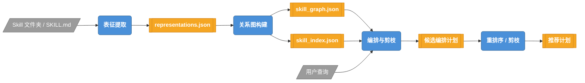

三模块概要：

| 模块 | 输入 | 核心处理 | 输出 |
| --- | --- | --- | --- |
| **表征提取** | Skill 文件夹中的 `SKILL.md` | 扫描、解析、LLM 抽取 schema、规范化名称与类型 | `representations.json`、词表、诊断日志 |
| **关系图构建** | `representations.json` | 构建 Skill 注册表、生成候选关系、LLM 判断 `can_feed`、构建索引 | `skill_graph.json`、`skill_index.json`、`build_manifest.json` |
| **编排与剪枝** | 关系图产物 + 用户查询 | Grounding、沿 `can_feed` 边搜索候选路径、LLM 重排序 | 候选计划列表、推荐计划、缺口诊断 |

### 2.2 数据流转

每个模块的产物文件及其下游消费关系如下：

**表征提取模块产物：**

```text
OUTPUT/
  representations.json        ← 下游关系图构建的唯一输入
  diagnostics.json            ← 抽取诊断（调试用）
  normalization_decisions.json ← 规范化证据（调试用）
  io_name_vocab.json          ← 输入输出语义名词表（关系图构建 + 在线检索使用）
  task_vocab.json             ← 能力词表（关系图构建 + 在线检索使用）
  extraction.log              ← 抽取日志
```

**关系图构建模块产物：**

```text
.skillmash/index/
  build_manifest.json         ← 在线阶段的加载入口，记录阈值和元数据
  skills.json                 ← Skill 注册表
  skill_graph.json            ← Skill-only 关系图（can_feed 边）
  skill_index.json            ← 多维度检索索引
  llm_matches.json            ← LLM 关系判断记录（可回溯）
  diagnostics.json            ← 关系图构建诊断
  io_name_vocab.json          ← 继承的词表
  task_vocab.json             ← 继承的词表
  slot_taxonomy.json          ← slot 分类
  slot_contracts.json         ← slot 合约
```

**编排与剪枝模块产物：**

```text
候选编排计划列表，每条计划包含：
  steps                       ← Skill 调用步骤序列
  produced_artifacts          ← 计划产出的 artifact
  missing_inputs              ← 未被满足的输入（缺口标识）
  can_feed_edges              ← 计划使用的 can_feed 边及置信度
  goal_score                  ← 目标匹配分
  reasons                     ← 排序理由

推荐计划                      ← 经 LLM 重排序后的最优方案
```

关键原则：下游只消费上游的结构化产物，不回溯原始数据。关系图构建只读 `representations.json`，不再重新解析 `SKILL.md`；编排模块只读 build artifact，不再重新扫描 Skill 文件夹。

---

## 3. 核心模块详解

### 3.1 表征提取模块

表征提取模块是 SkillMash 流水线的第一模块，负责将原始 Skill 文件夹中的 `SKILL.md` 转化为结构化的 `SkillRepresentation`。它是整个系统的数据入口——下游的关系图构建和在线编排都消费其产物，不再回溯原始 Skill 文档。

#### 3.1.1 模块定位与职责

表征提取模块在流水线中的位置：

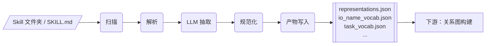

核心职责：

1. **扫描与解析**：递归发现含 `SKILL.md` 的文件夹，将 Markdown 文本拆分为 YAML frontmatter + body
2. **LLM Schema 抽取**：通过 OpenAI-compatible 接口从 SKILL.md 文本中提取结构化的输入输出 schema
3. **名称规范化**：通过动态词汇表和 LLM 语义判断，将自由文本的 I/O 名称统一归一为语义术语
4. **产物写入**：将规范化后的表征和词汇表写入 JSON 文件，供下游消费

遵循合约边界原则（见2.2节"关键原则"）。

#### 3.1.2 核心数据合约

表征提取模块定义了三级数据模型，对应提取流程的三个阶段：

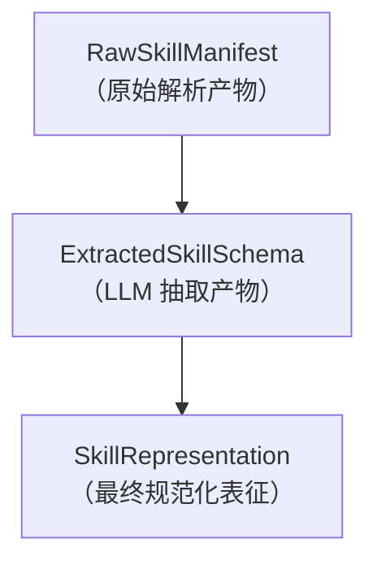

**第一级：`RawSkillManifest`** — SKILL.md 解析产物

| 字段 | 类型 | 说明 |
| --- | --- | --- |
| `folder` | `SkillFolder` | 文件夹元信息（id_hint, path, entry, relative_path） |
| `frontmatter` | `Dict[str, Any]` | YAML frontmatter，提供 name / version 等元数据 |
| `body` | `str` | Markdown 正文，包含 IO 描述细节 |
| `body_sha256` | `str` | 正文哈希，用于变更检测 |
| `diagnostics` | `List[ExtractionDiagnostic]` | 解析阶段的诊断信息 |

**第二级：`ExtractedSkillSchema`** — LLM 抽取产物

| 字段 | 类型 | 说明 |
| --- | --- | --- |
| `description` | `str` | Skill 功能描述 |
| `inputs` | `List[ParameterSpec \| Dict]` | LLM 识别的输入参数列表 |
| `outputs` | `List[ArtifactSpec \| Dict]` | LLM 识别的输出 artifact 列表 |
| `confidence` | `Optional[float]` | LLM 对抽取结果的置信度 |
| `warnings` | `List[str]` | LLM 标注的警告信息 |

**第三级：`SkillRepresentation`** — 最终规范化表征（下游合约）

| 字段 | 类型 | 说明 |
| --- | --- | --- |
| `id` | `str` | 规范化后的 Skill 标识（slug 形式，如 `aris-arxiv`） |
| `name` | `str` | 人类可读名称 |
| `description` | `str` | 功能描述 |
| `version` | `str` | Skill 版本 |
| `inputs` | `List[ParameterSpec]` | 规范化后的输入列表 |
| `outputs` | `List[ArtifactSpec]` | 规范化后的输出列表 |

**`ParameterSpec` 与 `ArtifactSpec`：name 与 type 分离**

`ParameterSpec`（输入参数）和 `ArtifactSpec`（输出 artifact）是 I/O 描述的统一数据结构，遵循核心架构原则——**name 是语义名称，type 是数据承载格式**：

```text
name = 语义名称，例如 query、paper、summary
type = 数据承载格式，例如 text、json、pdf、markdown
```

| 字段 | ParameterSpec | ArtifactSpec | 说明 |
| --- | --- | --- | --- |
| `name` | ✓ | ✓ | 语义名称（经 io_name_vocab 规范化） |
| `type` | ✓ | ✓ | 数据承载格式（经 data_type_vocab 规范化） |
| `required` | ✓ | — | 是否必填输入 |
| `description` | ✓ | ✓ | 自然语言描述 |
| `default` | ✓ | — | 默认值 |

这种分离避免了把"数据是什么"和"数据用什么格式承载"混在一起，使下游的 `can_feed` 关系判断更精确——两个 Skill 能否对接，既看语义名称匹配，也看数据格式兼容。


#### 3.1.3 LLM Schema 提取

`LLMSchemaExtractor` 使用 LLM 从 SKILL.md 文本中提取结构化的输入输出 schema。它将 `RawSkillManifest` 的 frontmatter 与 body 作为上下文，请求 LLM 返回 JSON，再将响应解析为 `ExtractedSkillSchema`。

**System Prompt 设计要点**

System Prompt（`_SCHEMA_EXTRACTION_PROMPT`）对 LLM 的输出施加了严格约束，核心要点如下：

| 约束 | 目的 |
| --- | --- |
| 只返回 JSON，不含 Markdown | 确保可解析性 |
| 输出须为用户面向 deliverable | 过滤 errorCode / status / logs 等内部控制字段 |
| name = 语义名称，type = 数据格式 | 落实 name/type 分离原则 |
| 推荐短名词角色名（query, paper, summary 等） | 利于词汇表归一和图谱链接 |
| 推荐 type 值列表（text, markdown, json, pdf 等） | 与 `data_type_vocab` 对齐 |
| 嵌套 deliverable 要展开 | 避免 raw API container 被误记为输出 |
| 不重复 emit 同一语义的输入 | 去重，避免冗余 |
| 不确定时用 unknown + warning | 容错兜底 |

`extract_many()` 支持批量提取以减少 API 调用；当 `LLM_MODEL` 指向本地模型路径时，系统自动启用 vLLM 离线推理，同一模型路径的所有组件共享 engine instance。

#### 3.1.4 名称规范化体系

不同 Skill 用不同说法描述同一语义，这是 SkillMash 要解决的核心问题之一。例如：

```text
web_search Skill:     输入名 "Query or Arxiv ID"     → 语义名称是什么？
summarize Skill:      输入名 "search query"           → 与上面的 "Query" 是否同一个语义？
paper_download Skill: 输出名 "Downloaded PDF"         → 语义名称是 "paper" 还是 "downloaded_pdf"？
```

名称规范化体系通过动态词汇表与 LLM 语义判断，将这些自由表述统一归一为语义术语，使下游的 `can_feed` 关系判断建立在稳定的语义基础之上。

##### 词汇表的结构

词汇表管理规范名（term）与别名集合（aliases）的映射关系：

```text
规范名（term）    别名集合（aliases）
query            {query_or_arxiv_id, search_query, paper_topic, ...}
paper            {downloaded_pdf, academic_paper, ...}
summary          {brief, abstract, ...}
```

当遇到新名称时，系统通过查找词汇表判断是否已有语义等价的规范名。查找时，规范名本身和其别名都能命中。

词汇表具有以下特性：

| 特性 | 说明 |
| --- | --- |
| **动态可增长** | 随 Skill 语料扩展，新语义名称可动态添加 |
| **容量上限（可选）** | 可设置有界约束，词汇表满时强制归并 |
| **线程安全** | 支持并发解析场景 |

##### 四种解析策略

当遇到词汇表中未见的 I/O 名称时，系统根据语义判断选择以下四种策略之一：

| 策略 | 触发条件 | 行为 | 示例 |
| --- | --- | --- | --- |
| **归入已有** | 新名称与已有规范名语义等价 | 将新名称作为别名加入已有规范名 | `search_query` → 归入 `query` |
| **创建新项** | 新名称是真正新的语义名称，且词汇表未满 | 创建新的规范名 | `transcript` → 新建 `transcript` |
| **强制归并** | 词汇表已满，无法创建新项 | 强制归入语义最接近的已有规范名 | `outline` → 归入 `summary` |
| **排除** | 名称仅用于日志/统计/遥测，非运行时语义 | 丢弃，不进入词汇表 | `analytics_count` → 排除 |

策略选择优先级：**归入已有 > 创建新项 > 强制归并 > 排除**。系统根据语义判断结果和词汇表当前状态，选择最合适的策略。

##### 单个名称规范化流程

每个未见词汇表的 I/O 名称，按以下流程进行规范化决策：

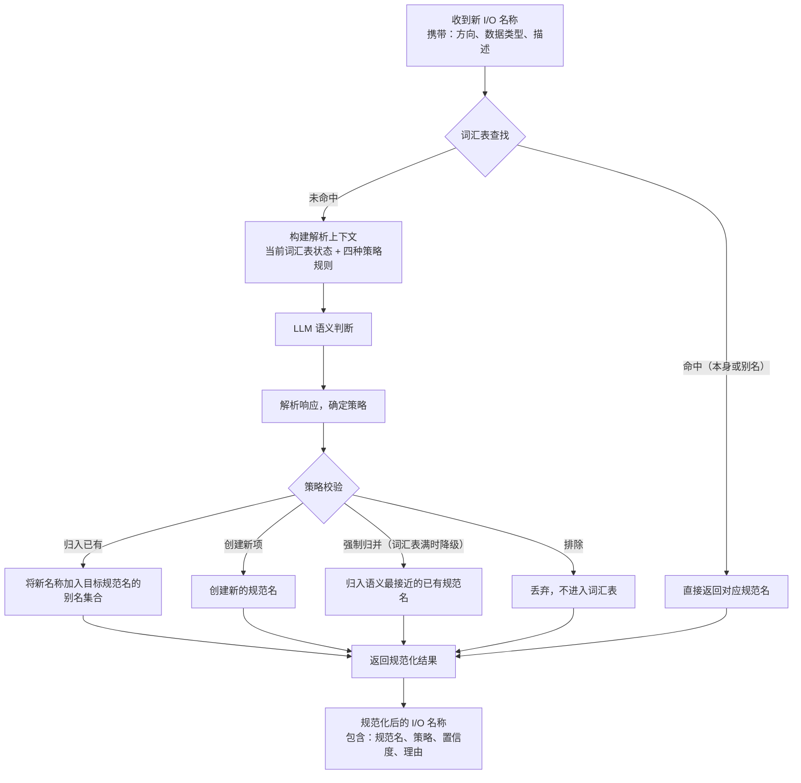

**关键校验逻辑**：

- 若 LLM 返回的策略不合法，降级为"强制归并"
- 若 LLM 建议创建新项但词汇表已满，降级为"强制归并"
- 若 LLM 指定的目标规范名不存在，替换为语义最接近的规范名
- 置信度值强制收敛到 `[0.0, 1.0]` 区间

##### 批量规范化流程

同一 Skill 的多个 I/O 名称通常存在语义关联。为保持一致性，系统将同一 Skill 的所有未见名称批量提交给 LLM：

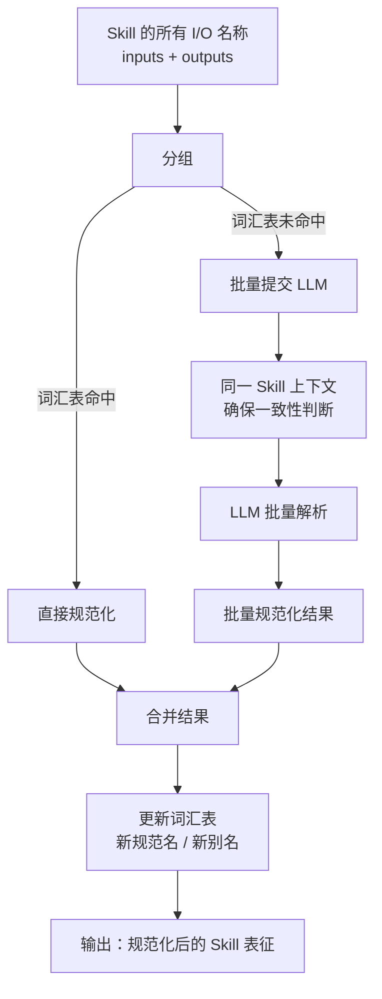

批量处理的优势：

1. **上下文一致性**：LLM 可看到同一 Skill 的所有 I/O 名称，避免同一语义被归一为不同规范名
2. **减少 API 调用**：一次请求处理多个名称，降低延迟和成本
3. **更好的语义推断**：Skill 内部的输入输出关系可辅助语义判断

##### 三维规范化

名称规范化是 Skill 表征规范化的三个维度之一。完整的规范化流程覆盖 name、type、metadata 三个维度：

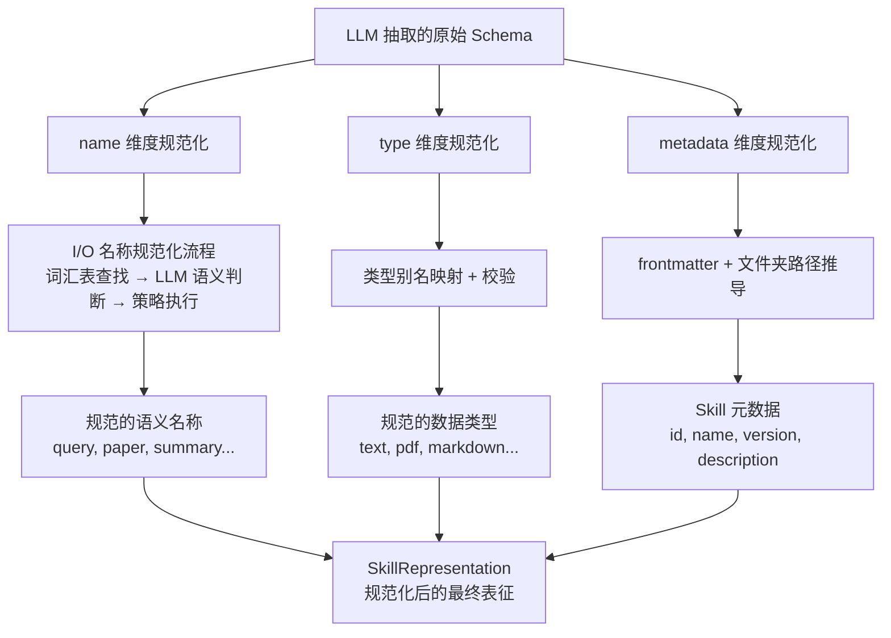

**name 维度**：I/O 名称规范化，通过词汇表和 LLM 语义判断，将自由表述归一为稳定语义术语

**type 维度**：数据类型规范化，先查类型别名映射（如 `natural_language_query → text`），再校验是否在预定义类型集合内，不在则降级为 `unknown`

**metadata 维度**：Skill 元数据规范化，从 frontmatter 的元数据和文件夹路径推导唯一标识（id、name、version、description），由 `MetadataNormalizer` 类实现

##### 去重与合并

规范化后可能出现名称冲突：两个输入/输出经规范化后得到相同的规范名。系统按以下规则合并：

1. **保留已知的类型**：若类型冲突，优先保留预定义类型集合中的类型
2. **合并描述**：将两条描述拼接，保留语义信息
3. **必填逻辑**：若任一条目为必填，合并后仍为必填

这确保最终表征中每个语义名称只出现一次，避免下游关系图构建时的冗余判断。

#### 3.1.5 端到端样例

以 `aris-arxiv` Skill 为例，展示从 SKILL.md 原文到最终 `SkillRepresentation` 的完整数据流转。

**Step 1：SKILL.md 原文（简化）**

```markdown
---
name: Aris Arxiv
version: 1.0.0
---

# Aris Arxiv

Search, download, and summarize academic papers from arXiv.

## Inputs
| Name | Type | Required | Description |
|------|------|----------|-------------|
| Query or Arxiv ID | text | true | Search query or arXiv identifier |

## Outputs
| Name | Type | Description |
|------|------|-------------|
| Downloaded PDF | pdf | Downloaded paper PDF |
| Paper Summary | markdown | Summary of the paper |
```

**Step 2：LLM 抽取结果（`ExtractedSkillSchema`）**

```json
{
  "description": "Search, download, and summarize academic papers from arXiv.",
  "inputs": [
    {
      "name": "query_or_arxiv_id",
      "type": "text",
      "required": true,
      "description": "Search query or arXiv identifier."
    }
  ],
  "outputs": [
    {
      "name": "downloaded_pdf",
      "type": "pdf",
      "description": "Downloaded paper PDF."
    },
    {
      "name": "paper_summary",
      "type": "markdown",
      "description": "Summary of the paper."
    }
  ],
  "confidence": 0.92,
  "warnings": []
}
```

LLM 已将 `Query or Arxiv ID` 规范为 `query_or_arxiv_id`，`Downloaded PDF` 规范为 `downloaded_pdf`，`Paper Summary` 规范为 `paper_summary`——但这些仍是自由文本名，尚未经过词汇表归一。

**Step 3：词汇表解析（`IONameResolution`）**

假设当前 `io_name_vocab` 已有 term `query` 和 `summary`，但无 `paper`：

| token | 词汇表查找 | Resolver 判断 | action | normalized_value | confidence | reason |
| --- | --- | --- | --- | --- | --- | --- |
| `query_or_arxiv_id` | 未命中 | LLM 判断与 `query` 语义等价 | `alias_existing` | `query` | 0.95 | "search query is the same semantic name as query" |
| `downloaded_pdf` | 未命中 | LLM 判断是新语义名称 | `create_new` | `paper` | 0.90 | "downloaded PDF is a paper artifact, distinct from query" |
| `paper_summary` | 未命中 | LLM 判断与 `summary` 语义等价 | `alias_existing` | `summary` | 0.92 | "paper summary is a summary of a paper" |

type 规范化则通过 `data_type_aliases` 直接映射：`text → text`（exact）、`pdf → pdf`（exact）、`markdown → markdown`（exact）。

**Step 4：最终 `SkillRepresentation`**

```json
{
  "id": "aris-arxiv",
  "name": "Aris Arxiv",
  "description": "Search, download, and summarize academic papers from arXiv.",
  "version": "1.0.0",
  "inputs": [
    {
      "name": "query",
      "type": "text",
      "required": true,
      "description": "Search query or arXiv identifier.",
      "default": null
    }
  ],
  "outputs": [
    {
      "name": "paper",
      "type": "pdf",
      "description": "Downloaded paper PDF."
    },
    {
      "name": "summary",
      "type": "markdown",
      "description": "Summary of the paper."
    }
  ]
}
```

经过规范化后，`aris-arxiv` 的 I/O 名称已成为稳定的语义术语 `query`、`paper`、`summary`——下游关系图构建可直接基于这些术语判断 `can_feed` 关系，例如 `aris-arxiv.summary(markdown)` 能否满足某个 Skill 的 `query(text)` 输入。

---

### 3.2 关系图构建模块

关系图构建模块是 SkillMash 流水线的第二模块，负责从规范化表征中构建 Skill 之间的 `can_feed` 关系图。它消费表征提取模块的产物 `representations.json`，产出 Skill 关系图和检索索引，供在线编排模块使用。

#### 3.2.1 模块定位与职责

关系图构建模块在流水线中的位置：

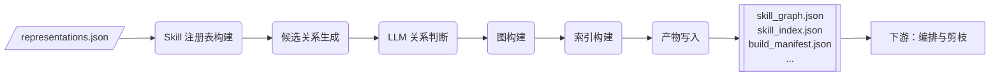

核心职责：

1. **注册表构建**：将 `SkillRepresentation` 列表转换为按 ID 索引的注册表，并进行基础校验
2. **候选关系生成**：通过确定性规则生成高召回率的 Skill-Skill 关系候选
3. **LLM 关系判断**：通过 LLM 对候选关系进行语义验证，判断 `can_feed` 关系是否成立
4. **确定性关系补充**：对精确匹配的 I/O 名称，直接建立关系，无需 LLM 判断
5. **图构建与索引**：将验证后的关系转换为图结构，并构建多维度检索索引
6. **产物写入**：输出完整的构建产物清单

遵循合约边界原则（见 2.2 节"关键原则"），下游编排模块只读关系图构建产物，不再重新解析 `representations.json`。

#### 3.2.2 核心数据合约

关系图构建模块定义了以下核心数据结构：

**`SkillRegistry`** — Skill 注册表

| 字段 | 类型 | 说明 |
| --- | --- | --- |
| `skills` | `Dict[str, SkillRepresentation]` | 按 Skill ID 索引的表征字典 |
| `diagnostics` | `List[GraphDiagnostic]` | 注册阶段的诊断信息 |

**`RelationCandidate`** — 候选关系

| 字段 | 类型 | 说明 |
| --- | --- | --- |
| `source_id` | `str` | 源 Skill ID |
| `target_id` | `str` | 目标 Skill ID |
| `relation_hints` | `List[str]` | 建议的关系类型（如 `["can_feed"]`） |
| `candidate_methods` | `List[str]` | 生成候选的方法（如 `["exact_io_match"]`） |
| `priority` | `str` | 优先级（`high` / `medium` / `low`） |
| `evidence` | `Dict[str, Any]` | 支撑证据（matched_terms、port_mappings 等） |

**`LLMMatch`** — LLM 关系判断结果

| 字段 | 类型 | 说明 |
| --- | --- | --- |
| `source_id` | `str` | 源 Skill ID |
| `target_id` | `str` | 目标 Skill ID |
| `relation_type` | `str` | 关系类型（`can_feed`） |
| `confidence` | `float` | 置信度（0.0 ~ 1.0） |
| `method` | `str` | 判断方法（`llm_ontology_match` / `llm_consensus_match` / `deterministic_exact_io_match`） |
| `reasons` | `List[str]` | 判断理由 |
| `supporting_fields` | `Dict[str, Any]` | 支撑字段（port_mappings、source_outputs、target_inputs） |
| `accepted` | `bool` | 是否被接受 |

**`GraphNode` / `GraphEdge`** — 图的节点和边

| 字段 | GraphNode | GraphEdge | 说明 |
| --- | --- | --- | --- |
| `id` | ✓ | — | 节点标识（如 `skill:aris-arxiv`） |
| `type` | ✓ | ✓ | 类型（节点：`skill`；边：`can_feed`） |
| `label` | ✓ | — | 显示名称 |
| `source` | — | ✓ | 边的源节点 |
| `target` | — | ✓ | 边的目标节点 |
| `confidence` | — | ✓ | 边的置信度 |
| `method` | — | ✓ | 边的生成方法 |
| `properties` | ✓ | — | 节点属性（inputs、outputs 等） |
| `evidence` | — | ✓ | 边的证据 |

**`SkillIndex`** — 多维度检索索引

| 字段 | 类型 | 说明 |
| --- | --- | --- |
| `by_output` | `Dict[str, List[str]]` | 按输出名称索引的 Skill ID 列表 |
| `by_input` | `Dict[str, List[str]]` | 按输入名称索引的 Skill ID 列表 |
| `by_data_type` | `Dict[str, List[str]]` | 按数据类型索引的 Skill ID 列表 |
| `neighbors` | `Dict[str, List[str]]` | 邻接 Skill 列表 |
| `upstream_by_input` | `Dict[str, List[str]]` | 按输入名称索引的上游 Skill 列表 |
| `downstream_by_output` | `Dict[str, List[str]]` | 按输出名称索引的下游 Skill 列表 |
| `by_text_term` | `Dict[str, List[str]]` | 按文本术语索引的 Skill 列表 |

**`BuildManifest`** — 构建产物清单（在线阶段的加载入口）

| 字段 | 类型 | 说明 |
| --- | --- | --- |
| `schema_version` | `str` | Schema 版本标识 |
| `artifacts` | `Dict[str, str]` | 产物文件名映射 |
| `thresholds` | `Dict[str, float]` | 关系置信度阈值 |
| `planning_defaults` | `Dict[str, Any]` | 编排阶段的默认参数 |
| `llm` | `Dict[str, Any]` | LLM 配置元数据 |
| `created_at` | `str` | 构建时间 |

#### 3.2.3 候选关系生成

候选关系生成是关系图构建的关键步骤。它通过确定性规则快速生成高召回率的 Skill-Skill 关系候选，再由 LLM 进行精确验证。这种"先粗筛、后精筛"的策略既保证了召回率，又控制了 LLM 调用成本。

**候选生成方法**

系统采用两种确定性方法生成候选关系：

| 方法 | priority | 触发条件 | 说明 |
| --- | --- | --- | --- |
| `exact_io_match` | `high` | 源 Skill 输出名称与目标 Skill 输入名称完全相同，且类型相同 | 最强的候选，通常会被接受 |
| `compatible_type_match` | `medium` | 输出类型与输入类型兼容，且存在语义重叠（名称或描述共享术语） | 需 LLM 进一步验证 |

**类型兼容规则**

当输出类型与输入类型不完全相同但语义兼容时，系统仍可生成候选。兼容类型组合定义如下：

```text
COMPATIBLE_CAN_FEED_TYPES:
  (markdown, text)     ← Markdown 内容是文本
  (audio, file)        ← 音频文件是文件类型
  (video, file)        ← 视频文件是文件类型
  (image, file)        ← 图片文件是文件类型
  (pdf, file)          ← PDF 文件是文件类型
  (path, file)         ← 路径可指向文件
```

此外，`text`、`markdown`、`json` 三种类型之间可相互转换（均为内容承载类型 `CONTENT_CARRIER_TYPES`）。

**文本强制转换**

当精确类型匹配和兼容类型匹配都不满足时，系统通过文本强制转换（textual coercion）识别语义连接：

条件 1：目标输入是通用文本输入（名称在 `GENERIC_TEXT_INPUT_NAMES` 中）

```text
GENERIC_TEXT_INPUT_NAMES:
  body, content, prompt, query, question, request, script, text, transcript
```

条件 2：源输出是文本类输出（名称在 `TEXTUAL_OUTPUT_TERMS` 中）

```text
TEXTUAL_OUTPUT_TERMS:
  article, brief, content, draft, notes, report, review, script, summary, transcript
```

示例：`speech-to-text.transcript(markdown)` → `general-writing.query(text)`，转录文本可作为写作输入。

**候选过滤与限制**

为控制候选数量，系统实施以下过滤策略：

1. **泛化 I/O 名称过滤**：跳过过于泛化的 I/O 名称（如 `output`、`input`、`result`）
2. **Fanout 限制**：当某个 I/O 名称的输出 Skill 数 × 输入 Skill 数超过阈值时，跳过该名称
3. **每 Skill 候选数限制**：限制每个 Skill 最多生成的候选关系数
4. **Port mapping 限制**：限制每个候选记录的 port mapping 数量

**候选生成流程**

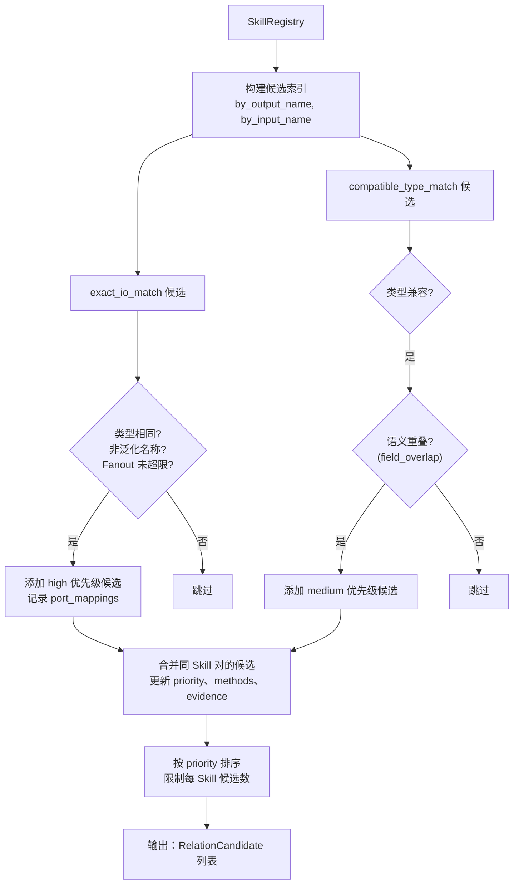

#### 3.2.4 LLM 关系判断

LLM 关系判断对候选关系进行语义验证。它将候选关系批量提交给 LLM，判断 `can_feed` 关系是否成立，并返回置信度和支撑证据。

**System Prompt 设计要点**

System Prompt 对 LLM 的输出施加了严格约束：

| 约束 | 目的 |
| --- | --- |
| 只返回 JSON，不含 Markdown | 确保可解析性 |
| 不创造新的 Skill 或关系类型 | 限制在候选范围内 |
| 选择 port_mappings 只能来自候选 evidence | 确保可追溯性 |
| 若候选方向错误，可省略或返回低置信度 | 容错机制 |
| 优先选择内容输入（body/query/text）而非控制输入（command/format） | 避免控制流字段误判 |

**批量匹配流程**

候选关系按批次提交给 LLM：


**共识机制**

为确保关系判断的稳定性，系统采用共识机制：

1. 每个候选批次调用 LLM **两次**，第二次将 Skill 顺序交换（target → source）
2. 只保留**两次都接受**的关系作为最终匹配
3. 置信度取两次结果的**最小值**
4. 未达成共识的关系记录为诊断信息（severity: `info`，code: `no_consensus_match`）

共识机制可关闭（`require_consensus=False`），此时只使用第一次调用结果。

**验证与规范化**

LLM 返回的原始匹配结果需要经过验证和规范化：

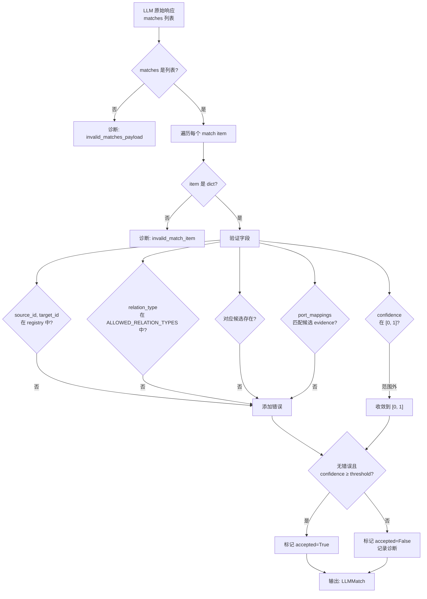

**置信度阈值**

默认阈值 `can_feed: 0.7`。只有置信度 ≥ 阈值且无验证错误的匹配才会被接受。

#### 3.2.5 确定性关系补充

对于精确 I/O 名称匹配的候选，系统直接建立关系，无需 LLM 判断。这避免了不必要的 API 调用，也提高了关系的可信度。

**确定性关系条件**

| 条件 | 说明 |
| --- | --- |
| `candidate_methods` 包含 `exact_io_match` | 候选由精确 I/O 匹配生成 |
| `relation_hints` 包含 `can_feed` | 建议的关系类型是 `can_feed` |
| 源输出与目标输入的 **name 和 type 均相同** | 精确匹配 |

满足以上条件的候选直接转换为 `LLMMatch`，置信度设为 `1.0`，方法标记为 `deterministic_exact_io_match`。

**关系解析整合**

`RelationResolver` 整合 LLM 判断和确定性关系：

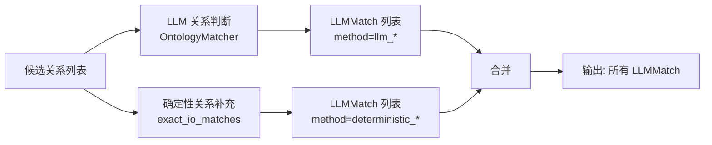

#### 3.2.6 索引构建

索引构建为在线编排阶段提供高效的检索能力。系统从 Skill 注册表和关系图中构建多个维度的倒排索引。

**索引类型与用途**

| 索引 | 内容 | 用途 |
| --- | --- | --- |
| `by_output` | 输出名称 → Skill ID 列表 | 查找能产出特定 artifact 的 Skill |
| `by_input` | 输入名称 → Skill ID 列表 | 查找需要特定输入的 Skill |
| `by_data_type` | 数据类型 → Skill ID 列表 | 按数据格式筛选 Skill |
| `neighbors` | Skill ID → 邻接 Skill 列表 | 图遍历、路径搜索 |
| `upstream_by_input` | 输入名称 → 上游 Skill 列表 | 查找能提供特定输入的上游 Skill |
| `downstream_by_output` | 输出名称 → 下游 Skill 列表 | 查找能消费特定输出的下游 Skill |
| `by_text_term` | 文本术语 → Skill 列表 | 按关键词检索 Skill |

**索引裁剪策略**

为控制索引大小，系统对部分索引实施 bucket size 限制：

| 索引 | 限制 | 原因 |
| --- | --- | --- |
| `by_output` / `by_input` | max_io_bucket_size = 16 | 过于泛化的名称会命中过多 Skill |
| `upstream_by_input` / `downstream_by_output` | max_io_bucket_size = 16 | 同上 |
| `by_text_term` | max_text_bucket_size = 24 | 过于泛化的术语会命中过多 Skill |

超过限制的 bucket 直接跳过，不写入索引。

**索引构建流程**

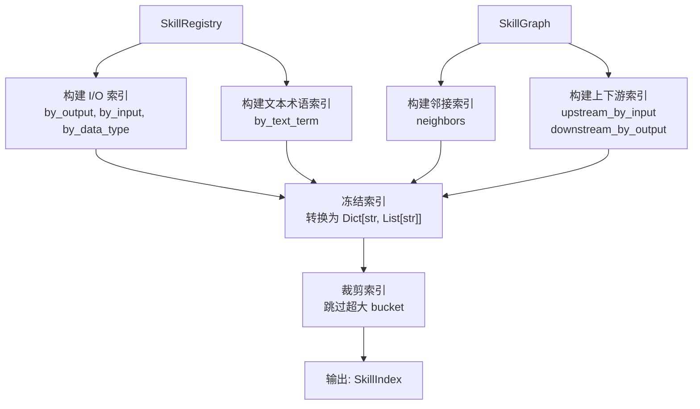

#### 3.2.7 端到端样例

以 `aris-arxiv` 和 `speech-to-text` 两个 Skill 为例，展示从候选生成到最终 `can_feed` 边的完整流程。

**Step 1：规范化表征（来自表征提取模块）**

```json
// aris-arxiv
{
  "id": "aris-arxiv",
  "outputs": [
    {"name": "paper", "type": "pdf"},
    {"name": "summary", "type": "markdown"}
  ]
}

// speech-to-text
{
  "id": "speech-to-text",
  "inputs": [
    {"name": "audio", "type": "audio", "required": true}
  ],
  "outputs": [
    {"name": "transcript", "type": "markdown"}
  ]
}

// general-writing（假设存在）
{
  "id": "general-writing",
  "inputs": [
    {"name": "query", "type": "text", "required": true}
  ]
}
```

**Step 2：候选关系生成**

候选 1：`aris-arxiv → general-writing`

```text
检查: aris-arxiv.outputs["summary"] vs general-writing.inputs["query"]
类型: markdown vs text → 兼容（CONTENT_CARRIER_TYPES）
语义重叠: summary 和 query 无直接重叠
文本强制转换: summary ∈ TEXTUAL_OUTPUT_TERMS, query ∈ GENERIC_TEXT_INPUT_NAMES
→ 触发 textual coercion
→ 生成 candidate:
  source_id: aris-arxiv
  target_id: general-writing
  relation_hints: ["can_feed"]
  candidate_methods: ["compatible_type_match"]
  priority: medium
  evidence:
    matched_type: "markdown->text"
    port_mappings: [
      {source_output: "summary", source_type: "markdown",
       target_input: "query", target_type: "text",
       match_method: "compatible_type_match",
       match_reason: "textual content can be adapted as target content input"}
    ]
```

候选 2：`speech-to-text → general-writing`

```text
检查: speech-to-text.outputs["transcript"] vs general-writing.inputs["query"]
类型: markdown vs text → 兼容
文本强制转换: transcript ∈ TEXTUAL_OUTPUT_TERMS, query ∈ GENERIC_TEXT_INPUT_NAMES
→ 触发 textual coercion
→ 生成 candidate:
  source_id: speech-to-text
  target_id: general-writing
  candidate_methods: ["compatible_type_match"]
  priority: medium
```

候选 3：`aris-arxiv → speech-to-text`

```text
检查: aris-arxiv.outputs["paper"] vs speech-to-text.inputs["audio"]
类型: pdf vs audio → 不兼容
→ 无候选
```

**Step 3：LLM 关系判断**

LLM 对候选 1 和候选 2 进行判断：

```json
// 第一次调用结果
{
  "matches": [
    {
      "candidate_id": "aris-arxiv<->general-writing",
      "source_id": "aris-arxiv",
      "target_id": "general-writing",
      "relation_type": "can_feed",
      "confidence": 0.85,
      "reasons": ["summary(markdown) can satisfy query(text) for writing input"],
      "supporting_fields": {
        "port_mappings": [{"source_output": "summary", "target_input": "query"}],
        "source_outputs": ["summary"],
        "target_inputs": ["query"]
      }
    },
    {
      "candidate_id": "speech-to-text<->general-writing",
      "source_id": "speech-to-text",
      "target_id": "general-writing",
      "relation_type": "can_feed",
      "confidence": 0.92,
      "reasons": ["transcript is text content suitable for writing query"]
    }
  ]
}

// 第二次调用结果（Skill 顺序交换）
{
  "matches": [
    {
      "source_id": "aris-arxiv",
      "target_id": "general-writing",
      "confidence": 0.88,
      ...
    },
    {
      "source_id": "speech-to-text",
      "target_id": "general-writing",
      "confidence": 0.90,
      ...
    }
  ]
}
```

**Step 4：共识过滤**

```text
aris-arxiv → general-writing:
  第一次 confidence: 0.85
  第二次 confidence: 0.88
  → 共识达成，取最小值 0.85
  → accepted = True

speech-to-text → general-writing:
  第一次 confidence: 0.92
  第二次 confidence: 0.90
  → 共识达成，取最小值 0.90
  → accepted = True
```

**Step 5：最终 SkillGraph**

```json
{
  "nodes": [
    {"id": "skill:aris-arxiv", "type": "skill", "label": "Aris Arxiv", ...},
    {"id": "skill:speech-to-text", "type": "skill", "label": "Speech to Text", ...},
    {"id": "skill:general-writing", "type": "skill", "label": "General Writing", ...}
  ],
  "edges": [
    {
      "source": "skill:aris-arxiv",
      "target": "skill:general-writing",
      "type": "can_feed",
      "confidence": 0.85,
      "method": "llm_consensus_match",
      "evidence": {"port_mappings": [{"source_output": "summary", "target_input": "query"}], ...}
    },
    {
      "source": "skill:speech-to-text",
      "target": "skill:general-writing",
      "type": "can_feed",
      "confidence": 0.90,
      "method": "llm_consensus_match",
      "evidence": {"port_mappings": [{"source_output": "transcript", "target_input": "query"}], ...}
    }
  ]
}
```

**Step 6：SkillIndex**

```json
{
  "by_output": {
    "paper": ["aris-arxiv"],
    "summary": ["aris-arxiv"],
    "transcript": ["speech-to-text"]
  },
  "by_input": {
    "audio": ["speech-to-text"],
    "query": ["general-writing"]
  },
  "upstream_by_input": {
    "query": ["aris-arxiv", "speech-to-text"]
  },
  "downstream_by_output": {
    "summary": ["general-writing"],
    "transcript": ["general-writing"]
  },
  "neighbors": {
    "aris-arxiv": ["general-writing"],
    "speech-to-text": ["general-writing"]
  }
}
```

通过 `upstream_by_input["query"]`，在线编排模块可快速找到能提供 `query` 输入的上游 Skill——`aris-arxiv`（通过 `summary`）和 `speech-to-text`（通过 `transcript`）——从而构建候选编排计划。
