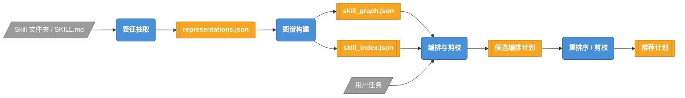
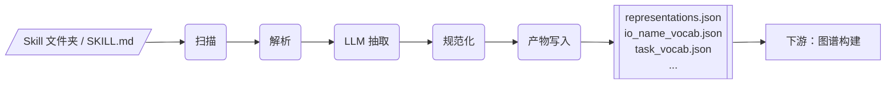
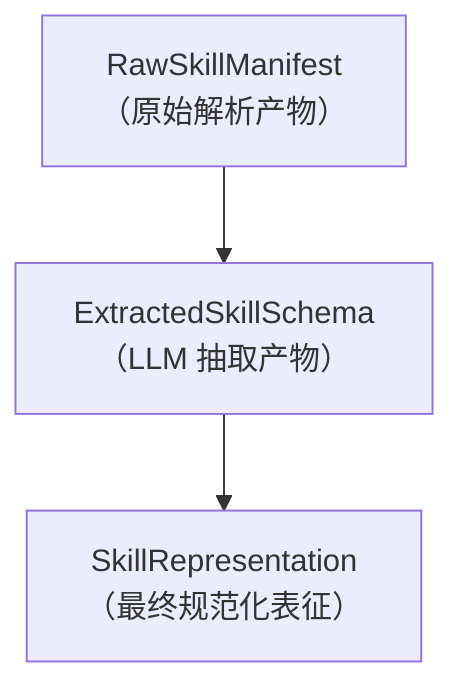
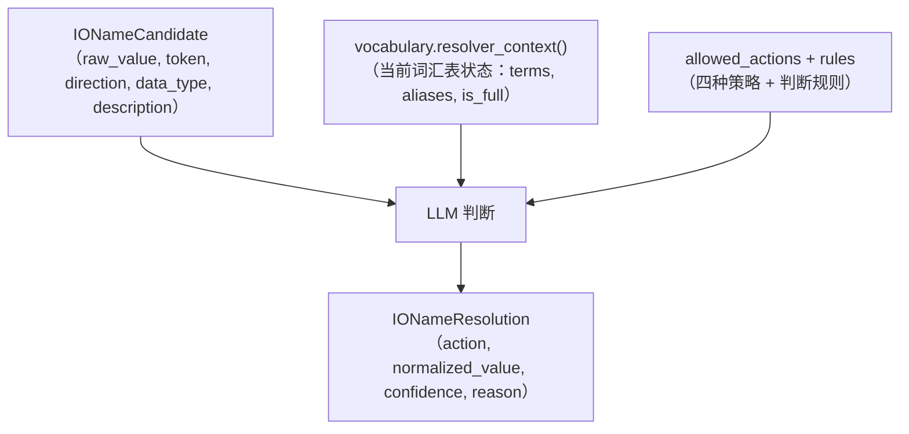
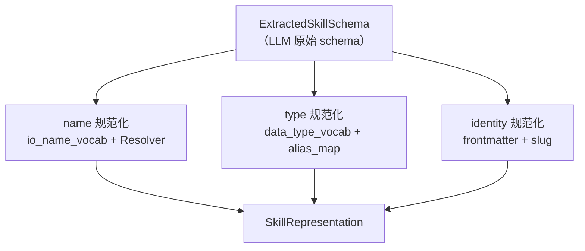

# SkillMash 设计说明书

## 1. 项目概述

### 1.1 简介

SkillMash 是一个面向 Agent Skill 的离线表征构建与在线编排系统。它的核心使命是：把真实 Skill 文件夹转成稳定的结构化表征，并基于这些表征生成可解释的候选编排计划。

概括而言，SkillMash 要做的事情是：

```text
SKILL.md → 结构化表征 → Skill 关系图谱 → 自动编排执行计划 → 推荐最优方案
```

当 Agent 生态中的 Skill 越来越多、粒度越来越杂，我们需要一种结构化的方式来理解、拆解、复用、组合和规划这些 Skill。SkillMash 正是为了解决这个问题而设计的。

### 1.2 要解决的问题

Skill 数量和粒度不断增长，但系统缺少一种结构化方式理解、拆解、复用、组合和规划这些 Skill。SkillMash 重点解决以下两个核心问题：

**1. Skill 描述不统一，关系不可知**

不同 Skill 用不同说法描述输入输出和能力（如 `Query or Arxiv ID`、`search query`、`paper topic`），系统也无法自动判断一个 Skill 的输出能否作为另一个 Skill 的输入（如 `web_search` 的输出能否满足 `summarize_text` 的输入）。

SkillMash 通过结构化表征抽取将自然语言 Skill 文档转为统一的 `SkillRepresentation`，用词汇表（`io_name_vocab`、`task_vocab`）规范化语义名称，并通过确定性候选生成 + LLM 判断自动建立 `can_feed` 关系。

**2. 多条候选路径缺少选择依据**

同一个任务可能存在多条可行的编排路径——例如既能调用一个粗粒度 Skill 直接完成，也能拆成多个原子 Skill 链分步完成。系统需要根据输入输出兼容性、目标匹配度和路径质量来排序推荐。

SkillMash 通过 `PlanReranker` 对候选编排计划重排序，提供排序依据和推荐方案。重排序器只排序已有候选，不创造新路径。

### 1.3 目标

SkillMash 的整体目标：

1. **将自然语言 Skill 文档转为结构化表征**，使 Skill 可被机器理解、比较与组合
2. **自动发现 Skill 间的可达关系**（`can_feed`），构建 Skill 关系图谱
3. **从用户查询自动生成候选编排计划**，并通过重排序推荐最优方案
4. **保持跨阶段数据合约的稳定性**，使各模块可独立运行与迭代
5. **标识计划中的输入缺口**，为后续追问提供线索

SkillMash 的演进路线遵循以下优先级：

```text
先让真实 Skill 文档稳定进入系统（表征抽取）
再让图关系稳定可追踪（图谱构建）
再让在线计划可解释（编排与剪枝）
最后再扩展到原子拆解、Artifact 图、typed DAG 和真实执行
```

---

## 2. 系统架构

### 2.1 分阶段流水线

SkillMash 采用分阶段流水线架构，每个阶段产出结构化产物，供下游消费，不回溯上游原始数据。

整体流程如下：



三阶段概要：

| 阶段 | 输入 | 核心处理 | 输出 |
| --- | --- | --- | --- |
| **表征抽取** | Skill 文件夹中的 `SKILL.md` | 扫描、解析、LLM 抽取 schema、规范化名称与类型 | `representations.json`、词表、诊断日志 |
| **图谱构建** | `representations.json` | 构建 Skill 注册表、生成候选关系、LLM 判断 `can_feed`、构建索引 | `skill_graph.json`、`skill_index.json`、`build_manifest.json` |
| **编排与剪枝** | 图谱产物 + 用户查询 | Grounding、沿 `can_feed` 边搜索候选路径、LLM 重排序 | 候选计划列表、推荐计划、缺口诊断 |

### 2.2 数据流转

每个阶段的产物文件及其下游消费关系如下：

**表征抽取阶段产物：**

```text
OUTPUT/
  representations.json        ← 下游图谱构建的唯一输入
  diagnostics.json            ← 抽取诊断（调试用）
  normalization_decisions.json ← 规范化证据（调试用）
  io_name_vocab.json          ← 输入输出语义名词表（图谱构建 + 在线检索使用）
  task_vocab.json             ← 能力词表（图谱构建 + 在线检索使用）
  extraction.log              ← 抽取日志
```

**图谱构建阶段产物：**

```text
.skillmash/index/
  build_manifest.json         ← 在线阶段的加载入口，记录阈值和元数据
  skills.json                 ← Skill 注册表
  skill_graph.json            ← Skill-only 关系图（can_feed 边）
  skill_index.json            ← 多维度检索索引
  llm_matches.json            ← LLM 关系判断记录（可回溯）
  diagnostics.json            ← 图构建诊断
  io_name_vocab.json          ← 继承的词表
  task_vocab.json             ← 继承的词表
  slot_taxonomy.json          ← slot 分类
  slot_contracts.json         ← slot 合约
```

**编排与剪枝阶段产物：**

```text
候选编排计划列表，每条计划包含：
  steps                       ← Skill 调用步骤序列
  produced_artifacts          ← 计划产出的 artifact
  missing_inputs              ← 未被满足的输入（缺口标识）
  can_feed_edges              ← 计划使用的 can_feed 边及置信度
  goal_score                  ← 目标匹配分
  reasons                     ← 排序理由

推荐计划                      ← 经 LLM 重排序后的最优方案
```

关键原则：下游只消费上游的结构化产物，不回溯原始数据。图谱构建只读 `representations.json`，不再重新解析 `SKILL.md`；编排阶段只读 build artifact，不再重新扫描 Skill 文件夹。

---

## 3. 核心模块详解

### 3.1 表征提取模块

表征提取模块是 SkillMash 流水线的第一阶段，负责将原始 Skill 文件夹中的 `SKILL.md` 转化为结构化的 `SkillRepresentation`。它是整个系统的数据入口——下游的图谱构建和在线编排都消费其产物，不再回溯原始 Skill 文档。

#### 3.1.1 模块定位与职责

表征提取模块在流水线中的位置：



核心职责：

1. **扫描与解析**：递归发现含 `SKILL.md` 的文件夹，将 Markdown 文本拆分为 YAML frontmatter + body
2. **LLM Schema 抽取**：通过 OpenAI-compatible 接口从 SKILL.md 文本中提取结构化的输入输出 schema
3. **名称规范化**：通过动态词汇表和 LLM 语义判断，将自由文本的 I/O 名称统一归一为语义术语
4. **产物写入**：将规范化后的表征和词汇表写入 JSON 文件，供下游消费

合约边界原则：下游只消费 `representations.json`，不回溯 `SKILL.md`。

#### 3.1.2 核心数据合约

表征提取模块定义了三级数据模型，对应提取流程的三个阶段：



**第一级：`RawSkillManifest`** — SKILL.md 解析产物

| 字段 | 类型 | 说明 |
| --- | --- | --- |
| `folder` | `SkillFolder` | 文件夹元信息（id_hint, path, entry, relative_path） |
| `frontmatter` | `Dict[str, Any]` | YAML frontmatter，提供 name / version 等元数据 |
| `body` | `str` | Markdown 正文，包含 IO 描述细节 |
| `body_sha256` | `str` | 正文哈希，用于变更检测 |
| `diagnostics` | `List[ExtractionDiagnostic]` | 解析阶段的诊断信息 |

**第二级：`ExtractedSkillSchema`** — LLM 抽取产物

| 字段 | 类型 | 说明 |
| --- | --- | --- |
| `description` | `str` | Skill 功能描述 |
| `inputs` | `List[ParameterSpec \| Dict]` | LLM 识别的输入参数列表 |
| `outputs` | `List[ArtifactSpec \| Dict]` | LLM 识别的输出 artifact 列表 |
| `confidence` | `Optional[float]` | LLM 对抽取结果的置信度 |
| `warnings` | `List[str]` | LLM 标注的警告信息 |

**第三级：`SkillRepresentation`** — 最终规范化表征（下游合约）

| 字段 | 类型 | 说明 |
| --- | --- | --- |
| `id` | `str` | 规范化后的 Skill 标识（slug 形式，如 `aris-arxiv`） |
| `name` | `str` | 人类可读名称 |
| `description` | `str` | 功能描述 |
| `version` | `str` | Skill 版本 |
| `inputs` | `List[ParameterSpec]` | 规范化后的输入列表 |
| `outputs` | `List[ArtifactSpec]` | 规范化后的输出列表 |

**`ParameterSpec` 与 `ArtifactSpec`：name 与 type 分离**

`ParameterSpec`（输入参数）和 `ArtifactSpec`（输出 artifact）是 I/O 描述的统一数据结构，遵循核心架构原则——**name 是语义角色，type 是数据承载格式**：

```text
name = 运行时语义角色，例如 query、paper、summary
type = 数据承载格式，例如 text、json、pdf、markdown
```

| 字段 | ParameterSpec | ArtifactSpec | 说明 |
| --- | --- | --- | --- |
| `name` | ✓ | ✓ | 语义角色名称（经 io_name_vocab 规范化） |
| `type` | ✓ | ✓ | 数据承载格式（经 data_type_vocab 规范化） |
| `required` | ✓ | — | 是否必填输入 |
| `description` | ✓ | ✓ | 自然语言描述 |
| `default` | ✓ | — | 默认值 |

这种分离避免了把"数据是什么"和"数据用什么格式承载"混在一起，使下游的 `can_feed` 关系判断更精确——两个 Skill 能否对接，既看语义角色匹配，也看数据格式兼容。


#### 3.1.3 LLM Schema 提取

`LLMSchemaExtractor` 使用 LLM 从 SKILL.md 文本中提取结构化的输入输出 schema。它将 `RawSkillManifest` 的 frontmatter 与 body 作为上下文，请求 LLM 返回 JSON，再将响应解析为 `ExtractedSkillSchema`。

**System Prompt 设计要点**

System Prompt（`_SYSTEM_PROMPT`）对 LLM 的输出施加了严格约束，核心要点如下：

| 约束 | 目的 |
| --- | --- |
| 只返回 JSON，不含 Markdown | 确保可解析性 |
| 输出须为用户面向 deliverable | 过滤 errorCode / status / logs 等内部控制字段 |
| name = 语义角色，type = 数据格式 | 落实 name/type 分离原则 |
| 推荐短名词角色名（query, paper, summary 等） | 利于词汇表归一和图谱链接 |
| 推荐 type 值列表（text, markdown, json, pdf 等） | 与 `data_type_vocab` 对齐 |
| 嵌套 deliverable 要展开 | 避免 raw API container 被误记为输出 |
| 不重复 emit 同一语义的输入 | 去重，避免冗余 |
| 拿不准时用 unknown + warning | 容错兜底 |

`extract_many()` 支持批量提取以减少 API 调用；当 `LLM_MODEL` 指向本地模型路径时，系统自动启用 vLLM 离线推理，同一模型路径的所有组件共享 engine instance。

#### 3.1.4 名称规范化体系

不同 Skill 用不同说法描述同一语义，这是 SkillMash 要解决的核心问题之一。例如：

```text
web_search Skill:     输入名 "Query or Arxiv ID"     → 语义角色是什么？
summarize Skill:      输入名 "search query"           → 与上面的 "Query" 是否同一个语义？
paper_download Skill: 输出名 "Downloaded PDF"         → 语义角色是 "paper" 还是 "downloaded_pdf"？
```

名称规范化体系通过动态词汇表 + LLM 语义判断，将这些自由表述统一归一为语义术语，使下游的 `can_feed` 关系判断建立在稳定的语义基础之上。

**`BaseVocabulary`：动态词汇表基类**

`BaseVocabulary` 是线程安全、有界可增长的动态词汇表，管理 term → aliases 的映射关系：

```text
term（规范名）  aliases（别名集合）
query           {query_or_arxiv_id, search_query, paper_topic, ...}
paper           {downloaded_pdf, academic_paper, ...}
summary         {brief, abstract, ...}
```

核心设计要点：

| 特性 | 说明 |
| --- | --- |
| **term → aliases 映射** | 每个规范 term 拥有一个别名集合，lookup 时 alias 和 term 本身都能命中 |
| **容量上限 `max_vocab_size`** | 可选的有界约束；未设置时词汇表随 Skill 语料自然增长 |
| **线程安全** | 所有读写操作通过 `RLock` 保护，支持并发 LLM 解析场景 |
| **可增长** | `create_term()` 动态添加新 term，`add_alias()` 动态添加别名 |

**`IONameVocabulary`：I/O 名称专用词汇表**

`IONameVocabulary` 继承 `BaseVocabulary` 的核心机制，并增加了 I/O 名称特有的约束：

| 扩展 | 说明 |
| --- | --- |
| **`allowed_types`** | 每个 term 关联一组允许的数据类型，如 `query` 允许 `{text, json}`，`paper` 允许 `{pdf, url}` |
| **`IONameVocabTerm`** | 继承 `BaseVocabTerm`，新增 `allowed_types: Set[str]` 字段 |
| **与 `SemanticVocabulary` 的分工** | `IONameVocabulary` 管 I/O 语义名（query, paper），`SemanticVocabulary` 管 task/能力词（search, summarize） |

**解析策略四选一**

当遇到一个词汇表中未见的 I/O 名称时，Resolver 必须选择以下四种策略之一：

| 策略 | 触发条件 | 行为 | 示例 |
| --- | --- | --- | --- |
| **`alias_existing`** | 新名称与已有 term 语义等价 | 将新拼写加入已有 term 的别名列表 | `search_query` → alias of `query` |
| **`create_new`** | 新名称是 genuinely new 的运行时语义角色，且词汇表未满 | 创建新 term | `transcript` → new term `transcript` |
| **`merge_existing`** | 词汇表已满，无法创建新 term | 强制归入语义最接近的已有 term | 新名 `outline` → merge into `summary` |
| **`exclude_non_runtime`** | 名称是纯日志/统计/遥测字段 | 丢弃，不进入词汇表和最终表征 | `analytics_count` → excluded |

优先级逻辑：`alias_existing` > `create_new` > `merge_existing` > `exclude_non_runtime`。Resolver 根据语义判断和词汇表状态选择最合适的策略。

**`LLMIONameResolver`：LLM 语义判断**

`LLMIONameResolver` 使用 LLM 判断新名称与词汇表已有 term 的语义等价关系，决定归一策略：



解析流程：

1. **构建候选**：将 LLM 抽取的原始 I/O 名称转为 `IONameCandidate`，携带方向（input/output）、数据类型和描述
2. **构建上下文**：将当前词汇表状态（所有 term、别名、是否已满）序列化为 JSON
3. **发送给 LLM**：system prompt 要求返回 JSON，包含 `action`、`target`、`confidence`、`reason` 四个字段
4. **解析响应**：`_resolution_from_payload()` 将 LLM 返回的 JSON 转为 `IONameResolution`，并施加约束校验：
   - 若 `action` 不是四种合法策略之一，降级为 `merge_existing`
   - 若 `action` 为 `create_new` 但词汇表已满，降级为 `merge_existing`
   - 若 `action` 为 `alias_existing` / `merge_existing` 但 target 不在词汇表中，替换为 `closest_term`
   - confidence 值被强制收敛到 `[0.0, 1.0]` 区间

批量解析（`resolve_many`）将一个 Skill 的所有未见 I/O 名称一起发给 LLM，利用同一 Skill 的上下文做一致性判断，避免同一语义在不同方向被归一为不同 term。

**Normalizer：三维规范化流程**

`SkillRepresentationNormalizer` 将 LLM 原始 schema 通过词汇表解析转为最终 `SkillRepresentation`，执行 name / type / task 三维规范化：



- **name 规范化**：对每个 input/output 的 `name` 字段，先查 `io_name_vocab`（命中则直接返回），未命中则提交给 Resolver（LLM 或启发式），根据返回的 resolution 执行对应策略
- **type 规范化**：对 `type` 字段，先查 `data_type_aliases` 别名映射（如 `natural_language_query → text`），再校验是否在 `data_type_vocab` 集合内，不在则降级为 `unknown`
- **identity 规范化**：从 frontmatter 的 `name` / `version` 和文件夹路径推导 Skill 的 `id` / `name` / `version`

规范化还包含去重逻辑：如果两个 input/output 经规范化后得到相同的 `name`，会合并为一个条目（类型冲突时保留已知的、描述合并拼接）。

#### 3.1.5 端到端样例

以 `aris-arxiv` Skill 为例，展示从 SKILL.md 原文到最终 `SkillRepresentation` 的完整数据流转。

**Step 1：SKILL.md 原文（简化）**

```markdown
---
name: Aris Arxiv
version: 1.0.0
---

# Aris Arxiv

Search, download, and summarize academic papers from arXiv.

## Inputs
| Name | Type | Required | Description |
|------|------|----------|-------------|
| Query or Arxiv ID | text | true | Search query or arXiv identifier |

## Outputs
| Name | Type | Description |
|------|------|-------------|
| Downloaded PDF | pdf | Downloaded paper PDF |
| Paper Summary | markdown | Summary of the paper |
```

**Step 2：LLM 抽取结果（`ExtractedSkillSchema`）**

```json
{
  "description": "Search, download, and summarize academic papers from arXiv.",
  "inputs": [
    {
      "name": "query_or_arxiv_id",
      "type": "text",
      "required": true,
      "description": "Search query or arXiv identifier."
    }
  ],
  "outputs": [
    {
      "name": "downloaded_pdf",
      "type": "pdf",
      "description": "Downloaded paper PDF."
    },
    {
      "name": "paper_summary",
      "type": "markdown",
      "description": "Summary of the paper."
    }
  ],
  "confidence": 0.92,
  "warnings": []
}
```

LLM 已将 `Query or Arxiv ID` 规范为 `query_or_arxiv_id`，`Downloaded PDF` 规范为 `downloaded_pdf`，`Paper Summary` 规范为 `paper_summary`——但这些仍是自由文本名，尚未经过词汇表归一。

**Step 3：词汇表解析（`IONameResolution`）**

假设当前 `io_name_vocab` 已有 term `query` 和 `summary`，但无 `paper`：

| token | 词汇表查找 | Resolver 判断 | action | normalized_value | confidence | reason |
| --- | --- | --- | --- | --- | --- | --- |
| `query_or_arxiv_id` | 未命中 | LLM 判断与 `query` 语义等价 | `alias_existing` | `query` | 0.95 | "search query is the same semantic role as query" |
| `downloaded_pdf` | 未命中 | LLM 判断是新语义角色 | `create_new` | `paper` | 0.90 | "downloaded PDF is a paper artifact, distinct from query" |
| `paper_summary` | 未命中 | LLM 判断与 `summary` 语义等价 | `alias_existing` | `summary` | 0.92 | "paper summary is a summary of a paper" |

type 规范化则通过 `data_type_aliases` 直接映射：`text → text`（exact）、`pdf → pdf`（exact）、`markdown → markdown`（exact）。

**Step 4：最终 `SkillRepresentation`**

```json
{
  "id": "aris-arxiv",
  "name": "Aris Arxiv",
  "description": "Search, download, and summarize academic papers from arXiv.",
  "version": "1.0.0",
  "inputs": [
    {
      "name": "query",
      "type": "text",
      "required": true,
      "description": "Search query or arXiv identifier.",
      "default": null
    }
  ],
  "outputs": [
    {
      "name": "paper",
      "type": "pdf",
      "description": "Downloaded paper PDF."
    },
    {
      "name": "summary",
      "type": "markdown",
      "description": "Summary of the paper."
    }
  ]
}
```

经过规范化后，`aris-arxiv` 的 I/O 名称已成为稳定的语义术语 `query`、`paper`、`summary`——下游图谱构建可直接基于这些术语判断 `can_feed` 关系，例如 `aris-arxiv.summary(markdown)` 能否满足某个 Skill 的 `query(text)` 输入。
